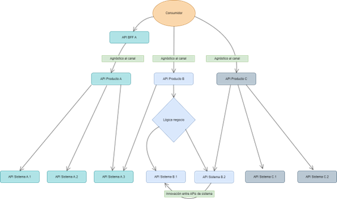

|**Versión**|**Fecha**|**Autor**|**Comentarios**|
| :- | :- | :- | :- |
|**1.0**|11/04/2023|Axpe|Versión inicial|

# Índice
- [1. Antecedentes](#_toc1689117939)

- [2. Tipificación y clasificación de las APIs](#_toc439664740)

    - [2.1. Categorización de las APIs](#_toc1043760565)

    - [2.2. Tipos de APIs	](#_toc456211337)

    - [2.3. Invocación entre APIs	](#_toc1699599255)

# Antecedentes

Redactar en función del cliente en el que se esté

# Tipificación y clasificación de las APIs
Con el objetivo de mantener una organización en los dominios funcionales, y pretendiendo exponer APIs como servicios, se ha optado por generar una tipificación en los modelos de API. Tomando en cuenta la paltaforma de desarrollo e implementación, donde se ejecutarán las APIs, se han generado los dos siguientes tipos: 

1. **API de Sistema**
2. **API de Producto/Negocio**
3. **API BFF (Backend for Frontend)**
El presente documento describe el alcance de cada uno de estos tipos de API, así como los principios y normalizaciones que deberán asegurar su buen uso dentro del ecosistema API. Cada una de estas APIs puede o no contar con esquemas de seguridad, políticas o restricciones distintas, dependiento del ámbito de la arquitectura donde se vayan a ejecutar. 

## Categorización de APIs
Antes de entrar en la propuesta de tipificación de APIs, haremos una ligera distinción entre dos categorías de API: 
1. **API Funcionales**. Orientadas a soportar funciones de negocio.
2. **API no Funcionales**. Dan soporte a las funciones de negocio, son de uso transversal a los dominios de negocio. 

Partiendo de esta categorización, ahora podemos pasar a definir los tipos de API con su orientación y los principios que las regirán. 

## Tipos de API 
(Redactar según el cliente en el que se esté, aqui se deja un ejemplo de Renta4)
Derivado de la situación actual, se llevará a cabo un esfuerzo para llegar a un ecosistema de API que permita mantener una organización óptima para el diseño, la implementación y el uso de las APIs. 
Encaminaremos los esfuerzos por mantener los servicios de Backend tal cual existen a día de hoy, colocando adaptadores que permitan extraer la lógica asociada a la recuperación de datos, dependiendo del canal. De esta forma, se elimina la responsabilidad de retornar un modelo de dato dependiendo del canal, logrando modelos *sanos* determinados por el dominio funcional de negocio.

El siguiente diagrama muestra la propuesta para el banco renta4 de los tipos de API en una vista de capas, la cual representa los principales colindantes con el ecosistema en un alto nivel. 

  

Se propone un modelo en el que las **API Funcionales (también llamadas de Producto o Negocio)** estén por encima de las API de Sistema. Estas APIs pueden ser simples (de passthrough) o complejas, que orquesten múltiples llamadas a las API de Sistema. Sin embargo, en el modelo propuesto las API Funcionales no podrán llamar directamente al backend, sino que tendrán que pasar por las API de Sistema. Se puede acceder a ellas a través de diferentes canales: digitales (web y mobile), a través de las oficinas y también terceros. Para estas API se propone una seguridad basada en flujos Oauth. 

**Las API de Sistema** se corresponderían con las API Utilities del modelo actual del banco. Estas APIs se encuentran por debajo de las Funcionales y están más cerca de los servicios Oracle con Natstat. Estas APIs son internas, no se encuentran expuestas, por lo que no se las puede llamar desde el Gateway. Las políticas serán menos extrictas en las API de Sistema que en las Funcionales.

A continuación, se hace una definición más detallada de cada tipo de API y se explican algunos de los principios y normas que los regirán durante la etapa de diseño del API.

### API de sistema

#### Funcional

Este tipo de API es la más cercana a los sistemas de información, en nuestro caso ahora focalizaremos los esfuerzos de diseño sobre el Oracle y Natstat. 
Las APIs de Sistema representan las interfaces de mayor granularidad dentro del dominio de negocio, deberán de contener las operaciones esenciales en cuanto al manejo de los datos. Se pretende que estas API tengan una relación directa con un servicios de Backend que exponga las operaciones del subsistema que representan, debiendo ser agnósticos al canal que los consume.

Los modelos de datos de este tipo de API deberán de ser la base sobre el que se sustentarán los servicios del dominio de negocio, por lo que debe de tenerse en cuenta el uso de esquemas de datos propios al dominio, pretendiendo minimizar el uso de modelos pertenecientes a otros dominios o bien contar con modelos compuestos. En el caso de que sea indispensable la composición de modelos en este tipo de API para la ejecución de los servicios de Backend, se deberá plantear un patrón que aplique al mayor número de servicios a implementar.

Este tipo de APIs pueden estar ubicadas en el ámbito Interno o bien Externo. Serán consideradas como ámbito Interno todas aquellas que exponen el uso de los sistemas internos, en nuestro primer alcance están representados por Oracle y Natstat. Las APIs de ámbito externo son representadas por aplicaciones de terceros, frecuentemente las APIs de soporte (explicadas más abajo) pertencen al ámbito externo, ya que son _utilidades_ que no forman parte del dominio de negocio; sin embargo puede (y se recomienda) que el dominio de negocio adquiera soluciones externas para operaciones altamente especializadas donde el tercero tenga experiencia en esa área en particular del dominio.

> **Caso de estudio**: _Los modelos de datos que actualmente se utilizan en los servicios backend, pueden estar acoplados en primer instancia al canal, también puede que incluyan modelos de datos compuestos, es decir elementos no propios del dominio funcional y que se usan para completar alguna estructura de dato como soporte al canal para evitar el consumo de dos servicios y obtener el completo de los datos a través de una sola petición._

#### No Funcional

También conociadas como API de Soporte, se utilizan como medio de acceso a funciones que no son propias del dominio de negocio, sino que son un complemento o incluso pueden ser un enriquecedor de los modelos de datos propios del dominio de negocio.

> **Ejemplo**: Un caso representativo de este tipo de API es la impresión de un documento, donde el API puede exponer su operación de impresión de documento y habilitar parámetros para indicar el formato en que se solicita la impresión, así como la representación del mismo; de esta forma cualquir dominio funcional que requiera de la impresión de un documento, que no es una actividad propia del dominio, podrá usar esta API.

#### Técnica

Se pretende usarlas para que los equipos técnicos puedan proveer a los desarrolladores de implementaciones que les faciliten la generación e integración de componentes de Software e Infraestructura durante el ciclo de vida de desarrollo.

> **Caso de estudio**: Desarrollo de una especificación para la generación de infraestructura a través de uno de los ciclos de operaciones de desarrollo (devOps) para proveer de infraestructura requerida para la puesta en ejecución de una instancia de servicio. Se pretende trabajar de la mano con ambos equipos en la generación y adopción del API técnica.

Hasta ahora, en las definiciones que hemos presentado, estamos llevando a cabo la categorización y tipificación de APIs en el sentido síncrono, bajo un modo RESTFul, donde cada invocación al API es llevada a cabo mediante una requisición (request) y se espera una respuesta (response) bajo el protocolo indicado. Sin embargo, bajo un modelo arquitectónico orientada a eventos, este modelo puede complicar la implementación en operaciones que no son síncronas, por ende se trabajara en la guía de diseño para el uso de APIs asíncronas.

#### Asíncrona

Por la naturaleza de este tipo de API, su uso se limitará para comunicar sucesos dentro de una arquitectura manejada por eventos. Su especificación se basará en la iniciativa AsyncAPI 2.0, a diferencia del resto, que se promoverá el uso de la especificación openAPI 3.0. En una etapa temprana se pretende identificar un caso de uso donde se pueda validar el uso de este tipo de API dentro del ecosistema.

> **Caso de estudio**: Para mostrar el diferenciador en el uso de un API asíncrona, se pretende aplicar el caso de uso de LogOperacional, donde las APIs de Sistema sean capaces de enviar una petición de escritura en el LogOperacional de forma asíncrona y desacoplada a la operación de negocio, a la vez que se asegure la escritura en el LogOperacional y se provean los mecanismos necesarios para los casos de fallo de escritura.

### API de Producto o de Negocio
 
Estas APIs son siempre **Funcionales**, por eso a veces también se las denomina así, y exponen internamente los recursos del dominio de negocio. Representan operaciones complejas soportadas por las APIs de Sistema y pretenden ser los interlocutores con las operaciones de Backend, de tal forma que el consumo de una API de Sistema sea a través de este tipo de API. Tiene como principal responsabilidad el componer la información a través de la ejecución de distintas operaciones de backend expuestas a través de las APIs de sistema, ya sean Internas o Externas.

Este tipo de API sigue siendo agnóstico al canal, su diseño deberá de estar centrado en la multicanalidad, de tal forma que el canal de origen no implique la implementación de lógica especializada o esté acompañada por un modelo de datos acorde. Se debe evitar el acoplamiento al canal, tanto en el diseño de la propia API como en las operaciones y esquemas contenidos en la especificación. 

En cuanto a los modelos de datos contenidos en este tipo de API, deberán de ser generados con base a los esquemas provistos por las API de sistema, de tal forma que un esquema en este nivel de API tenga los mismos o un menor número de elementos de datos respecto al esquema del API de Sistema del que se procura la información. En este nivel de API se fomenta la composición de modelos asociados al dominio funcional de negocio, siempre respetando la jerarquía y organización natural de los elementos de dominio, así como sus reglas y validaciones por cada elemento.

A diferencia del resto de los otros tipos de API, están se encuentran implementadas en el API Management, estando limitadas a:

- _Operaciones de orquestación_: para los casos en que una operación contenida en el producto conlleve a más de una invocación a una operación de negocio, por lo que se tendrá que llevar a cabo la orquestación de llamadas a las APIs de recurso correspondiente. Otro caso de uso dentro de este ámbito es la transformación en el tipo de contenidos de entrada/salida de los datos, por ejemplo los casos en que se envie un documento XML y se tenga que transformar a un documento JSON para llevar a cabo la invocación a la operación de negocio.

- _Composición de esquemas_: esta característica está vinculada a la orquestación de operaciones, ya que como resultado de esta orquestación es probable que tengamos que componer un modelo de datos que represente ambas operaciones.
- _Enriquecimiento de esquemas_: este caso es de uso frecuente en la ejecución del API, en particular para el caso de monitorización, cuando requerimos de un identificador que permita dar seguimiento al flujo completo de la transacción o bien para informar cuestiones técnicas tanto a los siguientes niveles de API como a los consumidores. Normalmente está asociado al enriquecimiento de información en las cabeceras de request/response dentro de ciclo de ejecución del proceso de negocio en referencia. O bien para resolver los casos en que sea necesario adicionar información propia del canal a los esquemas de datos del negocio, sin que esto represente una lógica distinta al servicio funcional de negocio dado.
- _Resolución de los modelos de seguridad_: al ser este tipo de APIs expuestas para los consumidores aplicativos, en este punto se deberá de hacer un intercambio entre el identificador de referencia y el de valor, teniendo en consideración que los modelos de seguridad así lo determinen. O bien si es necesario localizar información de seguridad a partir de un identificador propio del consumidor (como puede ser el caso de un identificador de sesión). Es a partir de este punto que se debe resolver la propagación de los identificadores de seguridad (tokens) hacia los siguientes niveles de API.

- _Homologación de mensajes_: como parte de las responsabilidades de este tipo de API, está el asegurar el modelo de dato de mensajes al cliente final, tales como errores, advertencias y/o información. Con frecuencia el tratamientos de estos mensajes lleva una orientación al consumidor, por tanto, si existe una lógica de adaptación y/o enriquecimiento del contenido de los mensajes, se deberá proporcionar en este nivel de API.

Se establece como principio de diseño que este tipo de APIs estén desacopladas a la aplicación o a un producto de Software en particular, ya que de otra forma es suceptible que este tipo de API termine comportándose como un **patrón "Backend for Frontend"**. Teniendo como desventaja el limitar su uso únicamente para esta aplicación y mantener un acoplamiento directo entre la API y el aplicativo, donde cualquier cambio en la pantalla podría implicar un cambio en la API.

> Para evitar el uso de este patrón, se pretende proveer en fases posteriores, de una API única expuesta para el consumo de los aplicativos frontales. Debido a la complejidad subyacente a la implementación de este modelo de exposición donde se pone sobre la balanza el consumo de APIs de sistema versus la capa de presentación, queda fuera de alcance en esta etapa.

## Invocación entre las API 

El flujo de comunicación entre los diferentes niveles de API debe estar supeditado a su naturales de obtención y transmición de la información. Por tanto, si ubicamos los tipos de API en la plataforma en una vista horizontal, podemos ver su representación de la siguiente forma:

  

De esta forma podemos resumir en la siguiente tabla los medios de invocación entre los diferentes niveles de API.

(REVISAR TABLA)
**APIs de experiencia** 

- :negative_squared_cross_mark: Otra API de Experienca
- :white_check_mark: API de BaaS
- :negative_squared_cross_mark: API de Sistema

**APIs de Producto**

- :negative_squared_cross_mark: Otra API de Experienca
- :negative_squared_cross_mark: API de BaaS
- :white_check_mark: API de Sistema

**APIs de sistema**

- :negative_squared_cross_mark: Otra API de Experienca
- :negative_squared_cross_mark: API de BaaS
- :white_check_mark: API de sistema, ya sea de soporte o bien, preferentemente del mismo dominio

Dentro de este principio de ordenamientos y tipificación de API, es importante marcar las restricciones y normas en las guías de diseño de cada una de estas, pero sin perder de vista la flexibilidad al diseñar un servicio bancario o API de experiencia. En particular, habrá que establecer patrones y mecanismos de recuperación de información a partir del como estarán implementadas las operaciones de negocio en el Backend, de tal forma que no se rompan las estructuras actuales que conlleven a la regeneración de los dominios de negocio.
