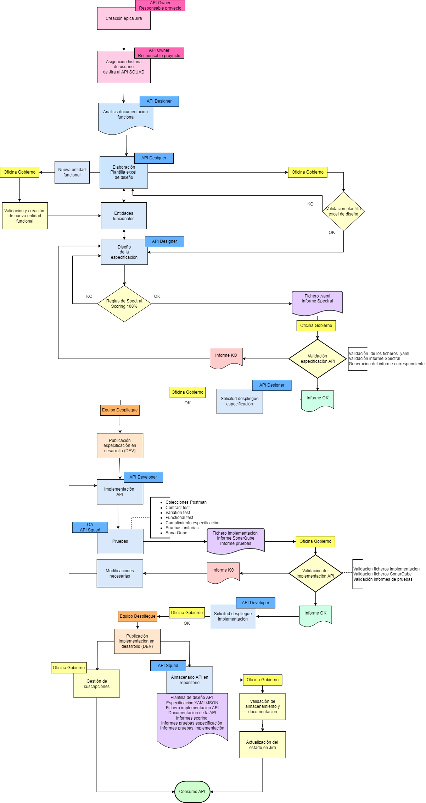
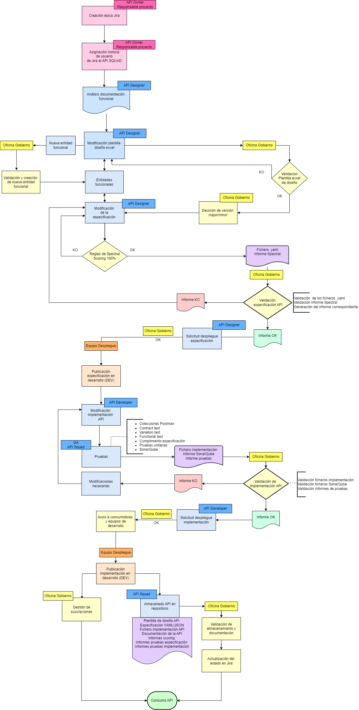

# **Procedimientos de creación y modificación de las APIs**
|**Versión**|**Fecha**|**Autor**|**Comentarios**|
| :- | :- | :- | :- |
|**1.0**|10/03/2023|Axpe|Versión inicial.|
|**1.1**|21/06/2023|Axpe|Modificación de los diagramas de flujo.|
|**1.2**|22/06/2023|Axpe|Modificación del procedimiento de creación, parte de los test. |
|**2.0**|06/07/2022|Axpe|Modificación de los procedimientos de creación y modificación y anexo del procedimiento sin oficina de gobierno. |
|**2.1**|07/07/2022|Axpe|Se añaden los diagramas de flujo modificados. |

# Procedimientos de creación y modificación de las APIs
[Introducción	](#_toc139613530)

[Documentos necesarios	](#_toc139613531)

[Documentos de consulta	](#_toc139613532)

[Documentos técnicos	](#_toc139613533)

[Proceso de creación de una API con Oficina de Gobierno	](#_toc139613534)

[Plantilla de diseño API	](#_toc139613535)

[Diseño de especificación API	](#_toc139613536)

[Scoring de la especificación API	](#_toc139613537)

[Validación de la especificación API	](#_toc139613538)

[Despliegue de la especificación API en el entorno de desarrollo	](#_toc139613539)

[Implementación de la API	](#_toc139613540)

[Testing de la implementación API	](#_toc139613541)

[Validación de la implementación API y las colecciones de pruebas	](#_toc139613542)

[Despliegue de la implementación API en entorno de desarrollo	](#_toc139613543)

[Proceso de modificación de una API con Oficina de Gobierno	11](#_toc139613544)

[Modificación Plantilla de diseño API	](#_toc139613545)

[Modificación de la API	](#_toc139613546)

[Despliegue de la API	](#_toc139613547)

[Procedimiento de creación de una API sin Oficina de Gobierno	](#_toc139613548)

[Diseño de la especificación API	](#_toc139613549)

[Implementación de la API	](#_toc139613550)

[Procedimiento de modificación de una API sin Oficina de Gobierno	](#_toc139613551)

[Despliegue de la API en un entorno superior](#_toc139613552)

[Despliegue de la API en entorno de pre-producción](#_toc139613553)

[Despliegue de la API en entorno de producción](#_toc139613554)

[Despliegue de la API en entornos superiores sin Oficina de Gobierno](#_toc139613555)

# Introducción

El presente documento tiene como objetivo proporcionar una guía completa sobre los flujos y procedimientos de creación, modificación y migración de APIs, adaptándolas a la normativa definida para la compañía. 

En primer lugar, se incluirá un apartado dedicado a los documentos necesarios para estos procesos. En esta sección se recopilarán los documentos técnicos relevantes, los estándares y patrones recomendados, así como otras definiciones clave que servirán como base para el diseño y la implementación de las APIs. Estos recursos proporcionarán un marco sólido para garantizar la coherencia y la calidad de las APIs desarrolladas. 

A continuación, se abordarán los siguientes procedimientos y flujos específicos de creación, modificación y migración de APIs. Cada procedimiento se desarrollará acompañado con un diagrama de flujo que ayudará a seguir visualmente los pasos y las interacciones involucradas en cada proceso.
# Documentos necesarios

En este apartado se desarrollarán los documentos necesarios para la creación, modificación y migración de las APIs de la compañía. Los documentos necesarios se dividen en dos grandes conjuntos; los documentos de consulta y los documentos técnicos, que apoyarán en estos procesos a todas las personas implicadas.
## Documentos de consulta
Los documentos incluidos en esta sección son documentos que contienen la información básica que acompañará a los diseñadores y a todos los agentes implicados en 

- **Guía de Diseño REST**: El documento tiene como objetivo establecer una serie de buenas prácticas para el diseño de APIs REST, con el fin de estandarizar su estructura.
- **Definición de la estructura de error**: El fichero contendrá la definición de la estructura de error para que pueda ser reutilizable.
- **Propagación de errores funcionales**: El documento incluirá la definición y los detalles sobre la gestión de los tipos y códigos de errores de la API. De esta manera, se identificará cuándo y dónde se deben utilizar cada uno de los errores definidos.
- **Versionado de las APIs**: El documento explicará el proceso de versionado de las APIs de acuerdo con unas especificaciones y buenas prácticas. Estas directrices permitirán homogeneizar y estandarizar el versionado de las APIs.
- **Estándares y patrones**: En este documento se presentarán diversos documentos útiles para el diseño de una API, que abarcan desde la fase conceptual y de análisis, hasta las buenas prácticas, la tipificación de errores y las políticas de seguridad. El objetivo principal de estas guías es proporcionar toda la información necesaria para facilitar un buen diseño de APIs desde cero. Además, también se incluirán algunos patrones que se pueden aplicar a las APIs, como el BFF, Composite, etc.
- **Tipificación y clasificación**: Este documento describe la clasificación de los modelos de APIs en tres grandes grupos, organizados por capas: APIs de Sistema o Técnicas, APIs de Negocio o Funcionales y APIs Backend for Frontend o BFF. El documento detalla el alcance de cada tipo de API, así como los principios y las normas que deben garantizar su correcto uso dentro del ecosistema API.
- **Ciclo de vida del API**: Este documento define el ciclo de vida de una API, el cual se considera un factor clave para su gestión. A través de este ciclo, se pretende determinar y gestionar los diferentes estados que atraviesa una API a lo largo de su vida, desde su identificación hasta su decomisión. 
- **Guía de referencia oAuth**: En este documento se aborda la seguridad OAuth que será implementada para controlar las APIs. Se incluyen aspectos como el ciclo de vida de OAuth2, la creación y el uso de scopes para limitar el acceso de las aplicaciones cliente, el acceso a las APIs mediante los diferentes Grant Types, y todos los demás aspectos relacionados con el empleo del protocolo OAuth2, incluyendo el manejo de tokens y su uso adecuado.  
- **Normativa API**: El documento recopila el conjunto de reglas obligatorias para las APIs de la compañía. Se describe la estructura de estas reglas y se clasifican en tres tipos: reglas diseñadas específicamente para la compañía (Ruleset), las reglas OWASP y las reglas OpenAPI.  
- **Metodología de Testing**: Este documento aborda la importancia del testing a lo largo de todo el ciclo de vida de una API con el objetivo de detectar y corregir errores desde etapas tempranas, lo que permite obtener un producto final de alta calidad. Además, se presentan los diferentes tipos de pruebas y se incluyen ejemplos de la mayoría de ellas.
- **Catalogación funcional**: En este documento se describe la catalogación funcional de las APIs de la compñía. La catalogación funcional de las APIs se refiere al proceso de organizar las APIs según sus funcionalidades. En este documento, se presenta la propuesta de catalogación de APIs específica para la compañía, la cual se ha basado en el estándar BIAN.
- **Guía de buenas prácticas de desarrollo back Java**: En esta guía se definen los diferentes componentes de desarrollo con el objetivo de lograr una estructura sólida en los proyectos.
- **Guía de buenas prácticas de testing en desarrollo de microservicios stack spring boot**: En este documento se presentan diferentes herramientas de testing y se proporcionan pautas para establecer buenas prácticas enfocadas en el desarrollo de dichas herramientas.
- **Guía de normalización en desarrollo de microservicios backend en Java**: En este documento se establecen criterios uniformes para el desarrollo de nuevos componentes por parte de los diferentes equipos, con el objetivo de lograr una homogeneización en dicho desarrollo.
## Documentos técnicos
Los siguientes documentos técnicos de diferentes softwares se emplearán para comprender y utilizar correctamente las funcionalidades y características de esos softwares en el contexto del diseño de APIs.

- **Documentación Spectral**: Documento en el que se describe en detalle el procedimiento de validación de especificaciones de APIs utilizando la herramienta Spectral. En este documento se proporcionará un paso a paso completo para la instalación, creación y modificación de reglas en Spectral. Esta guía se diseñará como una base de referencia para los diseñadores y arquitectos de APIs de la compañía, permitiéndoles revisar y evaluar el diseño de las APIs REST de manera efectiva.
- **Guía de Validación**: En este documento se proporciona un detalle completo sobre el uso de la herramienta de validación de diseño de APIs, Spectral, en los entornos de Stoplight Studio, Visual Studio Code y Standalone. Se explicará paso a paso cómo utilizar Spectral en cada uno de estos entornos para realizar la revisión de las especificaciones APIs de la compañía de manera efectiva.
- **Documentación de la herramienta Stoplight**: En este documento se proporciona información detallada sobre el uso de la herramienta de diseño Stoplight.
- **Documentación de la herramienta Postman**: En este documento se proporcionará información detallada sobre el uso de la herramienta de testing Postman.
- **Documentación de la herramienta SonarQube**: En este documento se proporciona información detallada sobre el uso de la herramienta SonarQube.
- **Documentación de la herramienta PRISM**: En este documento se proporciona información detallada sobre el uso de la herramienta PRISM.

# Proceso de creación de una API con Oficina de Gobierno

  

Este procedimiento tiene como objetivo definir una interfaz de los recursos a través de una API, de manera que se identifican las operaciones, estructuras de cuerpos de entrada/salida, formatos de respuesta y códigos HTTP implicados. Este procedimiento se realizará según las directrices establecidas en el documento Ciclo de vida del API.  

El flujo se inicia cuando el responsable de proyecto crea la **épica en Jira** y asigna la historia de usuario de Creación de una nueva API al API Squad. 
## Plantilla de diseño API  
Una vez asignada la tarea, El API Squad comenzará la creación de la API. El primer paso es realizar el **análisis funcional** de la documentación aportada para poder **rellenar la plantilla Excel de diseño de API** (vendrá adjunta a la tarea del Jira).

Para rellenar la plantilla Excel de diseño de API, el API Designer **reutilizará las entidades funcionales existentes**. En caso de necesitar una nueva entidad funcional, realizará una propuesta con dicha entidad, que será aprobada por la Oficina de Gobierno y se añadirá a la lista con el resto de las entidades funcionales. 

La plantilla rellena se adjuntará a la tarea Jira de “validación de plantilla de diseño API” para que la OG realice la validación. La plantilla Excel de diseño quedará almacenada como parte de documentación asociada a una versión de la API, pero la documentación oficial y de referencia será la especificación YAML. Además, en este momento se realizará la definición de las pruebas funcionales.

La OG **revisará la plantilla Excel de diseño** de AP y podrá emitir dos informes:

- Informe KO, con los cambios necesarios a realizar en la plantilla Excel. 
- Informe OK, que permite continuar con el flujo. 
## Diseño de especificación API
Una vez se haya revisado y aprobado la plantilla, la tarea en el Jira se asignará de nuevo al API SQUAD, que comenzará el diseño de la especificación API. Para ello, se realizarán los siguientes pasos:

- **Creación de los objetos necesarios y su estructura:** Es muy importante en todo el diseño API la óptima creación de objetos con una estructura adecuada, permitiendo la comprensión de su funcionamiento, la modularización y su reutilización. Para ello se empleará el documento Guía de Diseño REST.
- **Utilización de las estructuras existentes y las entidades de Negocio** que se puedan aplicar al diseño de la nueva API. 
- **Planteamiento de los endpoints y sus operaciones:** A partir de la lógica de negocio proporcionada para la creación de esta nueva API, se realiza un planteamiento de los endpoints necesarios y las operaciones que contendrán. Todo esto se realizará siguiendo el documento Guía de Diseño REST.
- **Planteamiento de los errores necesarios:** El siguiente paso, una vez planteados todos los endpoints con sus respectivas operaciones, se realiza el planteamiento de los errores necesarios en función de las necesidades de la API. Este planteamiento se realizará siguiendo los siguientes documentos: Guía de Diseño REST, Definición de errores funcionales, Definición de la estructura de error.
- **Elección del Grant Type:** En esta parte se elegirá el Grant Type con el que se realizará la conexión vía seguridad oAuth. Según lo desarrollado en el documento Guía de referencia oAuth, el Grant Type se elegirá en función de la documentación entregada por la Oficina de Gobierno.
- **Planteamiento de los scopes:** Por último, se realizará por parte del API Squad un planteamiento de los scopes que se emplearán en esta nueva API, siguiendo lo definido en la Guía de referencia oAuth. Los scopes deben tener una estructura concreta que se ha definido en el documento citado. La creación de los scopes corresponderá al API Architect ya que a su vez también hace las funciones de Service Manager, dentro de la Oficina de Gobierno.

Finalizados estos pasos, se realiza la especificación YAML empleando como base la Plantilla aprobada por la compañía y las buenas prácticas desarrolladas en los documentos anteriormente citados, además del esquema propuesto en la Plantilla Excel de diseño y el documento de Estándares y Patrones.
## Scoring de la especificación API
El API Designer, en primer lugar, pasará las reglas de Spectral a la especificación para obtener un Scoring del 100% y asegurar que la API cumple la Normativa definida. 

Hasta que la API no obtenga un Scoring del 100%, no se pasará a los siguientes pasos del flujo. 
## Validación de la especificación API 
En el momento en el que la especificación API obtenga un Scoring del 100%, se solicitará a la Oficina de Gobierno la revisión de la especificación dentro de la tarea de Jira “Solicitud validación de API”, adjuntando los siguientes documentos:

- Informe de Spectral con la puntuación del 100%
- Fichero .yaml que contenga la especificación API.
- Además, se lanzará una Pull Request en caso de que se emplee una herramienta Git, para poder tener un buen control sobre las versiones de la especificación YAML.

En este momento, la Oficina de Gobierno debe aceptar la solicitud de revisión. La **revisión se centrará en el informe de Spectral y en la especificación API**. La Oficina de Gobierno podrá emitir dos tipos de informes diferentes:

- Informe KO, donde se incluirán todos los puntos pendientes que deben ser corregidos por el API Squad. 
- Informe OK, donde el Equipo de Gobierno informará al Equipo de Despliegue de que la API está lista. 
## Despliegue de la especificación API en el entorno de desarrollo
Cuando la OG ha emitido el informe OK, el **API Designer podrá solicitar el despliegue de la especificación** a la OG. Ya que se ha pasado la validación, la OG dará el aprobado y se publicará el mock (entorno de desarrollo) para poder liberar el desarrollo del front. 

Será **el Equipo de Despliegue quien se encargue de la publicación de la API**. 

Se notificará la versión de la especificación API publicada. Esto se realizará siguiendo las indicaciones establecidas en el documento de Versionado de las APIs.
## Implementación de la API
Una vez que se tiene la especificación API, se llevará a cabo **la implementación del microservicio asociado a la API** y el despliegue en el entorno de desarrollo para poder ensamblarlo con la API por parte del API Developer. La implementación de la API comenzará una vez que el responsable de Proyecto haya asignado al squad la historia de usuario en Jira “Creación de la implementación API” (dentro de la épica de Solicitud API). La implementación deberá seguir la normalización y estandarización definida previamente en los siguientes documentos:

- Guía de buenas prácticas de desarrollo back Java.
- Guía de buenas prácticas de testing en desarrollo de microservicios stack spring boot.
- Guía de normalización en desarrollo de microservicios backend en Java.

A la hora de desarrollar la implementación, una vez elegido el arquetipo más adecuado, se debe implementar el modelo; clase donde se especifica cada objeto que se debe recuperar de la base de datos. A continuación, se debe implementar el repositorio; capa donde se definirán las funciones que se realizarán en la base de datos. Posteriormente se desarrolla el servicio, en esta capa se mapearán los objetos obtenidos de la capa del repositorio. También se manejará el control de errores. Finalmente se implementa la capa del controlador, en esta capa es donde el usuario llama para acceder a los recursos implementados dentro del servicio.
## Testing de la implementación API
Acompañando la implementación, se deben realizar también las **pruebas correspondientes en POSTMAN**. Estas pruebas serán realizadas por el rol QA Tester o, en su defecto, por el propio API Squad. De manera manual, se realizarán las siguientes pruebas:

- Contract test
- Variation test
- Pruebas funcionales 
- Cumplimiento de la especificación 
- Pruebas unitarias de la implementación 

Para el desarrollo de las pruebas se seguirá en todo momento lo definido en el documento Metodología de Testing, realizando pruebas a lo largo de toda la implementación para obtener una API consistente y válida. Por otro lado, se utilizará **la herramienta SonarQube** para asegurar la calidad del código. 

Se deberán obtener los siguientes informes: 

- Informe de SonarQube con 0 errores.
- Informe de los contract test API/Implementación, variation test API/Implementación, test funcionales API/Implementación, test unitarios. 
## Validación de la implementación API y las colecciones de pruebas
Del mismo modo que con la especificación API, se realizará un proceso similar para la validación de la implementación, empleando la tarea del Jira “Validación de la implementación API”, que se asignará a la Oficina de Gobierno y se adjuntarán los siguientes documentos:

- Informe SonarQube con 0 errores.
- Informes de las pruebas de POSTMAN; contract test, variation test, test funcionales, test unitarios.
- Ficheros de la implementación.
- Además, se lanzará una Pull Request en caso de que se emplee una herramienta Git, para poder tener un buen control sobre las versiones del código.

En este momento, la Oficina de Gobierno debe aceptar la solicitud de revisión. La revisión se centrará en los archivos que se han adjuntado en este último momento y en las pruebas de POSTMAN implementadas. La Oficina de Gobierno podrá emitir dos tipos de informes diferentes:

- Informe KO, donde se incluirán todos los puntos pendientes que deben ser corregidos por el API Squad.
- Informe OK, donde el Equipo de Gobierno informará al Equipo de Despliegue de que la implementación está lista.
## Despliegue de la implementación API en entorno de desarrollo
En cuanto se realice el informe OK mencionado, la Oficina de Gobierno notificará que se va a realizar el despliegue de la versión correspondiente de la implementación API. La versión se asignará siguiendo lo estipulado en el documento de Versionado de las APIs.

Es el Equipo de Despliegue quien llevará a cabo la función de **despliegue en el entorno de desarrollo**.

El API Designer/Developer se encargará de almacenar la API en el repositorio correspondiente, con los siguientes ficheros:

- Plantilla Excel de diseño API
- Fichero especificación YAML o JSON
- Ficheros de la implementación API
- Documentación de la API 
- Informe Spectral 
- Informe SonarQube
- Informes pruebas 

El almacenado en el repositorio se actualizará, si es necesario, cuando se despliegue la API en entornos superiores. La Oficina de Gobierno validará el correcto almacenamiento en el repositorio y la documentación, y actualizar el estado en el Jira. 

La Oficina de Gobierno se encargará **de gestionar las suscripciones** para que la API pueda ser consumida.  

# Proceso de modificación de una API con Oficina de Gobierno

  

Este procedimiento tiene como objetivo modificar una API adaptándolas a las necesidades funcionales del momento. Estas modificaciones pueden ser añadir funcionalidad, eliminar funcionalidades o modificar las funcionalidades existentes. Este procedimiento se realizará según las directrices establecidas en el documento Ciclo de vida del API.  

El flujo se inicia cuando el responsable de Proyecto crea en la herramienta Jira la épica de Solicitud API y asigna al API Squad la historia de usuario Modificación de API. 
## Modificación Plantilla de diseño API
Una vez asignada la tarea, El API Squad comenzará la modificación de la API.  Este equipo deberá modificar la plantilla de diseño existente, que quedará asociada a la mueva versión de la API, siguiendo la normalización y estandarización establecida previamente. Cualquier modificación en el YAML deberá reflejarse en la plantilla de diseño. Además, en este momento se realizará la definición de las pruebas funcionales. 

Para rellenar la plantilla Excel de diseño de API, el API Designer **reutilizará las entidades funcionales existentes**. En caso de necesitar una nueva entidad funcional, realizará una propuesta con dicha entidad, que será aprobada por la Oficina de Gobierno y se añadirá a la lista con el resto de las entidades funcionales. 

Una vez completada la plantilla, se adjuntará en la historia de usuario en Jira de “Solicitud validación de API” y se asignará la tarea a la OG, para su validación.  Ésta, la validará y, observando las modificaciones, se decidirá si éstas se corresponden con una versión *major* o con un cambio *minor* (release). 
## Modificación de la API
Una vez que la Oficina de Gobierno ha realizado estas tareas, se asignará la historia de usuario “Modificación API” al API Squad, que comenzará la modificación de la API completa, empezando por su especificación.   

A partir de este momento, el flujo a seguir es equivalente al flujo de “Creación de una API”, que se ha descrito en el apartado anterior. 
## Despliegue de la API 
En el momento de desplegar la implementación de la API (una vez que se han realizado las pruebas y las validaciones correspondientes) en el entorno de desarrollo, en este punto **la OG deberá avisar a los consumidores y a los equipos de desarrollo**. 

El despliegue en los entornos de pre-producción y de producción seguirán el mismo flujo que el de Creación de una API, con las pruebas correspondientes. 

- **Versión *minor* o *release:*** se notifica a todos los consumidores el despliegue de una nueva versión minor, para validar su correcto funcionamiento y evitar errores. 
- **Versión *major:*** se notifica a todos los consumidores la disponibilidad de una nueva versión de la API. Después de que la nueva versión se encuentre desplegada en producción, el API Owner podrá iniciar una solicitud de deprecación de la API antigua, y entonces comenzaría el Proceso de deprecación. 

## Procedimiento de creación de una API sin Oficina de Gobierno 

  

El proceso se inicia cuando entra una nueva petición de creación de API a través de la vía de comunicación establecida por la compañía. El solicitante normalmente será el responsable de proyecto o el experto de negocio del área donde se genera la necesidad.  

El API Squad recogerá la petición y designará los roles de API Designer, API Developer y QA (en caso de que haya). 
## Diseño de la especificación API
El API Designer analizará la documentación funcional aportada en la petición para poder proceder con el diseño de la especificación de la API. Hará uso de las entidades de negocio existentes o, en caso de necesitar una entidad nueva, será el encargado de crearla y actualizar la lista. 

A continuación, comenzará el diseño de la especificación API. Para ello, se realizarán los siguientes pasos:

- **Creación de los objetos necesarios y su estructura:** Es muy importante en todo el diseño API la óptima creación de objetos con una estructura adecuada, permitiendo la comprensión de su funcionamiento, la modularización y su reutilización. Para ello se empleará el documento Guía de Diseño REST.
- **Utilización de las estructuras existentes y las entidades de Negocio** que se puedan aplicar al diseño de la nueva API. 
- **Planteamiento de los endpoints y sus operaciones:** A partir de la lógica de negocio proporcionada para la creación de esta nueva API, se realiza un planteamiento de los endpoints necesarios y las operaciones que contendrán. Todo esto se realizará siguiendo el documento Guía de Diseño REST.
- **Planteamiento de los errores necesarios:** El siguiente paso, una vez planteados todos los endpoints con sus respectivas operaciones, se realiza el planteamiento de los errores necesarios en función de las necesidades de la API. Este planteamiento se realizará siguiendo los siguientes documentos: Guía de Diseño REST, Definición de errores funcionales, Definición de la estructura de error.
- **Elección del Grant Type:** En esta parte se elegirá el Grant Type con el que se realizará la conexión vía seguridad oAuth. Según lo desarrollado en el documento Guía de referencia oAuth, el Grant Type se elegirá en función de la documentación entregada por la Oficina de Gobierno.
- **Planteamiento de los scopes:** Por último, se realizará por parte del API Squad un planteamiento de los scopes que se emplearán en esta nueva API, siguiendo lo definido en la Guía de referencia oAuth. Los scopes deben tener una estructura concreta que se ha definido en el documento citado. La creación de los scopes corresponderá al API Architect ya que a su vez también hace las funciones de Service Manager, dentro de la Oficina de Gobierno.

Finalizados estos pasos, se realiza la especificación YAML empleando como base las buenas prácticas desarrolladas en los documentos citados. 

Una vez que se tiene la especificación, el API Designer realizará la validación automática de la especificación utilizando las **reglas de Spectral** hasta obtener un Scoring del 100%. Si no se obtiene el Scoring, se realizarán los cambios necesarios y se repetirá el proceso hasta obtener el 100%. 

Realizada la validación automática con Spectral, el API Squad solicita al equipo de despliegue **la publicación de la especificación API** en el entorno de desarrollo. 

## Implementación de la API
Una vez que se tiene la especificación API, se llevará a cabo **la implementación del microservicio asociado a la API** y el despliegue en el entorno de desarrollo para poder ensamblarlo con la API por parte del API Developer. La implementación deberá seguir la normalización y estandarización definida previamente en los siguientes documentos:

- Guía de buenas prácticas de desarrollo back Java.
- Guía de buenas prácticas de testing en desarrollo de microservicios stack spring boot.
- Guía de normalización en desarrollo de microservicios backend en Java.

A la hora de desarrollar la implementación, una vez elegido el arquetipo más adecuado, se debe implementar el modelo; clase donde se especifica cada objeto que se debe recuperar de la base de datos. A continuación, se debe implementar el repositorio; capa donde se definirán las funciones que se realizarán en la base de datos. Posteriormente se desarrolla el servicio, en esta capa se mapearán los objetos obtenidos de la capa del repositorio. También se manejará el control de errores. Finalmente se implementa la capa del controlador, en esta capa es donde el usuario llama para acceder a los recursos implementados dentro del servicio.

Acompañando la implementación, se deben realizar también las **pruebas correspondientes en POSTMAN**. Estas pruebas serán realizadas por el rol QA Tester o, en su defecto, por el propio API Squad. De manera manual, se realizarán las siguientes pruebas:

- Contract test
- Variation test
- Pruebas funcionales 
- Cumplimiento de la especificación 
- Pruebas unitarias de la implementación 

Para el desarrollo de las pruebas se seguirá en todo momento lo definido en el documento Metodología de Testing, realizando pruebas a lo largo de toda la implementación para obtener una API consistente y válida. Por otro lado, se utilizará **la herramienta SonarQube** para asegurar la calidad del código. 

Si la implementación no supera las pruebas, el API Developer realizará las modificaciones necesarias. Cuando la implementación de la API pase todas las pruebas y cumpla con la calidad requerida, se dará por válida de forma automática y el API Squad solicitará el despliegue al equipo de despliegue. 

El equipo de despliegue **desplegará la implementación de la API en el entorno de desarrollo**. 

En este momento, el API Designer o el API Developer almacena la API en el repositorio correspondiente, con los siguientes ficheros:

- Fichero especificación YAML o JSON
- Ficheros de la implementación API
- Documentación de la API 
- Informe Spectral 
- Informe SonarQube
- Informes pruebas 

# Procedimiento de modificación de una API sin Oficina de Gobierno

El procedimiento de modificación de una API sin Oficina de Gobierno es equivalente al proceso de creación de una API sin Oficina de Gobierno. 

En este caso, será el propio API Squad quien decida si el cambio en la API va a ser una modificación *major* o *minor.* 

# Despliegue de la API en un entorno superior

  

## Despliegue de la API en entorno de pre-producción
A partir de este momento, la especificación y la implementación de la API van a la par en el proceso de despliegue.

Para poder desplegar la API completa en entornos de pre-producción, el QA Tester o el API Squad deberá ejecutar las siguientes colecciones de pruebas en POSTMAN:

- Contract test
- Variation test
- Pruebas funcionales 
- Cumplimiento de la especificación 
- Pruebas unitarias de la implementación 
- Pruebas UAT: pruebas de aceptación, son pruebas funcionales con los datos de negocio. 
- Pruebas de carga: estrés, rendimiento, performance, plataforma (en el caso de que sea la primera vez que se sube la API al entorno)
- Pruebas de regresión: en el caso de que NO sea la primera vez que la API se sube al entorno, estas pruebas sustituirán a las de carga. 

Una vez que la API ha pasado todas las pruebas correctamente, el API Owner (API Squad) solicitará el despliegue de la API a la Oficina de Gobierno. 

Dado que se han pasado todas las pruebas, la OG validará los informes de pruebas y dará el aprobado del despliegue. El equipo de despliegue procederá a **desplegar la API en el entorno de pre-producción**. Además, la OG **gestionará las suscripciones** a la API para permitir el consumo. 
## Despliegue de la API en entorno de producción

Para poder publicar la API en producción, de nuevo se deberá ejecutar la colección de pruebas en POSTMAN por parte del QA Tester o el API Squad:

- Contract test
- Variation test
- Pruebas funcionales 
- Cumplimiento de la especificación 
- Pruebas unitarias de la implementación 
- Pruebas UAT: pruebas de aceptación, son pruebas funcionales con los datos de negocio. 
- Pruebas de carga: estrés, rendimiento, performance, plataforma (en el caso de que sea la primera vez que se sube la API al entorno)
- Pruebas de regresión: en el caso de que NO sea la primera vez que la API se sube al entorno, estas pruebas sustituirán a las de carga. 

Una vez que la API ha pasado todas las pruebas correctamente, el API Owner (API Squad) solicita a la Oficina de Gobierno el despliegue. Dado que ha pasado todas las pruebas, la OG validará los informes de pruebas y aprobará la solicitud. El equipo de despliegue procederá a **desplegar la API** (implementación y especificación) **en el entorno de producción**. En este momento, el Squad actualizará los ficheros y la documentación almacenada en el repositorio, en caso de que sea necesario, y añadirá los nuevos informes de pruebas.  La OG validará el correcto almacenamiento de todos los ficheros en el repositorio correspondiente. 

La Oficina de Gobierno **gestionará las suscripciones** para permitir el consumo de la API.
## Despliegue de la API en entornos superiores sin Oficina de Gobierno

  

El procedimiento de despliegue de una API en entornos superiores sin Oficina de Gobierno es equivalente al flujo anterior, con las siguientes modificaciones: 

- No existe la solicitud del API Owner a la Oficina de Gobierno para desplegar la API en cada entorno, sino que el despliegue se hace de forma directa por el equipo de despliegue. 
- La gestión de las suscripciones en cada entorno la llevará a cabo el propio API Owner, en lugar de la Oficina de Gobierno. 
- La API se almacena en el repositorio correspondiente pero no hay validación de dicho almacenamiento y de la documentación por parte de la Oficina de Gobierno. 

