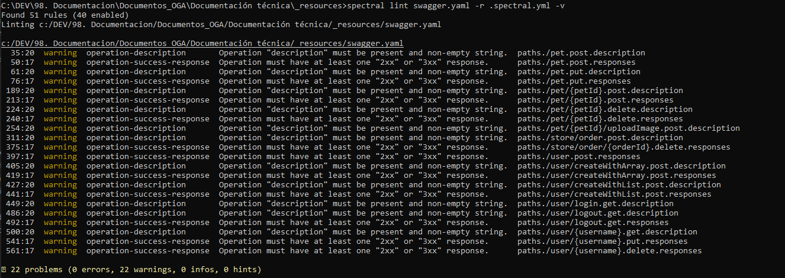

# Guía de uso de validación de la especificación API con Spectral

En este documento se detalle los pasos a realizar para realizar la validación de spectral sobre las especificaciones API. Para implmentar estas validaciones  se ha creado un conjunto de reglas obligatorias que se deberán incluir cuando se cree una nueva especificación de API ó modificar una existente.

Existen dos posibilidaes para realizar esta valididación:
- **Integrado con Stoplight Studio**.- Esta es la forma más sencilla y fácil para realizar la validación de las reglas. Cuando empezamos a desarrollar las especificación OpenAPI se irán aplicando de forma automática las reglas definidas.


- **Visual Studio Code**.- Mismo funcionamiento que en el anterior caso, para ello deberemos bajar las extensión de spectral. Una vez bajada, se configurará para que se validen los ficheros de tipo JSON/YAML y se indicará cuando se requiere que se pase dicha validación. 


- **Standalone**.- Esta forma se debería utilizar solo cuando se desees integrar Spectral en alguna pipeline o ejecución automática.

  **Línea de comando**: Para trabajar en este modo antes de empezar deberemos verificar que se tiene descargado e instalado NodeJS con el paquete necesesario de [Spectral](https://www.npmjs.com/package/@stoplight/spectral).

  Ejecutar el siguiente comando:
  ```sh
  spectral lint reference/pets.yaml -r .spectral.yml -v
  ```
  **Parámetros**
  - r : Parámetro para adjuntar los archivos de reglas, puede existes N archivos de reglas.
  - v : Parámetro para activar modo verbose.



## Reglas definidas
El detalle del nombre de cada regla y el objetivo de cumplimiento es el siguiente:

|Regla   | Descripción | Severidad  | OAS 3  |
|--------|-------------|------------|--------|
|info-title| La API debe tener un titulo informado.| ERROR      | X       | X      |  
|info-description| La API tiene que tener una descripción funcional.| ERROR      | X       | X      |

## Referencias
- [Git Spectral](https://meta.stoplight.io/docs/spectral/README.md)