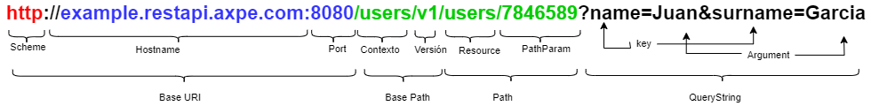

# **Guía de diseño REST**

|**Versión**|**Fecha**|**Autor**|**Comentarios**|
| :- | :- | :- | :- |
|**1.0**|09/02/2023|Axpe|Versión inicial|
|**1.1**|23/02/2023|Axpe|<p>Se han añadido los puntos de diseño y estándares.</p>|
|**1.2**|15/03/2023|Axpe|<p>Se han añadido los puntos de filtros complejos y ectensos, gestión de errores y glosario.</p>|
|**1.3**|21/04/2023|Axpe|<p>Se ha corregido el punto del discriminador, y a mayores se ha añadido más información en algunos apartados del punto 3. </p>|
|**1.4**|28/07/2023|Axpe|<p>Corrección de diferentes errores (paginación, tabla de codigos de estado, apartado de ejemplos) </p>|


# Índice

[**Guía de diseño REST**](#guía-de-diseño-rest)
- [Índice](#índice)
- [1. Introducción](#1-introducción)
  - [1.1. ¿Qué es una API?](#11-qué-es-una-api)
- [2. Destinatarios](#2-destinatarios)
- [3. Pautas generales](#3-pautas-generales)
  - [3.1. Estructura del documento](#31-estructura-del-documento)
  - [3.2. Especificación](#32-especificación)
  - [3.3. Idioma](#33-idioma)
  - [3.4. Ejemplos](#34-ejemplos)
  - [3.5. Extensión de Atributos](#35-extensión-de-atributos)
  - [3.6. Estructura Objetos definidos](#36-estructura-objetos-definidos)
  - [3.7. Versionado](#37-versionado)
- [4. Diseño](#4-diseño)
  - [4.1. Diseño URIs](#41-diseño-uris)
  - [4.2. Partes URL](#42-partes-url)
  - [4.3. Modelado de recursos](#43-modelado-de-recursos)
  - [4.4. Path Params](#44-path-params)
    - [4.4.1. Buenas prácticas](#441-buenas-prácticas)
  - [4.5. Query Params](#45-query-params)
    - [4.5.1 Buenas prácticas](#451-buenas-prácticas)
  - [4.6. Nomenclatura](#46-nomenclatura)
    - [4.6.1. Formatos](#461-formatos)
    - [4.6.2. Estructura del cuerpo del mensaje](#462-estructura-del-cuerpo-del-mensaje)
    - [4.6.3. Atributos](#463-atributos)
  - [4.7. Cabeceras](#47-cabeceras)
  - [4.8. Métodos HTTP](#48-métodos-http)
    - [4.8.1. Idempotencia y método seguro](#481-idempotencia-y-método-seguro)
    - [4.8.2. Arquetipos REST](#482-arquetipos-rest)
    - [4.8.3. GET](#483-get)
    - [4.8.4. POST](#484-post)
    - [4.8.5. PUT](#485-put)
    - [4.8.6. PATCH](#486-patch)
    - [4.8.7. DELETE](#487-delete)
    - [4.8.8. OPTIONS](#488-options)
    - [4.8.9. HEAD](#489-head)
    - [4.8.10. Resumen operaciones HTTP](#4810-resumen-operaciones-http)
  - [4.9. Códigos de estado HTTP](#49-códigos-de-estado-http)
  - [4.10. Filtros](#410-filtros)
    - [4.10.1. Filtros simples](#4101-filtros-simples)
    - [4.10.2. Filtros complejos](#4102-filtros-complejos)
    - [4.10.3. Filtros extensos](#4103-filtros-extensos)
  - [4.11. Paginación](#411-paginación)
    - [4.11.1. Paginación offset-limit](#4111-paginación-offset-limit)
      - [*Condiciones de uso*](#condiciones-de-uso)
    - [4.11.2. Paginación por cursor](#4112-paginación-por-cursor)
      - [*Condiciones de uso*](#condiciones-de-uso-1)
  - [4.12. Ordenación](#412-ordenación)
    - [4.12.1. Cuándo y condiciones de uso](#4121-cuándo-y-condiciones-de-uso)
  - [4.13. Obtención de recursos](#413-obtención-de-recursos)
    - [4.13.1. Recursos parciales](#4131-recursos-parciales)
    - [4.13.2. Obtención de recursos extendidos](#4132-obtención-de-recursos-extendidos)
  - [4.14. Mime-types](#414-mime-types)
  - [4.15. Herencia y polimorfismo](#415-herencia-y-polimorfismo)
    - [4.15.1. Composición del modelo](#4151-composición-del-modelo)
    - [4.15.2. Polimorfimos](#4152-polimorfimos)
    - [4.15.3. Discriminador](#4153-discriminador)
- [5. Gestión de Errores API](#5-gestión-de-errores-api)
- [6. Seguridad](#6-seguridad)
  - [6.1. Principios de Seguridad](#61-principios-de-seguridad)
  - [6.2. Políticas](#62-políticas)
  - [6.3. Buenas prácticas](#63-buenas-prácticas)
- [7. Modelo de datos](#7-modelo-de-datos)
- [8. Estándares](#8-estándares)
- [9. Glosario](#9-glosario)

[5. Gestión de Errores API](#gestion-de-errores-api)

[6. Seguridad](#seguridad)
- [6.1. Principios de Seguridad](#principios-de-seguridad)
- [6.2. Políticas](#politicas)
- [6.3. Buenas prácticas](#buenas-practicas-2)

[7. Modelo de datos](#modelo-de-datos)

[8. Estándares](#estandares)

[9. Glosario](#glosario)


<div style="page-break-after: always;"></div>

# 1. Introducción
El presente documento tiene como objetivo establecer una serie de buenas prácticas en torno al diseño de las APIs dentro de AXPE. Su objetivo es homogeneizar y estandarizar su estructura para:

- Facilitar el consumo tanto por equipos internos como por proveedores externos.
- Simplificar la toma de decisiones en torno al diseño.
- Acelerar los proyectos de los diferentes equipos de AXPE al hablar un lenguaje común.

## 1.1. ¿Qué es una API?
Una API es una interfaz expuesta por un sistema para establecer una forma técnica y funcional de interacción con múltiples sistemas. Es un contrato y una vía de acceso que permite la interoperabilidad entre sistemas. Cumpliendo las siguientes características:

- Toda API debe tener expuesta una versión mock. Se trata de una versión de la API que se comporta como la real, pero carece de muchas características funcionales y no-funcionales, limitándose a responder con un conjunto de datos estáticos que simulan el comportamiento de la API real.
- Debe ser definida como un servicio REST, siempre que sea posible.
- Las APIs deben tener una correcta visualización (API Portal)
- Deben estar correctamente versionadas.
- El consumo de esta debe estar manejado mediante permisos de las aplicaciones, planes de consumo y visibilidad de la misma.
- Debe estar definida utilizando un estándar: OpenApi 3.
- La definición debe estar desacoplada de la implementación.
- Diseño e implementación deben estar en inglés.
- Documentación de la API debe estar en inglés.
- Debe estar bien documentada y debe poderse consumir en base a su documentación.

<div style="page-break-after: always;"></div>

# 2. Destinatarios
Equipos que contengan perfiles técnicos y funcionales, con conocimientos a la hora de definir y diseñar especificaciones APIs, que hagan uso de una alguna plataforma API Management, como, por ejemplo: Google APIGEE, Mulesoft Platform, Azure API Mangement, Broadcom Layer7, etc.

<div style="page-break-after: always;"></div>

# 3. Pautas generales
## 3.1. Estructura del documento
Un documento de OpenAPI puede estar formado por un solo documento o dividirse en varias partes conectadas a discreción del autor. En este último caso, se utilizan palabras clave Reference Objects y .Schema Object $ref

Se recomienda que el documento raíz de OpenAPI se llame: API\_NombreServicio\_Versión.yaml.
## 3.2. Especificación
La especificación de una API indica un conjunto de prácticas, protocolos de comunicación y estructuras que definirán el contrato. Debido a que es un estándar, nos basaremos en la especificación OpenAPI. La versión de OpenAPI debe ser la misma para todos las APIs (actualmente existen dos versiones: 2.0 o 3.0).
El fichero debe tener la siguiente estructura general:
```yaml
  openapi: 3.0.1
info:
  title: BankAccounts Management
  version: 0.0.3
  description: 'This API allows you to get the information about the Bank Accounts.'
  contact:
    name: Alvaro Sanchez
    email: asanchez@correo.com
externalDocs:
  url: ...
  description: External documentation.
servers:
...
 tags:
  - name: BankAccounts
    description: ...
...
paths: 
...
components:
…
```
**Recomendación:** 
-	El nombre de los tags coincida con alguno de los path que se vayan a definir, además de que cada tag definido sea único.
-	A nivel de operación se recomienda poner una descripción.
- El operationId es recomendable que coincida con los endpoint definidos.

## 3.3. Idioma
Se establece el **inglés** como idioma para especificar las funcionalidades de nuestras APIs, es decir, para todas las URL, objetos, atributos y documentación asociada a los mismos (descripciones, ejemplos, etc.).

**No recomendado:**

```yaml
  '401':
    description: Recurso no autorizado
    content:
      application/json;charset=UTF-8:
        schema:
          $ref: '#/components/schemas/ResponseUnauthorized'
  '403':
    description: Recurso Prohibido
    content:
      application/json;charset=UTF-8:
        schema:
          $ref: '#/components/schemas/ResponseForbidden'
  '404':
    description: Recurso no encontrado
    content:
      application/json;charset=UTF-8:
        schema:
          $ref: '#/components/schemas/ErrorResponse'
```

**Recomendado:**

```yaml
  '400':
    description: Bad Request.
    headers:
      X-Request-ID:
        $ref: '#/components/headers/XRequestIdHeader'
    content:
      application/json:
        schema:
          $ref: '#/components/schemas/ErrorMessage'
        example:
          message:
            - code: BAD\_REQUEST
              message: Bad request.
              type: ERROR
              description: Wrong selected parameters or functional error has occured.
  '404':
    description: Not Found.
    content:
      application/json:
        schema:
          $ref: '#/components/schemas/ErrorMessage'
        example:
          messages:
            - code: resourcesNotFound
              type: ERROR
              message: Resources requested were not found.
              description: The employee with given id was not found.
  '500':
    description: Internal Server Error.
    headers:
      X-Request-ID:
        $ref: '#/components/headers/XRequestIdHeader'
    content:
      application/json:
        schema:
          $ref: '#/components/schemas/ErrorMessage'
        example:
          message:
            - code: INTERNAL\_SERVER\_ERROR
              message: Internal Server Error.
              type: ERROR
              description: An unexpected error was produced in the server.
```

## 3.4. Ejemplos
En la especificación de la API, se recomienda identificar ejemplos en la request y la response de cada operación y siempre a este nivel, ya que, de esta forma, cualquiera de los atributos implicados, si se modificase o eliminara, sólo habría que actualizar a este nivel los ejemplos. Y no haría falta acordarse de los ejemplos de cada objeto referenciado.

Por tanto, a nivel de especificación completa, no se recomienda identificar ejemplos a nivel de objeto completo, definido en la sección de "schemas". Ni a nivel de cada atributo que compone cada uno de los “schemas”. En caso de tratarse de un campo, en el que el ejemplo ayuda a entenderlo mejor, éste se deberá reflejar en la propia descripción del atributo. 

**NOTA:** Dichos ejemplos no deben contener información sensible de un caso real.

**Recomendado:**

```yaml
  paths:
    '/accounts/{accountId}':
      parameters:
        - $ref: '#/components/headers/XRequestID'
        - $ref: '#/components/parameters/AccountIdPathParam'
      get:
        tags:
          - Account
        description: Retrieve account information by id
        operationId: getAccountsAccountId
        responses:
          '200':
            description: OK
            schema:
              $ref: '#/components/schemas/AccountResponse'
            examples:
              account-response:
                data:
                  accountId: a0001
                  participants:
                    - customerId: usr0001
                      name: John
                      surname: Doe
                      identification:
                        value: 31820431T
                        type: NIF
                  balance:
                    amount: 15.45
                    currency: EUR
                  iban: ES7921000813610123456789
          '400':
            $ref: '#/components/responses/BadRequest'
          '401':
            $ref: '#/components/responses/Unauthorized'
          '403':
            $ref: '#/components/responses/Forbidden'
          '404':
            $ref: '#/components/responses/NotFound'
          '500':
            $ref: '#/components/responses/InternalServerError'
```

**Recomendado:**

```yaml
  properties:
    amount:
      type: number
      description: Transaction amount. Example of value 15.45.
      format: float
```

**No recomendado:**

```yaml
  components:
    schemas:
      Balance:
        title: Balance
        type: object
        description: Transaction amount.
        properties:
          amount:
            type: number
            description: Transaction amount.
            format: float
          currency:
            type: string
            description: String based on ISO 4217 to specify the transaction currency.
        required:
          - amount
          - currency
        x-examples:
          example-balance:
            amount: 15.45
            currency: EUR
```

**No recomendado:**

```yaml
  properties:
    amount:
      type: number
      description: Transaction amount.
      format: float
      example: 15.45
```

En cuanto a los ejemplos que se realizan para los errores, la forma de representarlos en la especificación será definiendo los ejemplos en el componente de “Examples”, y haciendo referencia a ellos desde la definición de dicho error.

**Recomendado:**

```yaml
  responses:
    '404':
      description: Not Found.
      headers:
        X-Request-ID:
          $ref: '#/components/headers/XRequestIdHeader'
      content:
        application/json:
          schema:
            $ref: '#/components/schemas/Errors'
          examples:
            err404Example:
              $ref: '#/components/examples/example-error404'
  ...
  examples:
    example-error404:
      value:
        errors:
          - code: NOT\_FOUND
            type: FATAL
            message: Not Found
            description: Resource not found.
```

##  3.5. Extensión de Atributos
Normalmente la estructura de la especificación ya está definida y es suficiente para la mayoría de los casos de uso, pero se puede añadir información adicional para casos específicos en los que sea necesario. En caso de que quiera extenderse, los atributos empezarán con el prefijo "X-".

**Ejemplo:** X-Api-Key
## 3.6. Estructura Objetos definidos
Así mismo, es necesario definir el atributo **title** para cada uno de los objetos definidos en la especificación, con el objetivo de que las herramientas de validación puedan reconocer dicho objeto, de manera que el título debe ser igual al objeto.

A continuación, se muestra la definición correcta de un objeto.

```yaml
  Balance:
    title: Balance
    type: object
    description: Transaction amount.
    properties:
      amount:
        type: number
        description: Transaction amount.
        format: float
      currency:
        type: string
        description: String based on ISO 4217 to specify the transaction currency.
    required:
      - amount
      - currency
```

Además, la herramienta de validación deberá revisar que exista una descripción y un summary.
Según el tipo de objecto definido, serán necesarios ciertos atributos: 
- **Headers**:
    - Deben llevar description. 
    - Deben tener un campo type.
    - Deben seguir una nomenclatura lowecase o kebab-case.
    - Deben tener ejemplos.

  ``` yaml
  XRequestIdHeader:
      description: Request ID.
      schema:
        type: string
        pattern: '^[0-9a-fA-F]{8}\-[0-9a-fA-F]{4}\-[0-9a-fA-F]{4}\-[0-9a-fA-F]{4}\-[0-9a-fA-F]{12}$'
        format: uuid
        minLength: 1
        maxLength: 40
        example: 54b9c11c-9162-45a1-a352-0d95734cd079
  ```

-	**Request Bodies**:
    - Deben tener ejemplos.
    - Deben incluir el campo description.
    - Deben ser requeridos 

  ```yaml
  ResourceBody:
      required: true
      content:
        application/json:
          schema:
            Resource:
              title: Resource
              type: object
              description: Object that encapsulates the resource.
              properties:
                atributeString:
                  type: string
                  description: Attribute description.
                  minLength: 1
                  maxLength: 200
                atributeLong:
                  type: integer
                  format: int64
                  minimum: 1
                  maximum: 999999
                  description: Attribute description.
                examples:
                  exampleReservationBody:
                    ...

  ```
-	**Parameters**:
    - Deben tener un campo type.
    - Deben incluir el campo description.
    - Deben estar referenciados.
```yaml
Limit:
  name: limit
  description: 'Number of records returned per page. If specified on entry, this will be the value of the query, otherwise it will be the 	value set by default.'
  in: query
  required: false
  schema:
    type: integer
    minimum: 1
    maximum: 100
    default: 10
```
-	**Responses**:
    - Deben tener ejemplos.
    - Deben incluir el campo description.
    - Deben estar referenciados.

```yaml

200GetDetail:
      description: OK.
      headers:
        X-Request-ID:
          $ref: '#/components/headers/XRequestIdHeader'
      content:
          application/json:
            schema:
              $ref: '#/components/schemas/ResourceData'
            examples:
              example-getResources:
                value:
                  data:
                    resourceId: 1
                    atributeString: RETAIL_BANKING
                    atributeDate: '2021-04-25T20:21:46.37'
```
**Recomendación**
- Los objetos y arrays deben tener la misma estructura de información y restricciones, independientemente del método HTTP utilizado.
- Si un atributo existe en el GET de una colección, también debe aparecer en el GET de un documento, y contener la misma información y estructura.

## 3.7. Versionado
**¿Por qué la necesidad de un versionado?**

En la mayoría de las ocasiones, excepto en pocos casos y muy simples, una API tiende a evolucionar a medida que cambian las necesidades de negocio. Por ejemplo, se agregarán nuevas funcionalidades u operaciones sobre un recurso, o se modificarán las existentes. La composición de los recursos también puede cambiar y la estructura del contenido en los recursos puede ser modificada.

La actualización de una API para gestionar requisitos nuevos o diferentes es un proceso relativamente fácil. El problema se centra en que, aunque el desarrollador que diseña e implementa una API tiene control total de los recursos que se exponen, no tiene el mismo control en las aplicaciones consumidoras que pueden ser creadas por organizaciones de terceros.

Por tanto, el objetivo es permitir que las aplicaciones existentes sigan funcionando, y las nuevas aplicaciones aprovechen las nuevas características y recursos sin alterar el consumo de las aplicaciones previamente a los cambios.

En el documento de versionado se detallan las mejores prácticas para el versionado de los servicios y muestra algunas consideraciones claves en el diseño, desarrollo, actualización y mejora de los servicios para facilitar la evolución compatible y además resalta algunos enfoques para realizar el versionado de los mismos, para apoyar y hacer esta evolución y su complejidad más manejable.

<div style="page-break-after: always;"></div>

# 4. Diseño
## 4.1. Diseño URIs
Las API REST utilizan identificadores de recursos uniformes (URI) para abordar los recursos. Es decir, las URIs son secuencias de caracteres que identifican unívocamente a un recurso. Los diseños de URIs realizados adecuadamente facilitan el entendimiento de la funcionalidad del recurso de la API, tal como:

**http://api.axpe.es/customers/{customerId}/accounts/{accountId}/credit-cards**

Un recurso diseñado incorrectamente, complicaría y sería muy difícil entender su objetivo, como:

**http://api.axpe.es/68dd0-a9d3-11e0-9f1c-0800200c9a66**
## 4.2. Partes URL
Las normativas presentadas en esta sección pertenecen al formato estándar de una URI. [RFC 6570](https://datatracker.ietf.org/doc/html/rfc6570) define la sintaxis URI genérica como se muestra a continuación:

Esquema:

<pre>
  URI = scheme ": //" BaseURI "/" BasePath "/" Path [ "?" query ] [ "#" fragment ]
</pre>

Ejemplos de endpoint con el estándar URI:

<div align="center">  </div>


<div align="center">  </div>

- **BaseURI**: Formado por el hostname y el puerto.
  - **Scheme**: El esquema identifica el protocolo a usar para acceder a los recursos. Puede ser HTTP (sin SSL) o HTTPS (con SSL).
  - **Hostname**: Contiene el nombre del servidor.
  - **Puerto**: Si no se informa se utilizará el por defecto para HTTP (80) y HTTPS (443).

- **BasePath**: Prefijo de la URL para todos los paths relativos a la raíz del host. Formado por un contexto y por la versión (Major Version) de la API.
  - **Recurso**: Nombre del recurso o recursos sobre el que se está operando. En caso de ser nombre compuesto, el formato será **kebab-case** y el plural no lo llevará nunca el primer sustantivo sino los siguientes a este ya que el primer sustantivo será complementario a los siguientes. Además, el nombre de este recurso ha de ser único, no puede coincidir con ningún otro ya que provoca un error en tiempo de despliegue. 

  Ejemplo: /customer-accounts, /customer-comissions, /payroll-accounts, /national-market

- **Contexto:** En la jerarquía lógica de los recursos, este sería el recurso padre.
- **Major Version / Versión**: Llevará siempre la letra v en minúscula y a continuación un numérico, no decimal.

- **Path**: Formado por el Resource (recurso hijo) y por el PathParam.
  - **Resource:** Es un recurso hijo, relacionado directamente con un recurso padre.
  - **PathParam:** Es la ruta que identifica el recurso especifico en el host el cual el cliente consumidor quiere acceder, separando la estructura jerárquica de recursos con una barra (“/”).

- **QueryString**: Es un componente opcional, se incluye a continuación del path y posee una estructura no jerárquica. Para identificar este elemento se utiliza el signo de interrogación (“?”). Proporciona una cadena de información que el recurso puede usar para algún propósito. Por ejemplo, parámetros de búsqueda o datos a ser procesados.

La query suele ser una cadena de pares de clave-valor(“key=argument”)separados uno del otro por un ampersand (“&”).

Respecto a la URL específica para cada tipo y nivel de API tendríamos la siguiente estructura común:

> https://{DNS}/{API\_NAME}/v1/{RECURSO}

**Nota:** Revisar la Catalogación de las APIs para ver cómo debe ser la nomenclatura de estas.
## 4.3. Modelado de recursos
Un recurso es la entidad de información lógica o cualquier entidad web que puede ser referenciada mediante URI, utilizando una interfaz uniforme. Es la entidad sobre la que actuamos. Normalmente se identifica con una entidad de negocio.

El modelado de recursos es un ejercicio que establece los conceptos claves de la API. Este proceso es similar al modelado de datos para un esquema de base de datos relacional, o el modelado de un sistema orientado a objetos.

En una URI, los recursos se encuentran dentro del BasePath y del Path (como se ha visto anteriormente). Cada segmento del Path y del BasePath que se encuentra separado por una barra inclinada ("/"), corresponde a un único recurso dentro del modelo de jerarquía (exceptuando la Major Version en el caso del Base Path, que NO es un recurso). Por ejemplo, el Contexto es un recurso, y el Resource también es un recurso. Por ejemplo, en este diseño de URI:

Ejemplo: 

> http://api.axpe.com/comissions/{comissionId}/customers/{customerId}

Indica que cada una de estas URIs debería también identificar un recurso accesible.

>http://api.axpe.com/comissions/{comissionId}/customers/{customerId}

>http://api.axpe.com/comissions/{comissionId}

>http://api.axpe.com/customers

>http://api.axpe.es

En estas URIs, "comissions" y "customers" son recursos de tipo Collection; "comissionId" y "customerId" también son recursos, aunque de diferente tipo. Se explicarán los tipos de recursos en el apartado de *Arquetipos REST*.

- Los nombres de los recursos deben estar alineados con los nombres utilizados por negocio para los mismos. Utilizando como base la [ISO 20022](https://www.iso20022.org/standardsrepository).
- Los identificadores de los recursos son únicos para cada recurso.
- Los nombres de los recursos pueden tener varios niveles. Estas agrupaciones se deben asociar con cuidado, intentando no tener más de 2 o 3 niveles, y agrupando solo las relaciones de recursos “fuertes”. 

**Incorrecto:**  
>/customers/1244/addresses/123/country/5/city/555/population/5568 

**Correcto:**  
>/customers/1244/addresses 

- Los recursos deben ser nombres, no verbos. Los recursos son entidades sobre las que actuamos, la acción ya viene definida por el verbo HTTP utilizado.
- Se debe utilizar siempre un sustantivo plural para recopilar y almacenar nombres de recursos.

**Incorrecto:**  
>/customers/v1/get-customers 

**Correcto:**  
>/customers/v1/customers

- No utilizar mayúsculas, las url son case sensitive.
- Utilizar, preferiblemente, kebab-case.

Ejemplo: 
>https://api.axpe.com/my-profile/v1/customers

- No mencionar a herramientas o referencias tecnológicas como bases de datos o plataformas a la hora de nombrar el recurso.

**Incorrecto:** 

  >/customers/v1/customers-db

  >/customers/v1/customers-mongo-db

- Intentar nombrar los recursos con nombres concretos, explicativos y cortos. Por ejemplo, un número de cuenta podría ser “/accountNumber” en vez de “/number”. Esto hará que sean más fácil de recordar y utilizar por el usuario.
- No se debe terminar un recurso con "/". Si se hace esto tendríamos definido lo siguiente:

**Incorrecto:**  
>/customers/{customersId}/ 

- Las extensiones de los archivos no deben estar presentes en la URI.
- Al hacer una petición sobre el recurso /customers/{customersId}/addresses también cumpliríamos el patrón del recurso superior y se ejecutarán ambos.

**Incorrecto:**  
>/v1/customers-accounts.json

- Cuando sea necesario el versionado de la API, el número de versión debe incluirse en la URI como prefijo. Una API se versiona sólo cuando el cambio no es compatible hacia atrás.
- El versionado basado en URL se utiliza para simplificar el uso de los consumidores de API, en comparación con los enfoques más complejos basados en campos de cabecera.
- En general, un número de versión que sigue el concepto de versión semántica tiene la estructura: **vMajor** 

Plantilla de URI: 
>/v{Major}/ 

Ejemplo: 
<pre>
  POST /v1/accounts/current-accounts/3455/account
</pre>

- La misma operación utilizando la versión 2 de la API 

Ejemplo: POST /v2/accounts/current-accounts/3455/account 
## 4.4. Path Params
Un path param es un identificador único del recurso. Por ejemplo: /customers/{customerId}

Pueden ponerse varios path param en caso de existir una ruta lógica de recursos dependientes entre sí:  /customers/{customerId}/documents/{documentId}
### 4.4.1. Buenas prácticas
- No pueden concatenarse los path params. Un path param debe ir precedido del recurso que representa. Si hiciésemos esto la URL quedaría incomprensible:

  >/customers/{customerId}/{documentId}  

  >/customers/13225365/647658

- El atributo debe ser identificativo en sí mismo, no es suficiente con un "{id}"

  >/customers/{id}

La razón es que, si este recurso se “amplía” en el futuro e incluye otros identificadores, no sabríamos a cuál de las entidades se refiere el parámetro {id}. Por ejemplo: 

**Incorrecto:**  
>/customers/{id}/documents/{documentId} 

**Correcto:**  
>/customers/{customerId}/documents/{documentId}

- Se aconseja que el identificador tenga una morfología similar en todos los endpoints. Por ejemplo, “xxxxId”, siendo xxx el nombre de la entidad a la que referencia:


  >/customers/{customerId}  

  >/accounts/{accountId}   

  >/payments/{paymentId}    

  >/customers/{customerId}/payments/{paymentsId}

- Hay que tener cuidado con no crear ambigüedades en las URI a la hora de definir paths. Por ejemplo, si la entidad "customers" puede identificarse por dos identificadores únicos y crearemos dos URI

  >/customers/{customerId}   

  >/customers/{nif}

al invocar a nuestra API se elegiría una de las opciones y no podríamos distinguir cual se ha elegido.
## 4.5. Query Params
Los Query Params son una forma de enviar datos adicionales a través de una URL para personalizar y filtrar los resultados de una solicitud, son ampliamente utilizados para solicitar información especifica y realizar operaciones avanzadas en los recursos disponibles.
Los query param son atributos que se utilizan para filtrar, ordenar y paginar. Se preceden de "?" y se pueden concatenar con "&".

    /customers?name=Jose&surname=López

### 4.5.1 Buenas prácticas
**Obligatoriedad**

- En general suelen ser atributos opcionales, aunque en ocasiones pueden ser obligatorios.
- Relacionado con la obligatoriedad de los atributos, a veces se necesita que al menos uno o varios parámetros de búsqueda sean obligatorios por una cuestión de eficiencia de la consulta o por el tipo de consulta en sí. En este caso se indicará en la descripción del propio método GET y se controlará que esos datos se envían. Si no se cumple, habrá que devolver un error 400 desde el backend.

**Estilo**

- En notación **camelCase**.
- Incluir una descripción que indique el significado del parámetro.
- Incluir un ejemplo que indique un valor real que podría utilizarse.
- Cada parámetro debe estar escrito igual que el objeto del modelo buscado. Ejemplos:

**Petición**:

Ejemplo: 
<pre>
  GET /customers?name=antonio&surname=martin&birthDate=1987-11-17
</pre>

**Código**:
```yaml
parameters:
  - name: name
    description: Field to filter employees by their name.
    in: query
    schema:
      type: string
      maxLength: 30
    required: false
  - name: surname
    description: Field to filter employees by their surname.
    in: query
    schema:
      type: string
      maxLength: 30
    required: false
  - name: birthDate
    description: Field to filter employees by their birthDate.
    in: query
    schema:
      type: string
      format: date
      maxLength: 30
    required: false
```

**Respuesta**:

```json
  {
    "data": [
      {
        "id": "1234",
        "name": "Antonio",
        "surname": "Martin",
        "birthDate": "1987-11-17"
      }
    ]
  }
```

**Tipos de datos** 

- Es recomendable que los parámetros tengan el tipo más específico posible. Por ejemplo, usar enumerados cuando sea posible, o **format=date** en caso de fechas.

**Limitadores**

- Cuidado con los tipos **string**. Ponerlos obligatorios no implica que no puedan enviarse como una cadena vacía. Poner un **minLength: 1** cuando son obligatorios, significa que no pueden incluirse vacíos.
- También se debe especificar un **maxLength** si lo tiene el modelo que consumimos para ser más restrictivos. 

```yaml
  schema:
    type: string
    minLength: 1
    maxLength: 20
```

- Si un atributo **string** es obligatorio no tiene sentido poner un **minLength: 0**.
- Si un número no puede ser negativo incluir un minimum: 0. 

Ejemplo:  

```yaml
  in: query
  name: age
  description: Customers age.
  required: false
  schema:
    type: integer
    format: int32
    minimum: 0
    example: 18
```

**Valores por defecto**

- Si tenemos un comportamiento en que un valor es obligatorio (por ejemplo, un paginado), podemos hacer que el atributo sea opcional y tener un valor por defecto establecido. De esta forma, se aligera el API y se hace “obligatorio” dicho campo.

```yaml
  in: query
  name: limit
  description: The number of items to return.
  required: false
  schema:
    type: integer
    minimum: 1
    maximum: 100
    default: 20
```

- Un query param con un valor default no tiene sentido que sea required: true.


|QueryString|Description|
| - | - |
|fields|Permite seleccionar los campos que se desean recuperar del recurso. Campos separados por el carácter  ‘,’. https://api.axpe.com/v1/namespace/resource/{resourceId}?fields=field1,field2|
|expand|Este campo permite al usuario solicitar información sobre las sub-entidades que desea expandir separadas por el carácter ‘,’. https://api.axpe.com/v1/namespace/resource/{resourceId}?expand=sub-entity1|
|isDescription|Estos parámetros deben ser opcionales, debe reportarse como booleanos. El campo se utilizará cuando la operación deba devolver los datos como códigos en lugar de  descripciones traducidas.|
|sort|<p>Permite ordenar los resultados obtenidos, ascendente “+” o descendente “-” por los criterios definidos por API Designer. </p><p>Ejemplo: GET  /customers/{customerId}?sort=+lastName. Los campos estarán separados por el carácter “,”.</p><p>**NOTA:**  Por motivos de complejidad, solo es válido para entidades.</p>|
|<atribute>|<p>En algunos casos los identificadores del URI pueden tener múltiples valores, se agrega un parámetro a QueryString con el nombre del campo del identificador que informa el tipo de datos que se utilizará.</p><p>https://api.axpe.com/v1/namespace/resource/{resourceId}?resourceType=value</p>|
|query|<p>Son aquellos casos en los que se desea permitir un número elevado de campos <attribute>, este permitimos agruparlos en un único, que contendrán el json codificado en Base64 que contendrá todos.</p><p>Por ejemplo, para una petición GET: https://api.axpe.com/v1/namespace/resource/{resourceId}?resourceType1=value1&resourceType2=value2&resourceType3=value3</p><p>Se codificaría el json:</p><p>{</p><p>`  `“resource\_type1”: ”value1”</p><p>`  `“resource\_type2”: ”value2”</p><p>`  `“resource\_type3”: ”value3”</p><p>}</p><p>wogICDigJxyZXNvdXJjZV90eXBlMeKAnTog4oCcdmFsdWUx4oCdLAogIOKAnHJlc291cmNlX3R5cGUy4oCdOiDigJx2YWx1ZTLigJ0sCiAg4oCccmVzb3VyY2VfdHlwZTPigJ06IOKAnHZhbHVlM+KAnQp9Cg</p><p></p><p>Pudiendo hacer la llamada GET:</p><p>https://api.axpe.com/v1/namespace/resource/{resourceId}?query= wogICDigJxyZXNvdXJjZV90eXBlMeKAnTog4oCcdmFsdWUx4oCdLAogIOKAnHJlc291cmNlX3R5cGUy4oCdOiDigJx2YWx1ZTLigJ0sCiAg4oCccmVzb3VyY2VfdHlwZTPigJ06IOKAnHZhbHVlM+KAnQp9Cg</p><p>Existirán casos en lo que seguir este esquema pueda violar los límites en cuanto a longitud de URL, consultar con el Área de Arquitectura para acometer el problema con otras técnicas.</p>|
|format|<p>Permite informar el formato de la respuesta de la API, Solo debe ser utilizado para HATEOAS. Permite informar el formato de la respuesta de la API. </p><p>NOTA: Ver más detalles en la sección "Diseño de encabezado HTTP". Ejemplo: GET /clientes?format=pdf </p>|

Ejemplo:  

```yaml
  name: fields
  description: Atribute used to retrieve filtered requests.
  in: query
  required: false
  schema:
    type: string
    maxLength: 32
```


## 4.6. Nomenclatura
Otro de los aspectos a establecer dentro de la nomenclatura de las APIs es el nombre y formato de los campos de entrada y salida de las peticiones HTTP.
### 4.6.1. Formatos
- Todas las menciones de JSON son una referencia al formato [JSON](https://datatracker.ietf.org/doc/html/rfc7159).
- Las cadenas de formato de fecha (sólo fecha, fecha y hora y timestamp) deben cumplimentar el estándar ISO 8601 tal como se indica en la [RFC 3339](https://datatracker.ietf.org/doc/html/rfc3339).
- Los campos que hagan referencias a código de tipo moneda se expresan como indica el estándar (3 dígitos), [ISO-4217](https://es.wikipedia.org/wiki/ISO_4217) -Los atributos asociados al código de país se expresaran como indica el estándar, con un código de 2 dígitos, [ISO-3166-1](https://es.wikipedia.org/wiki/ISO_3166-1#C%C3%B3digos_ISO_3166-1).
- Código de lenguajes, [ISO 639-1](https://www.iso.org/iso-639-language-codes.html)

### 4.6.2. Estructura del cuerpo del mensaje
Por defecto, se define que el formato debe ser [JSON](https://datatracker.ietf.org/doc/html/rfc7159). Aunque en algunos casos es posible que sea necesario definir otros formatos o mediaTypes según la funcionalidad del recurso.

Debe usarse un capa denotada como "data" en las salidas de los JSON:

- Pertenecen a verbos GET, pues es fácil que incluyan o puedan incluir paginación.
- Que necesiten información adicional no relacionada con el propio objeto (por ejemplo, metadatos de negocio).
- El uso de este envoltorio facilita la agrupación y estructuración de la información de respuesta y facilita la distinción la información de negocio y la de paginación.
- No debe utilizarse a la entrada de las peticiones.
- Debe ser obligatorio.

**Estructura de la petición**:      

```json
  {         
... atributos del recurso ...     
  } 
```

**Estructura de la respuesta**:    

```json
  {
    "data": {
          ... atributos del recurso ...
    },
    "pagination":{
        ... atributos paginación ...
    },
    "metadatos":{
          ... atributos metadatos ...
    }
  }
```

### 4.6.3. Atributos
- Los atributos tal y como se ha especificado en el documento deben ir en **inglés** y en notación **lowerCamelCase**.
- El nombre seleccionado debe ser lo más explícito posible, debe ser legible y auto explicativo de forma que simplemente viendo el JSON sea comprensible sin tener que recurrir a la documentación. Utilizando como base la [ISO 20022](https://www.iso20022.org/standardsrepository). 

Ejemplo: Entre number y phoneNumber, phoneNumber es mucho más explícito.

- El valor de los atributos **enumerados** también debe ser legibles y auto explicativos. Se recomienda establecer un formato único, para que sean fácilmente identificables en el JSON. Deberán ir en inglés y siempre en mayúscula. 

Ejemplo un campo status: 

- status: 0,1,2 **No** está bien definido, no se sabe a qué equivalen esos valores.
- status: OK, FAILURE, PROCESSING Sí está **bien** **definido**, los valores son legibles y no es necesario recurrir a la documentación.
- El nombre de los atributos **booleanos** debe indicar claramente a qué hace referencia, tener preguntas de sí/no como nombre, cuando su valor es true o false. Ejemplo sería: **isFinished**. Y por tanto aquellos atributos que correspondan con una respuesta ***"S"***, ***"N"***, deben modelarse como un booleano, así de esta forma el desarrollador sin ver el tipo de campo puede saber qué se trata de un tipo booleano.
- Se debe especificar y ser restrictivo lo máximo posible a la hora de definir el tipo del campo. 

Ejemplo, un atributo que representa una fecha debe ser un tipo [date](https://datatracker.ietf.org/doc/html/rfc3339).

- Los nombres de los atributos que sean identificadores únicos se acompañarán en nombre con la palabra **Id** y no code.  

**Incorrecto:**    

```json
  {
    "id": "number",
    "code": "integer"
    "codCliente": "integer"
  } 
```

**Correcto:**    

```json
  {
    "userId": "number",
    "documentId": "integer"
    "customerId": "integer"
  }
```

- Todos los campos de tipos de arrays deben ser nombrados en sustantivos y plurales, por lo tanto, los tipos de objetos deben ser nombrados en sustantivos y singulares.
- No se debe poner como sufijo en los “schemas” las palabras "DTO" o "Dto". 

**Incorrecto:**  

```yaml
  PortFolioDto:
    type: object
    additionalProperties: false
    properties:
      assetSymbolExt:
        type: string
        description: External Asset Symbol
        enum:
          - BTC
      assetSymbolaxpe:
        type: string
        description: axpe Asset Symbol
        enum:
          - BTC
```

**Correcto:** 

```yaml
  PortFolio:
    type: object
    additionalProperties: false
    properties:
      assetSymbolExt:
        type: string
        description: External asset symbol.
        enum:
          - BTC
      assetSymbolaxpe:
        type: string
        description: axpe asset symbol.
        enum:
          - BTC
```

## 4.7. Cabeceras 

|**Cabecera**|**Descripción**|
| - | - |
|Accept-Language (deseable)|El consumidor solicita la lista de idiomas por orden de preferencia.|
|Content-Language (deseable)|El servidor responde con el idioma de la respuesta|
|Authorization|Campo para enviar el token de acceso al API (OAuth, JWT)|
|If-None-Match (en caso de necesidad)|Obtiene los datos cacheados siempre que le ETag no hayan cambiado|
|If-Match (en caso de necesidad)|Utilizado para solicitudes de modificación de servicios. Permite realizar cambios solo si ningún otro cliente ha realizado ningún otro cambio durante la ejecución.|
|ETag (en caso de necesidad)|Campo utilizado en el proceso de acceso/modificación de recursos cacheados|
|Accept (deseable)|El consumidor solicita el formato de datos de la respuesta.|
|Content-Type|El servidor responde con el formato de los datos de respuesta|
|Location|El servidor devuelve tras un POST la URL del recurso recién creado.|
|X-Request-ID **\***|Identificador único de mensaje. La especificación de este UUID seguirá el formato de la norma [RFC-4122](https://www.ietf.org/rfc/rfc4122.txt)|

**\*** Para facilitar la búsqueda y filtrado de las solicitudes en los sistemas de logs, como kibana, se recomienda definir o usar un prefijo de no más de cuatro caracteres **“XXXX”** donde se indique el tipo y el significado de la petición. Además, todas las respuestas deberán informar dicho campo de cara a poder tener una trazabilidad completa de petición-respuesta.

Por ejemplo:

- Cambio o modificación en la cuenta nómina: “UPA” Update Payroll Account.
- Borrado de cuenta nómina: “DPA” Delete Payroll Account.
- Consulta de cuenta nómina: "RPA" Read Payroll Account.
- Creación de una cuenta nómina: “CPA” Create Payroll Account.

Ejemplo: RPA-732d6a23-816-4042-b2e3-ba15b7d8f490

## 4.8. Métodos HTTP
La manipulación de recursos en la arquitectura REST se realiza mediante las operaciones HTTP. La mayoría de las funcionalidades de negocio pueden caer dentro de las acciones CRUD estándar (Crear, Leer, Actualizar, Eliminar) y su mapeo a los métodos estándar y extendidos de HTTP.

Los métodos HTTP son los siguientes:

|**Método HTTP**|**Descripción**|
| - | - |
|**GET**|Recupera la representación de un recurso (único o colección).|
|**POST**|Puede crear un recurso o ejecutar una acción completa y arbitraria en un recurso.|
|**PUT**|Crea (si no existe) o edita (si existe) totalmente un recurso.|
|**DELETE**|Eliminar un recurso único o los recursos contenidos en una colección (nunca la propia colección).|
|**PATCH**|Actualización parcial de un recurso o colección de recursos.|
|**HEAD**|Recupera los meta-datos (cabeceras) asociados a un recurso, su comportamiento es similar a GET, excepto que no se devuelve ningún contenido en el body.|
|**OPTIONS**|Recupera la información sobre los métodos HTTP permitidos para un recurso.|
|**TRACE**|Utilizado para depurar.|

El uso de estos métodos debe ser consistente con la semántica, para ello se aplica la sección [4.3 de la RFC-7231](https://datatracker.ietf.org/doc/html/rfc7231#section-4.3) y la [RFC-5789](https://datatracker.ietf.org/doc/html/rfc5789).
### 4.8.1. Idempotencia y método seguro
- **Idempotencia** Un método HTTP es *idempotente* si, tras invocarlo varias veces sobre un mismo recurso, el estado de ese recurso no cambia en el servidor, aunque la respuesta del mismo sí podrá ser diferente.

Ejemplo con el método DELETE:  

Si hacemos una operación DELETE sobre un recurso: 

<pre>
  DELETE /comissions/79897987
</pre>

Se borrar la entidad indicada y nos devolverá una *respuesta 204* (Not content), indicando que se ha borrado satisfactoriamente. Si volvemos a invocar esta operación, en este caso se devolverá un *código HTTP 404*. Como podemos ver, la respuesta diferente, pero el recurso queda en el mismo estado (no existe).

**NOTA**: Todas las operaciones GET, PUT y DELETE siempre se comportarán de forma idempotente. Si existen efectos secundarios, esto nos indicara que se está gestionando una mala implementación de nuestras APIS.

Para ello se seguirá la sección [4.2.2 de la RFC-7231](https://datatracker.ietf.org/doc/html/rfc7231#section-4.2.2) donde se define el concepto de idempotencia.

- **Método seguro**

Los métodos seguros son aquellos que, en su semántica definida, principalmente los de lectura, no producen efectos o cambios sobre el recurso en el destino. En cualquier caso, se aplica la definición de *Método Seguro* de la sección [4.2.1 de la RFC-7231](https://datatracker.ietf.org/doc/html/rfc7231#section-4.2.1).

**RESUMEN**

|**Operación**|&emsp;**Uso**|&emsp;**Idempotente**|&emsp;**Seguro**|
| - | - | - | - |
|&emsp;GET|&emsp;Consulta recurso|&emsp;Si|&emsp;Si|
|&emsp;GET|&emsp;Consulta colección recursos|&emsp;Si|&emsp;Si|
|&emsp;POST|&emsp;Crear|&emsp;No|&emsp;No|
|&emsp;POST|&emsp;Operación|&emsp;No|&emsp;No|
|&emsp;PUT|&emsp;Actualizaciones completas|&emsp;Si|&emsp;No|
|&emsp;PATCH|&emsp;Actualizaciones parciales|&emsp;Si|&emsp;No|
|&emsp;DELETE|&emsp;Borrar|&emsp;Si|&emsp;No|
|&emsp;OPTIONS|&emsp;Info de método|&emsp;Si|&emsp;Si|
|&emsp;HEAD|&emsp;Info de recurso|&emsp;Si|&emsp;Si|
|&emsp;TRACE|&emsp;Depurar|&emsp;Si|&emsp;No|
### 4.8.2. Arquetipos REST
Al modelar los recursos de una API, se puede tomar como base algunos arquetipos de recursos básicos. Al igual que los patrones de diseño, los arquetipos de recursos nos ayudan a comunicar las estructuras y comportamientos que se encuentran comúnmente en los diseños de una API REST. Se componen de cuatro arquetipos de recursos distintos: **Document**, **Collection**, **Store** y **Controller**.

Para comunicar un modelo de recursos claro y limpio a los clientes, una API REST debe clasificar cada recurso con solo uno de estos arquetipos, para lograr uniformidad lo deseable es evitar diseñar recursos híbridos de más de un arquetipo. En su lugar se debe priorizar en lo posible el diseño de diferentes recursos que estén relacionados jerárquicamente.

A continuación, se describen los diferentes arquetipos:

- **Document**:

Un recurso de tipo document es un concepto similar a una instancia de objeto o registro de base de datos. La representación de estado de un documento normalmente incluye ambos campos con valores y enlaces a otros recursos relacionados. Con su campo fundamental y su estructura basada en enlaces, el tipo document es el arquetipo base de los otros arquetipos de recursos (collection, store y controller).

En otras palabras, los otros tres arquetipos de recursos pueden verse como especializaciones del arquetipo document.

Cada siguiente URI de ejemplo identifica en negrita un recurso del tipo document:
<pre>
  GET	http://api.axpe.es/customers/<b>{customerId}</b>
</pre>
<pre>
  GET	http://api.axpe.es/customers/<b>{customerId}</b>/accounts/<b>accountId</b>  
</pre>
Un recurso del tipo documento puede tener recursos hijo que representan sus conceptos subordinados específicos. Con su capacidad de reunir muchos tipos de recursos diferentes en un solo padre, un documento es un candidato lógico para ser un recurso raíz.

- **Collection**:

Un recurso de tipo Collection es un directorio (listas) de recursos administrado por el servidor. Los clientes pueden proponer nuevos recursos para ser agregados a una colección, sin embargo, depende de la colección elegir crear el nuevo recurso o no.

Un recurso de colección elige lo que quiere contener y también decide los URIs de cada recurso contenido.

Cada siguiente URI a continuación identifica negrita un recurso del tipo collection:
<pre>
  GET	http://api.axpe.es/<b>customers</b>
</pre>
<pre>
  GET http://api.axpe.es/<b>customers</b>/{customerId}/<b>accounts</b>
</pre> 
<pre>
  GET http://api.axpe.es/<b>customers</b>/{customerId}/<b>accounts</b>/{accountId}/<b>credit-cards</b>
</pre>
  

- **Store**:

Un **store** es un repositorio de recursos administrado por el cliente. Un recurso de tipo store permite a un cliente guardar recursos en una API, sacarlos de nuevo, y decidir cuándo eliminarlos. Por su cuenta, el **store** no crea nuevos recursos; por lo tanto un store nunca genera nuevas URIs.

En su lugar, cada recurso almacenado tiene una URI que fue elegido por un cliente cuando se colocó inicialmente en el **store**.

La siguiente interacción de ejemplo muestra a un usuario (con ID 1234) de cliente usando una API REST de AXPE, para insertar un recurso de tipo document llamado alonso en su store de favoritos, alonso es un recurso que ya se ha creado con anterioridad, y se añade a una lista (store en este caso) de favoritos:

<pre>
  PUT /business-Departments/1234/<b>favorites/alonso</b>
</pre>

Este otro ejemplo muestra una inserción de un tipo de pago (cash) del tipo documento en la store de tipos de pago:

<pre>
  PUT /payment-Methods/cash
</pre>

- **Controller**:

Los recursos de tipo controller son como funciones ejecutables, con parámetros y valores de retorno; entradas y salidas. 

Es una estructura organizativa que se utiliza para manejar funcionalidades complejas que no pueden ser gestionadas únicamente con las operaciones CRUD (Create, Read, Update, Delete), a través de un Controller es posible implementar acciones más avanzadas y personalizadas, como la validación de datos, autorizacion, etc.

Se utilizará el método HTTP **POST** para indicar que una nueva acción o funcionalidad se llevará a cabo.

Los controller suelen aparecer como el último segmento en una ruta URI, sin recursos hijos para seguirles en la jerarquía. El siguiente ejemplo muestra en negrita un recurso controller que permite a un cliente reenviar una alerta a un usuario:

<pre>
  POST /alertas/245743/<b>resend</b>
</pre>

Este otro ejemplo muestra a un cliente ejecutando la acción validar que existe un usuario con una Id concreta:

<pre>
  POST /customers/3378/<b>validate</b>
</pre>

### 4.8.3. GET
**Escenarios:**

Verbo asociado a la consulta, ya sea de un recurso o colección de recursos. Se identifican dos tipos de llamadas:

- Tipo Document, un único recurso:

<pre>
  GET /customers/{customerId}
</pre>

- Tipo "Collection o Store", un conjunto de recursos. Estas pueden tener asociados query parameters (filtros, que se verán con detalle en el apartado correspondiente).

<pre>
  GET /customers  
</pre>
<pre>
  GET /customers?name=Juan&surname=Castaño
</pre>

**¿Qué retorna?** 

1. Un GET de tipo document, un único recurso: devolverá un recurso específico, correspondiente al identificador deseado. 

Ejemplo de solicitud correcta:

||**Solicitud**|**Respuesta**|
| - | - | - |
|**Recurso**|GET /customers/23452345||
|**Header**||200 OK|
|**Payload**||{ <br>&nbsp;&nbsp;&nbsp;&nbsp;"data": {<br>&nbsp;&nbsp;&nbsp;&nbsp;&nbsp;&nbsp;&nbsp;&nbsp;"id": "23452345",<br>&nbsp;&nbsp;&nbsp;&nbsp;&nbsp;&nbsp;&nbsp;&nbsp;"name": "Juan",<br>&nbsp;&nbsp;&nbsp;&nbsp;&nbsp;&nbsp;&nbsp;&nbsp;"surname": "Castaño",<br>&nbsp;&nbsp;&nbsp;&nbsp;&nbsp;&nbsp;&nbsp;&nbsp;"secondSurname": "Castaño"<br>&nbsp;&nbsp;&nbsp;&nbsp;}<br>}|
||||

- Si existe el recurso, devolverá la información asociada en el payload y en la cabecera un código HTTP 200 de petición "exitosa".
- Si no existe el recurso (userId) indicado en la llamada, devolverá un 404 indicando que el objeto no fue encontrado.
- **RECOMENDACIÓN**: Se sugiere devolver solamente información de un recurso, sin metainformación, a no ser que sea esencial.

1. Un GET de un conjunto de recursos (“collection o store”) devolverá una lista de resultados. Por ejemplo:


||**Solicitud**|**Respuesta**|
| - | - | - |
|**Recurso**|GET/customers||
|**Header**||200 OK|
|**Payload**||{<br>&nbsp;&nbsp;&nbsp;&nbsp;"data": [<br>&nbsp;&nbsp;&nbsp;&nbsp;{<br>&nbsp;&nbsp;&nbsp;&nbsp;&nbsp;&nbsp;&nbsp;&nbsp;"id": "245345235234",<br>&nbsp;&nbsp;&nbsp;&nbsp;&nbsp;&nbsp;&nbsp;&nbsp;"name": "Juan",<br>&nbsp;&nbsp;&nbsp;&nbsp;&nbsp;&nbsp;&nbsp;&nbsp;"surname": "Castaño"<br>&nbsp;&nbsp;&nbsp;&nbsp;},<br>&nbsp;&nbsp;&nbsp;&nbsp;{<br>&nbsp;&nbsp;&nbsp;&nbsp;&nbsp;&nbsp;&nbsp;&nbsp;"id": "566434444460",<br>&nbsp;&nbsp;&nbsp;&nbsp;&nbsp;&nbsp;&nbsp;&nbsp;"name": "david",<br>&nbsp;&nbsp;&nbsp;&nbsp;&nbsp;&nbsp;&nbsp;&nbsp;"surname": "Perez"<br>&nbsp;&nbsp;&nbsp;&nbsp;}<br>&nbsp;]<br>} |
||||
- Si la llamada devuelve información, devolverá un código 200 y la información en un listado en el cuerpo del mensaje.
- Si la llamada no devuelve datos, con o sin filtros (query params), la búsqueda devolverá un 200, indicando un listado vacío.
- **RECOMENDACIÓN**: Se podrá devolver información adicional, como la paginación u ordenación si la consulta permitía dicha funcionalidad.

**Código de Buenas Prácticas**

Las diferentes llamadas deben enfocarse en torno a un mismo recurso, es decir, se debe fomentar la reutilización. No se debe duplicar o crear nuevos métodos para obtener información sobre misma identidad, para ello, ya se dispone los query string (filtros) para obtener la información deseada.

**Ejemplo incorrecto:** 

<pre>
  GET	/customers  
</pre>
<pre>
  GET	/customersByDepartment 
</pre>
<pre>
  GET	/customersByName
</pre>
Para distinguir las diferentes consultas utilizaremos query params:
<pre>
  GET	/customers?department=xxx&name=xxx
</pre>
### 4.8.4. POST
**Escenarios:**

Existen dos posibles situaciones para utilizar POST:

1. Para crear un recurso (document) en una colección:

<pre>
  POST /customers
</pre>

```json
  {
    "name": "Juan",
    "surname": "Castaño"
  }
```

1. Cuando se necesita representar una funcionalidad concreta que no podemos asociar a ningún método estándar CRUD (controller).

Se debe intentar evitar este tipo de invocación en la medida de lo posible, y debería reducirse a lo mínimo pensando en modificar el diseño para que se ajuste a otro tipo de recurso que no sea un controller.

Ejemplo: caso que se lanza un proceso batch que actualiza los usuarios a un nuevo estado. 

<pre>
  POST /customers/v1/promote
</pre>

Debido a su naturaleza, este tipo de acciones están sujetas a otras reglas específicas respecto a las de operaciones:

- Se identifican con un **verbo en la url** debajo de la entidad sobre la que realizan la acción.
- La documentación debe ser más completa e incluir todos los ejemplos implicados y necesarios para su cumplimiento para todos los casos que pueda abordar.

**¿Qué retorna?**

1. Creación de un nuevo recurso (**document**) en una colección. Si la creación se ha realizado con éxito:
- Código HTTP 201 (created).
- En la cabecera, se hace uso del campo Location al recurso con el id creado. De esta forma el usuario ya dispone del nuevo identificador del recurso.

  Location: /customers/2253345234523
- Y en el cuerpo (payload) irá vacío.

Ejemplo:

||**Solicitud**|**Respuesta**|
| - | - | - |
|**Recurso**|POST/customers||
|**Header**||201 Created   <br> Location /users/144444|
|**Payload**|{<br>"name": "Juan",<br>"surname": "Castaño"<br>}|

- Existe la posibilidad de devolver en el payload de respuesta el propio recurso creado. Este recurso tendrá que devolver el recurso con todos sus campos, tal como se devolvería en un GET. Se tendrá en cuenta que este objeto de salida seguramente sea diferente al utilizado en el payload de entrada, esto es debido a los atributos auto calculados o autogenerados a la hora de la creación de la nueva entidad.
- La recomendación es evitar devolver datos en el cuerpo de la invocación siempre que se pueda, simplemente devolver la **cabecera Location** con el código HTTP 201.

|             | **Solicitud** | **Respuesta**  |
| ----------- | ------------- | -------------- |
| **Recurso** | POST /users   |                |
| **Header**  |               | 201 Created<br>Location /users/1231231234123    |
| **Payload** |{ <br>&nbsp;&nbsp;&nbsp;&nbsp;"data":<br>&nbsp;&nbsp;&nbsp;&nbsp;&nbsp;&nbsp; {<br>&nbsp;&nbsp;&nbsp;&nbsp;&nbsp;&nbsp;&nbsp;&nbsp;"id": "1231231234123",<br>&nbsp;&nbsp;&nbsp;&nbsp;&nbsp;&nbsp;&nbsp;&nbsp;"name": "Juan",<br>&nbsp;&nbsp;&nbsp;&nbsp;&nbsp;&nbsp;&nbsp;&nbsp;"surname": "Castaño", <br>&nbsp;&nbsp;&nbsp;&nbsp;&nbsp;&nbsp;&nbsp;&nbsp;"status": "CREATED",<br>&nbsp;&nbsp;&nbsp;&nbsp;&nbsp;&nbsp;&nbsp;&nbsp;"timeStamp": "1653991582",<br>&nbsp;&nbsp;&nbsp;&nbsp;}<br>}|                |


1. Caso de uso de un **controller**, el comportamiento será el siguiente:
- La invocación ha sido satisfactoria se retorna: un código HTTP 200 (OK) y si fuera el caso se podrá retorna información en el cuerpo de respuesta.


||**Solicitud**|**Respuesta**|
| - | - | - |
|**Recurso**|POST /customers/cancel||
|**Header**||200 Ok|
|**Payload**|JSON de la petición|JSON de respuesta|

- Caso en que la operación se finaliza satisfactoriamente y no es necesario devolver información en el cuerpo de la llamada, entonces se retornará un código HTTP 204 (No content) y el cuerpo irá vacío.


||**Solicitud**|**Respuesta**|
| - | - | - |
|**Recurso**|POST /customers/cancel||
|**Header**||204 No content|
|**Payload**|JSON de la petición|N/A|

**Código de Buenas Prácticas**

En muchos casos a la hora de la creación de un objeto es posible que el objeto de entrada tenga menos campos que el objeto de salida.

Por ejemplo, los campos auto calculados por el sistema siempre estarán delegados y será el sistema el encargado de indicar el valor, por ejemplo, un ID o la fecha de creación de la identidad o el estado en el que se encuentra.

| **Entrada**    | **Salida**    |
| -------------- | ------------- |
| {<br>&nbsp;&nbsp;&nbsp;&nbsp;"name": "Juan",<br>&nbsp;&nbsp;&nbsp;&nbsp;"surname": "munoz"<br>} | {<br>&nbsp;&nbsp;&nbsp;&nbsp;"id": "234523452345234",<br>&nbsp;&nbsp;&nbsp;&nbsp;"name": "Juan",<br>&nbsp;&nbsp;&nbsp;&nbsp;"surname": "munoz",<br>&nbsp;&nbsp;&nbsp;&nbsp;"status": "PENDING",<br>&nbsp;&nbsp;&nbsp;&nbsp;"timestamp": "15646465465"<br>}|


### 4.8.5. PUT
**Escenarios:**

- Se utiliza en aquellos casos en los que se pretenda realizar una modificación completa de un recurso existente. Como la actualización es completa, será necesario enviar el **objeto** **completo**, incluyendo todos los atributos en el cuerpo de la solicitud a *excepción* *del identificador (ID)* que ya va informada en la url:

<pre>
  PUT	/customers/14444    
</pre> 

```json
  {
    "name": "Juan",
    "surname": "Castaño Hernandez"
  }
```

En otras ocasiones también se puede aplicar a la hora de crear el recurso. **Siempre** cuando el consumidor que invoca a la llamada conozca previamente el identificador con el que se va a crear. Esto caso no suele ser habitual, ya que normalmente es el servidor el quien que autogenera el identificador. Si se desconoce el identificador y lo autogenera el servidor, este método no deber utilizarse para creación y en su lugar debe usarse POST.

**¿Qué retorna?**

- Caso de haber **creado un recurso**, se devuelve un código HTTP 201 (Created) y la cabecera Location con la URL de acceso al recurso creado y su identificador.
- Caso de haber **modificado un recurso**, es decir, realizar una actualización del objeto completo, se devolverá un código HTTP 204 y el payload irá vacío.

|             | **Solicitud**     | **Respuesta**       |
| ----------- | ----------------- | ------------------- |
| **Recurso** | PUT /users/1244   |                     |
| **Header**  |                   | Opción 1: Se creó recurso: 201 Created <br>&nbsp;&nbsp;&nbsp;&nbsp;&nbsp;&nbsp;&nbsp;&nbsp;&nbsp;&nbsp;&nbsp;&nbsp;&nbsp;&nbsp;&nbsp;Location: /users/1244<br>Opción 2: Se modifica recurso: 204 No content |
| **Payload** | {<br>&nbsp;&nbsp;&nbsp;&nbsp;"name": "david",<br>&nbsp;&nbsp;&nbsp;&nbsp;"surname": "munoz",<br>&nbsp;} | 

**Código de Buenas Prácticas**

Cuando se invoque al método PUT, se debe informar con todos los campos que pertenecen al recurso, sean editables o no.
### 4.8.6. PATCH
**Escenarios:**

Aquellos casos en que se busca modificar un recurso de forma parcial (sólo parte de sus campos).

**CUIDADO**: Este método es más complejo de implementar, ya que es requisito obligatorio mantener la coherencia y sus obligatoriedades de los recursos. En los casos que no se tenga claro es preferible usar el método PUT verificando los campos modificables y los que no lo son.

La correcta forma de utilizarlo es:

- Se enviarán en el cuerpo de la solicitud sólo aquellos campos que se desean modificar y los atributos no enviados en el cuerpo de solicitud se mantendrán inalterados.
- El procedimiento para la actualización de los campos será el siguiente:
  - La petición del patch contiene atributos que no contiene el target, se añaden.
  - Contiene el atributo indicado en el cuerpo de la petición, su valor es reemplazado.
  - Atributos de tipo string, number y boolean, se sustituye por el valor.
  - Los atributos tipo array:
    - No contiene atributos con ID, el array es sustituido completamente.
    - Contienen atributos con ID, se sustituye o cambian los datos de ese objeto a través de su identificador.
  - Atributos tipo objeto, se definen las mismas normas de manera recursiva.
  - Atributo lleva como valor null en el cuerpo de la petición, este es eliminado.

A continuación, se reflejan varios escenarios y funcionamiento óptimo de este método sobre la entidad (customers) siguiente:

```json
{
  "id": "987654321",
  "name": "Juan",
  "surname": "Martín",
  "permissions": ["write"]
}
```

- Si enviamos un atributo que no existía, se añadirá.

|             | **Solicitud**           | **Respuesta**                  |
| ----------- | ----------------------- | ------------------------------ |
| **Recurso** | PATCH /users/987654321  |                                |
| **Header**  |                         | - 204 (No content) sin cuerpo de respuesta o <br> - 200 (OK) con el cuerpo|
| **Payload** | {<br>&nbsp;"email": "juanmarting@axpecom"<br>&nbsp;} | { <br>&nbsp;&nbsp;&nbsp;&nbsp;"data": {<br>&nbsp;&nbsp;&nbsp;&nbsp;&nbsp;&nbsp;&nbsp;&nbsp;"id": "987654321",<br>&nbsp;&nbsp;&nbsp;&nbsp;&nbsp;&nbsp;&nbsp;&nbsp;"name": "Juan",<br>&nbsp;&nbsp;&nbsp;&nbsp;&nbsp;&nbsp;&nbsp;&nbsp;"surname": "martín", <br>&nbsp;&nbsp;&nbsp;&nbsp;&nbsp;&nbsp;&nbsp;&nbsp;"permissions": ["read"],<br>&nbsp;&nbsp;&nbsp;&nbsp;&nbsp;&nbsp;&nbsp;&nbsp;"email": "juanmarting@axpe.com"<br>&nbsp;&nbsp;&nbsp;&nbsp;}<br>} |

- Envío de un atributo existente, se actualiza o modifica el valor.

|             | **Solicitud**           | **Respuesta**       |
| ----------- | ------------------------|-------------------- |
| **Recurso** | PATCH /users/987654321  |                     |
| **Header**  |                         | - 204 No content sin cuerpo de respuesta <br>- 200 OK con el cuerpo                                                     |
| **Payload** | {<br>&nbsp;"surname": "Perez"<br>&nbsp;} | { <br>&nbsp;&nbsp;&nbsp;&nbsp;"data": {<br>&nbsp;&nbsp;&nbsp;&nbsp;&nbsp;&nbsp;&nbsp;&nbsp;"id": "987654321",<br>&nbsp;&nbsp;&nbsp;&nbsp;&nbsp;&nbsp;&nbsp;&nbsp;"name": "Juan",<br>&nbsp;&nbsp;&nbsp;&nbsp;&nbsp;&nbsp;&nbsp;&nbsp;"surname": "Perez", <br>&nbsp;&nbsp;&nbsp;&nbsp;&nbsp;&nbsp;&nbsp;&nbsp;"permissions": ["read"]<br>&nbsp;&nbsp;&nbsp;&nbsp;}<br>} |

- Se envía un array y sin identificadores de cada uno de los ítems que lo compone, se manda el array completo y será para reemplazarlo en su totalidad.

|             | **Solicitud**            | **Respuesta**              |
| ----------- |------------------------- |--------------------------- |
| **Recurso** | PATCH /users/987654321   |                            |
| **Header**  |                          | - 204 No content sin cuerpo de respuesta <br>- 200 OK con el cuerpo|
| **Payload** | {<br>&nbsp;"permissions": ["admin"]<br>&nbsp;} | { <br>&nbsp;&nbsp;&nbsp;&nbsp;"data": {<br>&nbsp;&nbsp;&nbsp;&nbsp;&nbsp;&nbsp;&nbsp;&nbsp;"id": "987654321",<br>&nbsp;&nbsp;&nbsp;&nbsp;&nbsp;&nbsp;&nbsp;&nbsp;"name": "Juan",<br>&nbsp;&nbsp;&nbsp;&nbsp;&nbsp;&nbsp;&nbsp;&nbsp;"surname": "Perez", <br>&nbsp;&nbsp;&nbsp;&nbsp;&nbsp;&nbsp;&nbsp;&nbsp;"permissions": ["admin"]<br>&nbsp;&nbsp;&nbsp;&nbsp;}<br>} |

- Otro caso: si se envía un array y este contine en cada uno de sus ítems contiene identificadores, el comportamiento es diferente. Este caso se manda solo aquellos ítems del array que se quieren actualizar, con los datos correspondiente de cada ítem enviado:

Ejemplo: La entidad **user** tiene los siguientes atributos o valores:

```json
  {
    "id": "987654321",
    "name": "Juan",
    "surname": "Castaño",
    "permissions": [
      {
        "id": "1",
        "description": "read"
      }
    ]
  }
```

- Para añadir un ítem nuevo:

|             | **Solictud**           | **Respuesta**      |
| ----------- | ---------------------- | ------------------ | 
| **Recurso** | PATCH /users/987654321 |                    |
| **Header**  |                        | 204 No content sin cuerpo de respuesta <br>o 200 OK con el objeto entero en cuerpo   |
| **Payload** | {<br>&nbsp;&nbsp;&nbsp;&nbsp;"permissions": [<br>&nbsp;&nbsp;&nbsp;&nbsp;{<br>&nbsp;&nbsp;&nbsp;&nbsp;&nbsp;&nbsp;&nbsp;"id": "2",<br>&nbsp;&nbsp;&nbsp;&nbsp;&nbsp;&nbsp;&nbsp;"description": "admin"<br>&nbsp;&nbsp;&nbsp;&nbsp;}<br>&nbsp;]<br>} | { <br>&nbsp;&nbsp;&nbsp;&nbsp;"data": {<br>&nbsp;&nbsp;&nbsp;&nbsp;&nbsp;&nbsp;&nbsp;&nbsp;"id": "987654321",<br>&nbsp;&nbsp;&nbsp;&nbsp;&nbsp;&nbsp;&nbsp;&nbsp;"name": "Juan",<br>&nbsp;&nbsp;&nbsp;&nbsp;&nbsp;&nbsp;&nbsp;&nbsp;"surname": "Castaño", <br>&nbsp;&nbsp;&nbsp;&nbsp;&nbsp;&nbsp;&nbsp;&nbsp;"permissions":[<br>&nbsp;&nbsp;&nbsp;&nbsp;&nbsp;&nbsp;&nbsp;&nbsp;&nbsp;&nbsp;&nbsp;&nbsp;{<br>&nbsp;&nbsp;&nbsp;&nbsp;&nbsp;&nbsp;&nbsp;&nbsp;&nbsp;&nbsp;&nbsp;&nbsp;&nbsp;&nbsp;&nbsp;&nbsp;"id": "2",<br>&nbsp;&nbsp;&nbsp;&nbsp;&nbsp;&nbsp;&nbsp;&nbsp;&nbsp;&nbsp;&nbsp;&nbsp;&nbsp;&nbsp;&nbsp;&nbsp;"description": "admin"<br>&nbsp;&nbsp;&nbsp;&nbsp;&nbsp;&nbsp;&nbsp;&nbsp;&nbsp;&nbsp;&nbsp;&nbsp;},<br>&nbsp;&nbsp;&nbsp;&nbsp;&nbsp;&nbsp;&nbsp;&nbsp;&nbsp;&nbsp;&nbsp;&nbsp;{<br>&nbsp;&nbsp;&nbsp;&nbsp;&nbsp;&nbsp;&nbsp;&nbsp;&nbsp;&nbsp;&nbsp;&nbsp;&nbsp;&nbsp;&nbsp;&nbsp;"id": "1",<br>&nbsp;&nbsp;&nbsp;&nbsp;&nbsp;&nbsp;&nbsp;&nbsp;&nbsp;&nbsp;&nbsp;&nbsp;&nbsp;&nbsp;&nbsp;&nbsp;"description": "read"<br>&nbsp;&nbsp;&nbsp;&nbsp;&nbsp;&nbsp;&nbsp;&nbsp;&nbsp;&nbsp;&nbsp;&nbsp;}<br>&nbsp;&nbsp;&nbsp;&nbsp;&nbsp;&nbsp;&nbsp;&nbsp;]<br>&nbsp;&nbsp;&nbsp;&nbsp;}<br>} |     |

- En el caso de actualizar un ítem existente, se indica el ID del ítem a actualizar y los atributos que se van a modificar por el nuevo valor:

|             | **Solicitud**          | **Respuesta**     |
| ----------- | -----------------------| ----------------- |
| **Recurso** | PATCH /users/987654321 |
| **Header**  |                        | 204 (No content) sin cuerpo de respuesta <br>o 200 (OK)con el cuerpo    |
| **Payload** | {<br>&nbsp;&nbsp;&nbsp;&nbsp;"permissions": [<br>&nbsp;&nbsp;&nbsp;&nbsp;{<br>&nbsp;&nbsp;&nbsp;&nbsp;&nbsp;&nbsp;&nbsp;"id": "1",<br>&nbsp;&nbsp;&nbsp;&nbsp;&nbsp;&nbsp;&nbsp;"description": "admin"<br>&nbsp;&nbsp;&nbsp;&nbsp;}<br>&nbsp;]<br>} | { <br>&nbsp;&nbsp;&nbsp;&nbsp;"data": {<br>&nbsp;&nbsp;&nbsp;&nbsp;&nbsp;&nbsp;&nbsp;&nbsp;"id": "987654321",<br>&nbsp;&nbsp;&nbsp;&nbsp;&nbsp;&nbsp;&nbsp;&nbsp;"name": "Juan",<br>&nbsp;&nbsp;&nbsp;&nbsp;&nbsp;&nbsp;&nbsp;&nbsp;"surname": "Castaño", <br>&nbsp;&nbsp;&nbsp;&nbsp;&nbsp;&nbsp;&nbsp;&nbsp;"permissions":[<br>&nbsp;&nbsp;&nbsp;&nbsp;&nbsp;&nbsp;&nbsp;&nbsp;&nbsp;&nbsp;&nbsp;&nbsp;{<br>&nbsp;&nbsp;&nbsp;&nbsp;&nbsp;&nbsp;&nbsp;&nbsp;&nbsp;&nbsp;&nbsp;&nbsp;&nbsp;&nbsp;&nbsp;&nbsp;"id": "1",<br>&nbsp;&nbsp;&nbsp;&nbsp;&nbsp;&nbsp;&nbsp;&nbsp;&nbsp;&nbsp;&nbsp;&nbsp;&nbsp;&nbsp;&nbsp;&nbsp;"description": "admin"<br>&nbsp;&nbsp;&nbsp;&nbsp;&nbsp;&nbsp;&nbsp;&nbsp;&nbsp;&nbsp;&nbsp;&nbsp;}<br>&nbsp;&nbsp;&nbsp;&nbsp;&nbsp;&nbsp;&nbsp;&nbsp;]<br>&nbsp;&nbsp;&nbsp;&nbsp;}<br>} |     |

- Caso en el que se quiera borrar un atributo hay que indicarlo explícitamente, para ello utilizaremos el valor **null** para indicar esta acción.

|             | **Solicitud**          | **Respuesta**     |
| ----------- | ---------------------- | ----------------- |
| **Recurso** | PATCH /users/987654321 |                   |
| **Header**  |                        | 204 (No content) sin cuerpo de respuesta <br>o 200 (OK)con el cuerpo |
| **Payload** | {<br>&nbsp;"permissions": null<br>&nbsp;} | { <br>&nbsp;&nbsp;&nbsp;&nbsp;"data": {<br>&nbsp;&nbsp;&nbsp;&nbsp;&nbsp;&nbsp;&nbsp;&nbsp;"id": "123",<br>&nbsp;&nbsp;&nbsp;&nbsp;&nbsp;&nbsp;&nbsp;&nbsp;"name": "Juan",<br>&nbsp;&nbsp;&nbsp;&nbsp;&nbsp;&nbsp;&nbsp;&nbsp;"surename": "Martín"<br>&nbsp;&nbsp;&nbsp;&nbsp;}<br>} |

**¿Qué retorna?**

Con este verbo puede ocurrir **dos casos**: 

- Primer caso, la respuesta se devuelve un código 204 y el payload vacío. Se recomienda utilizar esta opción por su optimización. 
- Segundo caso, en la respuesta se devuelve el objeto modificado con todos sus atributos modificados o no, tal y como este definido.

Referencia [JSON Merge Patch](https://tools.ietf.org/html/rfc7386)

**Código de Buenas Prácticas**

- Esta operación debe ser atómica. Todas las modificaciones deben aplicarse o en caso contrario se debe emitir un error y no modificar ninguno.
- El PATCH debe ser idempotente. Aunque existe una RFC que permite que no sea idempotente su gestión es tan compleja a la hora de implementar el servicio que hay que evitar su uso.
### 4.8.7. DELETE
**Escenarios:**

Se pueden especificar dos tipos de endpoints para borrado:

- Borrar un objeto concreto (document):  

<pre>
  DELETE /customers/{userId}
</pre>

- Borrar todos los objetos (collection):

<pre>
  DELETE /customers
</pre>

**¿Qué retorna?**

- En caso del borrado de un objeto único (o varios) con éxito, se retorna un 204.
- En caso del borrado de un objeto único que no se encuentra, se retorna un 404 (no encontrado)

|             | **Solicitud**        | **Respuesta**   |
| ----------- | -------------------- | --------------  |
| **Recurso** | DELETE /users/1244   |                 |
| **Header**  |                      | 204 No content  |
| **Payload** |                      | N/A             |

###  4.8.8. OPTIONS
**Escenarios:**

Esta operación es utilizada para recuperar un header con la información relacionada y disponible del recurso por el que se pide información.

**¿Qué retorna?**

- Los posibles métodos relacionados con el recurso, dentro de la etiqueta **Allow**.
- Los **Content-type** admitidos.
- Metainformación que requiera el consumidor.

|             | **Solicitud**       |  **Respuesta** |
| ----------- | ------------------- | ---------------|
| **Recurso** | OPTIONS /users      |                |
| **Headers** |                     | HTTP/1.1 200 OK<br>*Allow*: GET,HEAD,POST,OPTIONS,TRACE<br>*Content-Type*: text/html; charset=UTF-8<br>Date: Wed, 08 May 2020 10:24:43 GMT<br>Content-Length: 0 |

### 4.8.9. HEAD
**Escenarios:**

Este método es similar a realizar una petición GET, la diferencia radica en que solo se retornan las cabeceras, sin respuesta en el cuerpo. Así sabemos que información tiene asociada el recurso.

**¿Qué retorna?**

Al realizar esta petición devolverá las siguientes opciones:

- Status code devuelto (si el recurso existe).
- Información sobre content-type.
- Caché.
- Última modificación del recurso.

|             | **Solicitud**      | **Respuesta**   |
| ----------- | ------------------ | ----------------|
| **Recurso** | HEAD /users/1244   |                 |
| **Headers** |                    | HTTP/1.1 200 OK<br>Content-Type: text/html; charset=UTF-8 Date: Wed, 08 May 2013 10:<br>12:29 GMT<br>ETag: "780602-4f6-4db31b2978ec0"<br>Last-Modified: Wed, 01 June 2022 16:13:23 GMT<br>Content-Length: 2452 |

Para ello se recomienda aplicar la referencia [RFC-7231](https://datatracker.ietf.org/doc/html/rfc7231#section-4.3.2).

### 4.8.10. Resumen operaciones HTTP

| **Operación** | **Empleo**                         | **Idempotente** | **Seguro** | **Query Params** | **Path Params** | **Request Body** | **Response Body**               |
| ------------- | ---------------------------------- | --------------- | ---------- | ---------------- | --------------- | ---------------- | ------------------------------- |
| **GET**       | Consulta recurso                   | Si              | Si         | No               | Si              | No               | Si                              |
| **GET**       | Consulta colección recursos        | Si              | Si         | Si               | No              | No               | Si                              |
| **POST**      | Crear recurso                      | No              | No         | No               | No              | No               | Si                              |
| **POST**      | Operación controller               | Puede           | Puede      | No               | No              | Si               | Puede                           |
| **PUT**       | Actualización completa del recurso | Si              | No         | No               | Si              | Si               | Puede. Se aconseja no informalo.|
| **PATCH**     | Actualización parcial del recurso  | Si              | No         | No               | Si              | Si               | Puede. Se aconseja no informalo.|
| **DELETE**    | Borrado del recurso                | Si              | No         | No               | Puede           | No               | No                              |
| **HEAD**      | Información del recurso            | Si              | Si         | No               | Puede           | No               | No                              |
| **OPTIONS**   | Información del método             | Si              | Si         | Si               | No              | No               | No                              |

## 4.9. Códigos de estado HTTP
El comportamiento del uso de los códigos HTTP queda definido en la sección [6 de la RFC-7231](https://datatracker.ietf.org/doc/html/rfc7231#section-6).

A continuación, se especifica la sintaxis. Donde el primer dígito del código de respuesta indica uno de los 5 tipos de respuesta:

- 1XX (Informational): Respuestas informativas, proceso continuo.
- 2XX (Successful): Peticiones correctas
- 3XX (Redirecction): Redirecciones, se deben tomar medidas adicionales para completar la solicitud.
- 4XX (Client Error): Errores del cliente. La solicitud contine una sintaxis incorrecta o no se puede cumplir.
- 5XX (Server Error): Errores de servidor. El servidor no completo una solicitud que aparentemente es correcta.

La información más detallada sobre los códigos de respuesta se puede consultar en estandar[RFC-7231 en la sección 6.1](https://tools.ietf.org/html/rfc7231#section-6.1)

La descripción  de los códigos de estado HTTP deben estar en inglés además de seguir el estándar definido en el estándar RFC-7231.

A continuación, se muestra los códigos HTTP de cada tipo:

|**Código HTTP 1XX**|**¿Cuándo usarlo?**|**¿Dónde usarlo?**|
| :- | :- | :- |
|**100**|La parte inicial de la petición se ha recibido y todavía no ha sido rechazada por el servidor. El servidor enviará una respuesta final cuando se reciba totalmente la petición.||
|<p>**101**</p><p></p><p></p>|<p>El servidor entiende la petición y va a ejecutarla.</p><p></p><p></p>||
||||

|**Código HTTP 2XX**|**¿Cuándo usarlo?**|**¿Dónde usarlo?**|
| :- | :- | :- |
|**200**|Respuesta exitosa y devuelve información del recurso|GET Collection GET, PUT, PATCH (no se recomienda) Document. PUT Store POST Controller|
|**201**|Respuesta exitosa y devuelve el recurso creado|POST Document|
|**202**|Se utiliza para la ejecución de métodos asíncronos para indicar que el servidor ha aceptado la petición y la ejecutará posteriormente.|PUT, POST, DELETE|
|**203**|Indica que la petición ha sido recibida pero que todavía no se ha actuado al respecto|GETPOST Controller|
|**204**|Respuesta es exitosa y no se devuelve el contenido en la respuesta|DELETE CollectionPUT, PATCH, DELETE DocumentPUT Store|
|**205**|Indica que el servidor ha cumplido con la solicitud y desea que el usuario restablezca la "vista del documento", que provocó el envío de la solicitud, a su estado original, tal como se recibió del servidor de origen.||
|**206**|<p>Se utiliza cuando se devuelven menos registros de los solicitados, por ejemplo, cuando hay un máximo de registros a devolver por petición en el backend.</p><p></p><p></p>||
||||

|**Código HTTP 3XX**|**¿Cuándo usarlo?**|**¿Dónde usarlo?**|
| :- | :- | :- |
|**300**|Indica que el recurso solicitado tiene más de una representación.||
|**301**|Movido permanentemente. El recurso solicitado no se encuentra en la URL especificada. La nueva ubicación debe ser devuelta en la cabecera de la respuesta.|GET, HEAD|
|**302**|El recurso solicitado ha sido encontrado temporalmente en otro lugar. La ubicación temporal debe ser devuelta en la cabecera de la respuesta.|GET, HEAD|
|**303**|Indica que la petición ha sido recibida pero que todavía no se ha actuado al respecto|GETPOST Controller|
|**304**|No es necesario que el servidor transfiera una representación del recurso de destino porque la petición indica que el cliente, que hizo la petición condicional, ya tiene una representación válida de dicho recurso.||
|**307**|Indica que el recurso solicitado está temporalmente en una URI diferente y que el usuario NO DEBE cambiar el método de solicitud si realiza una redirección automática a esa URI.||
||||

|**Código HTTP 4XX**|**¿Cuándo usarlo?**|**¿Dónde usarlo?**|
| :- | :- | :- |
|**400**|Petición incorrecta:  los parámetros seleccionados erróneos o se produce un error funcional|Todos, menos GET de un documento|
|**401**|Autorización incorrecta. La llamada necesita algún tipo de autorización, ya sea que este caducada o no se haya informado.|Todos|
|**402**|Se usa como parte de algún tipo de pago digital o esquema de micro pago. No usado actualmente.|Todos|
|**403**|No se tienen permisos para operar con esta invocación.|Todos|
|**404**|Recurso no encontrado.|GET, PUT, PATCH, DELETE Document|
|**405**|La petición no está permitida para el recurso al que se quiere invocar.|Todos|
|**406**|No utilizado actualmente.|Todos|
|**407**|El formato indicado en a la cabecera "Accept" de la petición, no es soportado por el servidor destino.|Todos|
|**408**|El servidor no ha recibido el mensaje completo de la petición en el tiempo de espera establecido.|Todos|
|**409**|No se pudo completar la solicitud debido a un conflicto con el estado actual del recurso solicitado.|PUT, POST|
|**410**|No usado actualmente. Indica que el acceso al recurso solicitado no está disponible en el servidor de origen y que esta condición es permanente.|Todos|
|**411**|El servidor no acepta la petición sin una definición de Content-Lenght.|Operaciones donde el campo Content-Lenght es obligatorio|
|**412**|Una o más condiciones en los campos de la cabecera de la petición han sido evaluados como FALSO cuando se han analizado en el servidor.|Todos|
|**413**|El servidor no está procesando la petición porque el payload es más largo de lo que puede procesar.|Todos|
|**414**|El servidor no está procesando la respuesta porque la URI es demasiado larga.|Todos|
|**415**|Formato incorrecto de la respuesta, no concuerda con el indicado en la cabecera "Content-Type".|POST, PUT, PATCH Document|
|**416**|Ninguno de los rangos en la petición concuerda con la extensión actual del recurso seleccionado. Rangos inválidos.|Todos|
|**417**|La cabecera de la petición no concuerda con ninguno de los servidores internos.|Todos|
|**422**|Estructuralmente la petición es correcta, pero no semánticamente.|Todos|
|**423**|El recurso al que se está intentado acceder está bloqueado.|Todos|
|**426**|No se procesa la petición con el protocolo actual, pero tal vez sí si el cliente actualiza un protocolo diferente.|Todos|
|**428**|Respuesta de precondición requerida. Indica que el servidor requiere que la petición sea condicional, por lo que se debe incluir la cabecera “If-Match”. Se recomienda su uso para flujos como el SCA o bien, para firmas previas antes de la operación.|Todos|
|**429**|Muchas peticiones en un periodo de tiempo determinado y se ha excedido el límite|Todos|
|**431**|<p>Los campos de cabecera son demasiado largos.</p><p></p>|Todos|
|<p></p><p></p>|||

|**Código HTTP 5XX**|**¿Cuándo usarlo?**|**¿Dónde usarlo?**|
| :- | :- | :- |
|**500**|Error inesperado por parte del servidor, no tiene forma de responder a la invocación.  Normalmente, es una respuesta global cuando no se puede cubrir con otro código o se busca enmascarar el error.|Todos|
|**501**|Funcionalidad no soportada por el servido.|Todos|
|**502**|Indica que el servidor, aunque actuando como puerta de enlace o proxy, recibió una respuesta no válida de un servidor de entrada al que accedió mientras intentaba cumplir con la solicitud.|Todos|
|**503**|Indica que el servidor no está disponible para realizar la petición debido a que está sobrecargado o se están realizando tareas de mantenimiento, y que probablemente se aliviará después de un tiempo.|Todos|
|**504**|Indica que el servidor, mientras actuaba como puerta de enlace o proxy, no recibió una respuesta oportuna desde un servidor ascendente al que necesitaba acceder para completar la solicitud.|Todos|
|**505**|El servidor no soporta la versión HTTP que se ha usado en la petición.|Todos|
||||

Podrán agregarse más códigos de estado HTTP siempre y cuando estén en el protocolo estándar y sean justificados. Para ver más detalles sobre la estructura y el control de los errores consultar los documentos de Propagación de errores funcionales y Definición de estructura de error.

Mapeo entre los distintos métodos y los códigos de estado más usados:


|**Estado Código**|**200 Success**|**201 Created**|**202 Accepted**|**204 No Content**|**400 Request**|**404 Not Found**|**422 Unprocessable Entity**|**500 Internal Server Error**|
| :- | :- | :- | :- | :- | :- | :- | :- | :- |
|GET|X||||X|X|X|X|
|GET (Async)|||X||X|X|X|X|
|POST (Controller)|X||X||X|X|X|X|
|POST||X|||X|X|X|X|
|PUT|X|X|X|X|X|X|X|X|
|PATCH|X||X|X|X|X|X|X|
|DELETE|X||X|X|X|X|X|X|
|HEAD|X|||X|X|X|X|X|
|OPTIONS|X|||X|X|X|X|X|


## 4.10. Filtros
Existen mecanismos de filtrado para ayudar a obtener los resultados esperados, restringiendo el subconjunto de elementos obtenidos mediante la declaración de condiciones.

Se usarán 3 tipos de filtros para las APIs en AXPE:

- Filtros simples
- Filtros complejos
- Filtros complejos demasiado extensos

### 4.10.1. Filtros simples
Los filtros simples son los más habituales, usan directamente los nombres de los campos de la entidad para las búsquedas en colecciones o stores de documentos a través de query parameters. La estructura del filtrado tiene la siguiente composición: **?[campo][operador][valor]**

- donde el **campo** es el nombre del atributo de la entidad a buscar.
- el **operador** es el operador utilizado para realizar el tipo de comparativa para hacer el filtrado.
- y el **valor** del atributo que cumple el operador.

A continuación, se indica cómo se debe usar el filtrado según la tipología del dato por el que se busca: un texto, un número o una fecha y el tipo de operación.


|**Operación**|**Textos**|**Números**|**Fechas**|
| - | - | - | - |
|**Igual**|GET .../?name=Juan|GET .../?amount=807.24|GET .../?executionDate=2018-30-05|
|**Comparación**|GET .../?name=Juan&name=pedro|GET .../?amount=807.24&amount=25.65|GET .../?executionDate=2018-30-05&executionDate=2018-29-05|
|**Mayor o igual**|N/A|GET .../?**from**Amount=807.24|GET.../?**from**ExecutionDate=2018-30-05|
|**Menor o igual**|N/A|GET .../?**to**Amount=807.24|GET.../?**to**ExecutionDate=2018-30-05|
|**Contiene**|GET .../?name=~Juan|N/A|N/A|

**Reglas adicionales:**

- El operador & es evaluado como un OR para los valores de un mismo nombre de atributo y un AND entre atributos distintos.
- Para las operaciones sobre campos numéricos, fechas o enumerados; se permitirá usar los prefijos “from” y “to”, que actuarán como comparadores de “mayor o igual que” y “menor o igual que”.

**Ejemplos:**

- **Igualdad** Para buscar los customers con nombre "david" y apellido "munoz":

<pre>
  GET	/customers?name=david&surname=munoz
</pre>

También podemos buscar por varios valores, incluyendo el parámetro varias veces:

<pre>
  GET	/customers?name=david&name=Juan
</pre>

- **Inclusión** Si tenemos ya un filtro que busca por "igualdad" y queremos dotarlo de la posibilidad de buscar por "inclusión", debemos incluir el carácter "~". Esta nomenclatura no es un estándar y no se usa de forma habitual.

<pre>
  GET	/customers?name=dav //Busca el nombre exacto "dav"   
</pre>

<pre>
  GET	/customers?name=~dav //Busca nombres que incluyan "dav"
</pre>

- **Mayor que / menor que** Crearemos un nuevo atributo y haremos que le preceda un "from" y un "to":

<pre>
  GET	/customers?<b>from</b>CreatrionDate=2019-01-01T00:00:00 //Busca usuarios con creationDate mayor que 2019   
</pre>

<pre>
  GET	/customers?<b>to</b>CreatrionDate=2019-11-31T23:59:59 //Busca usuarios con creationDate menor que 2020   
</pre>

<pre>
  GET	/customers?<b>from</b>CreatrionDate=2019-01-01T00:00:00&toCreatrionDate=2019-11-31T23:59:59 //Busca usuarios creados este año (entre 2019 y 2020)
</pre>

Las **ventajas** del uso de este tipo de filtrado son:

- Es fácil de usar en el servidor y en cliente.
- No tiene problemas con filtros combinacionales con el mismo campo.
- Las URIs son mucho más entendibles.

### 4.10.2. Filtros complejos
Esta definición de filtros está más enfocada a definiciones de servicios más técnicos. La sintaxis para utilizar un filtro complejo en los recursos de tipo collection en las APIs está basada en la definición de [RSQL](https://github.com/jirutka/rsql-parser#grammar-and-semantic).

RSQL tiene parsers implementados para JavaCC, Java, Python y otros lenguajes. Para filtrar un collection utilizando filtros complejos, se deberá enviar un parámetro *q* dentro de la query con la expresión RSQL a evaluar.

Ejemplo: http://axpe.com/customers?**q=name=="Juan Perez" and birthYear>2003**

Nota: Todos los ejemplos asumen que el query se codificará debidamente para viajar en la URI antes de enviarse al servidor.

### 4.10.3. Filtros extensos
Aunque serán poco frecuentes los filtros para consultas cuyo tamaño supera potencialmente las capacidades del stack tecnológico disponible, y que no pueden ser enviados en la URL, se ofrece la siguiente alternativa:

Para filtrar el recurso usuarios de tipo collection (GET /customers) se creará un recurso de tipo controller (ver sección sobre Controller) llamado **search** bajo el recurso de tipo collection, **POST /customers/search** y se enviará en el payload del mensaje los campos necesarios para su búsqueda siguiendo la misma estructura del recurso principal (customers).

## 4.11. Paginación
La mayoría de las operaciones GET sobre una colección podrían soportar o al menos se recomienda tener algún tipo de paginación. Devolver todos los recursos de la colección a la vez puede ser pesado y podría requerir demasiado tiempo y consumo.

El código **200 OK** será el utilizado para indicar que no se está devolviendo todo el contenido, en tal caso se acompañará de un nodo con los datos necesarios de paginación que nos permitirá movernos por la colección.

Existen varios métodos de paginación y en muchas ocasiones es complicado adaptarse si se van a exponer servicios que ya están implementados y tienen un tipo de paginación ya establecido.

Se definen **dos métodos de paginación** que cubren casi todo el espectro de necesidades y que deberán utilizar los equipos de desarrollo:
### 4.11.1. Paginación offset-limit
Es el método más común y simple para realizar una paginación. Limit/Offset se hizo popular entre las aplicaciones que utilizan bases de datos SQL que ya tienen LIMIT y OFFSET como parte de la sintaxis de SQL SELECT. Es muy fácil de implementar, ya que se requiere muy poca lógica de negocios para implementar dicha paginación.

**Limit:**

- Número de registros que se devuelven por página Ejemplo, con limit=10 se devolverán 10 registros en una consulta.
- Se recomienda establecer un límite por defecto, para que, en caso de que este campo no se indique en la petición, se retorne un número limitado de resultados en la respuesta. Además, será necesario indicar este valor por defecto en el contrato de definición de la API.
- Valor **no obligatorio** de indicar, ya que, si no se indica a la entrada, se usa el valor por defecto definido en el servicio, que habrá que documentar en la descripción del campo.

**Offset:**

- Parámetro en el que se indica el siguiente registro a devolver por el Backend.
- Si el servicio es implementado siguiendo esta paginación, desde el primer momento, el offset es el número de registro a partir del cual se quiere recibir el número de registros indicado en el limit. 

Ejemplo, offset=30 devolverá los registros de 31 en adelante.

- Si el servicio ya está implementado previamente, este offset debe utilizarse como la clave por la cual el backend es capaz de identificar la página a retornar, puede ser el número de registro como el caso anterior, puede ser un timestamp, un identificador de la página, etc. Este valor dependerá del tipo de implementación de la paginación que tenga el servicio.
- En la primera llamada no es necesario indicar el campo, ya que su valor por inicial sería 0, el resto de las llamadas sería obligatorio indicarlo.

A continuación, se muestran algunos casos:

- Primera llamada, y que devuelva la primera página:

<pre>
  GET	/customers?limit=10 //Devuelve los registros del 1 al 10 con un tamaño de página de 10
</pre>
- Para la consulta de otra página:

<pre>
  GET	/customers?offset=30&limit=10 //Devolverá los registros del 31 al 40 con un tamaño de página de 10
</pre>

La estructura de la **RESPUESTA** será siguiente:

- Esta estructura es obligatoria si hay resultados en la búsqueda, y se encontrará dentro de la estructura raíz "data".
  - Se usará en salidas que pertenezcan a verbos GET, ya que es fácil que puedan incluir la paginación.
  - El uso del “data” facilita la estructuración de la información de respuesta y distingue entre la información de negocio y la de paginación.
  - No se debe utilizar a la entrada de las peticiones.
- La información necesaria para paginación estará englobada en un nodo llamado **"pagination"**. Esta estructura es obligatoria si hay resultados en la búsqueda.
- Links de navegación a las páginas: actual(obligatorio) con "self", anterior (si existe) con "prev", y siguiente (si existe) con "next".
- Opcionalmente: "first" (primera página), "last" (última página).


|Atributo|Obligatorio|Descripción|
| - | - | - |
|offset|Si|Número de registro a partir del cual se quiere recibir el número de registros indicado en el limit. Si es indicado a la entrada, será el valor de la consulta. Si no es indicado a la entrada, al ser la consulta de la primera página su valor será 0|
|limit|Si|Número de registros que se devuelven por página. Si es indicado a la entrada, será el valor de la consulta, si no será el valor establecido por defecto por el servicio|
|pageNumber|No|Número de página en la que nos encontramos|
|totalPages|No|Número de páginas para el limit indicado|
|totalElements|No|Número total de elementos en el listado|
|links|Si|Lista de links de navegación a diferentes páginas|
|links.self|Si|Uri absoluta a la propia página que se ha devuelto.|
|links.first|No|Uri absoluta a la primera página de resultados.|
|links.last|No|Uri absoluta a la última página de resultados.|
|links.prev|No|Uri absoluta a la página previa de resultados.|
|links.next|Si **\***|Uri absoluta a la página siguiente.|

(**\***) Campo obligatorio siempre que haya siguiente página. Si es la última página de la colección, no se rellena dicho campo.
#### *Condiciones de uso*
- Para consumir las URIs devueltas en “first”, “last”, "self", “prev” y “next” para estos enlaces siempre será GET.
- Obtener la siguiente página sería un GET del contenido en "next".
- Las URIs de los enlaces (links) son absolutas, nunca relativas.
- Los objetos "pagination" y "links" deben ser referencias a objetos concretos dentro de la definición del API.
- Se deben mantener los queryParams (filtros, ordenación etc..) que pudieran venir en la Request en todos los links de salida acorde a la entrada.
- Si el limit no viene definido por el consumidor, el backend debe utilizar un valor por defecto.
- En los casos que la petición venga vacía, es decir, no devuelva información, se devolverá un **204 Not Content**.

```json
  {
    "data": [
      {
        "id": "ASDFA352345",
        "name": "Juan",
        "surname": "Perez"
      }
    ],
    "pagination": {
      "offset": 0,
      "limit": 10, 
      "pageNumber": 2,
      "totalPages": 7,
      "totalElements": 65,
      "links": {
        "first": "http://www.api.axpe.com/customers?limit=10",
        "prev": "http://www.api.axpe.com/customers?offset=3&limit=10",
        "self": "http://www.api.axpe.com/customers?offset=2&limit=10",
        "next": "http://www.api.axpe.com/customers?offset=4&limit=10",
        "last": "http://www.api.axpe.com/customers?offset=10&limit=10"
      }
    }
  }
```

### 4.11.2. Paginación por cursor
- Este tipo de paginación se basa en devolver en la respuesta de paginación un puntero concreto que apunta al siguiente dato a consultar dentro del dataset.
- Es especialmente útil cuando hay inserciones y borrados constantes en los datos a consultar, pues con ***offset-limit*** podríamos devolver respuestas inconsistentes.
- Sólo se permite avanzar hacia delante o hacia atrás durante la paginación, debido a que son posiciones relativas respecto a la anterior consulta.

La consulta con paginación en un método GET se va a utilizar con dos query parameters en la **ENTRADA**:

**pageSize:**

- Número de registros que se devuelven. Se aconseja tener un *pageSize* por defecto. En los casos en los que este campo no se indique en la petición, se deberá retornar un número limitado en la respuesta. Por otro lado, será necesario indicar este valor por defecto en el contrato de definición de la API.

**paginationKey:**

- Parámetro que identifica la posición de los registros a devolver.
- Si el cursor apunta a la página siguiente: el cursor será un token que contenga la información del último registro que devolvió en la anterior consulta e indicará el sentido "avanzar".
- Si el cursor apunta a la página anterior: el cursor será un token que contenga la información del primer registro que devolvió la anterior consultar e indicará el sentido "retroceder".
- En la primera llamada a la página no es necesario indicar este campo.
- Para la consulta de la primera página:

<pre>
  GET	/customers/v1/customers?<b>pageSize</b>=10 //Devolverá los registros del 1 al 10
</pre>

- Para la consulta de la siguiente página:

<pre>
  GET /customers/v1/customers?<b>pageSize</b>=10&<b>paginationKey</b>=134523SWEDRTGS      //Devolverá los 10 siguientes registros a partir del cursor indicado.
</pre>

A continuación, se detalla la estructura de **RESPUESTA**:

- Esta estructura es obligatoria siempre que haya resultados en la búsqueda.
- La paginación irá dentro de un nodo llamado "pagination".
- Esta estructura está constituida por el nodo llamado "Links" de navegación a las páginas, compuesto: actual (obligatorio) con "self", anterior (si existe) con "prev", y siguiente (si existe) con "next".
- Opcionalmente: "first" (primera página), "last" (última página).


|Atributo|Obligatorio|Descripción|
| - | - | - |
|paginationKey|Si|Campo (cursor) generado por el servicio, el cual indica la posición a recuperar.|
|pageSize|Si|Número de registros que se devuelven por página. Si es indicado a la entrada, será el valor de la consulta, si no será el valor establecido por defecto por el servicio.|
|pageNumber|No|Indica el número de página en la que se sitúa.|
|totalPages|No|Indica el número total de páginas para el pageSize.|
|totalElements|No|Número total de elementos en el listado.|
|links|Si|Conjunto de links de navegación a diferentes. Compuesta dichos enlaces son URIs absolutas, no relativas. páginas.|
|links.self|Si|Enlace a la propia página que se ha devuelto. Incluye los parámetros de consulta 'paginationKey' y 'pageSize'.|
|links.first|No|Enlace a la primera página de resultados. Incluye de manera opcional el parámetro de consulta 'pageSize'.|
|links.last|No|Enlace a la última página de resultados. Incluye los parámetros de consulta 'paginationKey' y 'pageSize'.|
|links.prev|No|Enlace a la página previa de resultados. Incluye los parámetros de consulta 'paginationKey' y 'pageSize'.|
|links.next|Si **\***|Enlace a la página siguiente. Incluye los parámetros de consulta 'paginationKey' y 'pageSize'.|

**(\*) Obligatorio**, siempre que haya siguiente página. Este campo, si es la última página de la colección, no se enviará.

```json
  {
    "data": [
      {
        "id": "ASDFA352345",
        "name": "Juan",
        "surname": "Perez"
      }
    ],
    "pagination": {
      "paginationKey": "aca4834xyz",
      "pageSize": 10,
      "pageNumber": 3,
      "totalPages": 7,
      "totalElements": 65,
      "links": {
        "first": "http://www.api.axpe.com/customers?pageSize=10",
        "prev": "http://www.api.axpe.com/customers?paginationKey=aca4834xyz&pageSize=10",
        "self": "http://www.api.axpe.com/customers?paginationKey=abc1234xyz&pageSize=10",
        "next": "http://www.api.axpe.com/customers?paginationKey=def5678xyz&pageSize=10",
        "last": "http://www.api.axpe.com/customers?paginationKey=ghi9012xyz&pageSize=10"
      }
    }
  }
```

#### *Condiciones de uso*
- Se sobreentiende que el verbo a utilizar para consumir las URIs devueltas en “first”, “last”, "self", “prev” y “next” para estos enlaces siempre será GET.
- Obtener la siguiente página sería un GET del contenido en "next".
- Las URIs de los enlaces (links) son absolutas, nunca relativas.
- Los objetos "pagination" y "link" deben ser referencias a objetos concretos dentro de la definición del API.
- Se deben mantener los queryParams (filtros, ordenación etc..) que pudieran venir en la Request en todos los links de salida acorde a la entrada.
- Si el consumidor no indica el pageSize, el backend debe utilizar un valor por defecto. El servicio decide si puede cumplir con este valor o retorna un número de resultados diferente.
- Para un caso en el que la petición no devuelva información, se devolverá un 204 Not Content.

## 4.12. Ordenación
- El parámetro **sortBy** indicado en la URI de servicio, establece al sistema qué valores se utilizan para ordenar el resultado. Sólo se admite cuando la ruta del recurso identifica una colección de entradas y el servicio final permite la ordenación.
- Por norma general, las consultas realizadas vendrán, por defecto, ordenadas por uno de los atributos.
- En algunos casos, si se quisiera ampliar esta necesidad y permitir ordenar por otros atributos, se incluirá el query param "sortBy" acompañado de los nombres de atributo por los que queremos ordenar, precedidos por - (descendente) o + (ascendente).
- Si no se indica + o -, por defecto será + (ascendente).

<pre>
  GET	/customers?sortBy=+name // Ascendente   
</pre>

<pre>
  GET	/customers?sortBy=-name // Descendente   
</pre>

<pre>
  GET	/customers?sortBy=name // Ascendente (por defecto)   
</pre>

<pre>
  GET	/customers?sortBy=name,-surname // Se ordena por name, luego por surname descendente
</pre>

### 4.12.1. Cuándo y condiciones de uso
- Los posibles valores por los que ordenar deben estar especificados en el description de sortBy o en un valor enumerado.
- Sería conveniente poner un criterio de ordenación por defecto si se incluye el atributo sortBy.
- En el caso de enviarse un atributo con un formato inadecuado (Ejemplo: sortBy=\*name) o un atributo por el cual no podemos ordenar, el servicio deberá devolver un error de tipo 400 indicando el motivo del fallo.
- Es una sintaxis sencilla de escribir y leer y tiene sentido en muchos lenguajes de programación, en lugar de especificar en otro parámetro de entrada el orden (ascendente o descendente)
- Para implementar esta funcionalidad en la capa API, el servicio backend debe soportar esta funcionalidad. En caso de no estar soportado en origen se recomienda **no desarrollar** esta característica en la capa API.

## 4.13. Obtención de recursos
En determinadas situaciones el consumidor, o sólo quiere recuperar algunos campos del servicio (Recursos Parciales), o requiere más información (Recursos Extendidos) y gustaría obtener información de los subrecursos asociados, por lo que nos vemos obligados a hacer consultas a otro endpoint.
### 4.13.1. Recursos parciales
Situaciones en las que el consumidor no necesita obtener todos los atributos de un recurso, y se requiere solamente un subconjunto de estos.

- Para estos casos, se ofrece el parámetro **fields** para que se pueda realizar una selección de aquellos atributos del recurso que se desea recibir.
- Se puede aplicar a la mayoría de los recursos, ya sean únicos como a colecciones.
- Para seleccionar aquellos atributos de segundo nivel y posteriores se usará el ‘.’ como elemento separador, haciendo uso de su código "%2E" como carácter de escapado.
- Esta opción optimiza el uso del ancho de banda del canal y los posibles recursos técnicos de nuestros backends, como mejorar latencias y repercutir en una mejor experiencia de usuario.

**Implementación**

- En este campo se especifican los atributos que se requieran obtener separados por coma.

<pre>
  GET	/customers?fields=id,name
</pre>

Del ejemplo indicado previamente, del objeto *users* se indicó devolver los atributos “id” y “name”, ignorando el resto de los atributos.

```json
  {
    "data": [
      {
        "id": "213432143",
        "name": "Maria"
      }
    ]
  }
```

- También se puede aplicar a recursos determinados.

<pre>
  GET	/customers/v1/customers/4564321?fields=id,name
</pre>

Si ampliamos esta capacidad y queremos filtrar por atributos que están anidados, se seguirá la estructura ofrecida por json, separando las estructuras por "."

```json
  {
    "data": [
      {
        "id": "213432143",
        "name": "Maria",
        "addresses": {
          "city": "Madrid"
        }
      }
    ]
  }
```

### 4.13.2. Obtención de recursos extendidos
En determinadas situaciones, la consulta de un recurso no ofrece suficiente información o se requiere obtener más información de otros recursos asociados, por lo que nos vemos obligados a hacer consultas a otro endpoint.

- Para realizar este tipo de consultas se hace el uso del query parameter llamado **expand**.
- Es un mecanismo que permite obtener los recursos relacionados en una sola llamada.  Por ejemplo:

<pre>
  GET	/customers/213432143  
</pre>

```json
  {
    "data": {
      "id": "213432143",
      "name": "Juan"
    }
  }
```

Después consultamos la información de sus vehículos:

<pre>
  GET	/customers/213432143/accounts    
</pre>

```json
  {
    "data": [
      {
      "number": "34223948575730320",
      "type": "Payroll"
      }
    ]
  }
```

En vez de realizar varias llamadas, se podría habilitar en el API un query param “expand”, que admitiese ampliar la información, añadiendo la de las cuentas asociadas de la siguiente forma:

<pre>
  GET /customers/v1/customers/213432143?expand=accounts
</pre>

```json
  {
    "data": {
      "id": "213432143",
      "name": "Juan",
      "accounts": [
        {
          "number": "34223948575730320",
          "type": "Payroll"
        }
      ]
    }
  }
```

De este modo, utilizando el atributo “expand” nos ahorra varias llamadas.

**Implementación**

- Obligatorio que el recurso principal, como los subrecursos asociados que se expandan, deben exponer su método GET correspondiente.
- Es necesario que el usuario tenga permisos para consultar los subrecursos expandidos, es decir, tenga acceso al método GET correspondiente.
- El valor del de los atributos del expand debe ser el mismo nombre del recurso que se quiere expandir. 

Por ejemplo, si tenemos los recursos: 

- /customers/{customerId}/accounts
- /customers/{customerId}/addresses 

se podría unificar y hacer en una única llamada, realizando la siguiente consulta:

<pre>
  GET	/customers/{customerId}?expand=accounts,addresses
</pre>

- El recurso expandido se introducirá en el JSON padre de salida dentro de una estructura llamada como el del subrecurso expandido en camelCase (vehicles y addresses):

```json
  {
    "data": {
      "id": "213432143",
      "name": "Juan",
      "accounts": [
        {
        "number": "34223948575730320",
        "type": "Payroll"
        }
      ],
      "address": {
        "city": "Salamanca",
        "line": "Calle Toro, 76"
      }
    }
  }
```

- Da la posibilidad de combinar con otros filtros para filtrar los recursos a recuperar.

<pre>
  GET	/customers?name=Juan&expand=accounts,addresses
</pre>

<pre>
  GET	/customers/123?expand=accounts&fields=name,accounts.type 
</pre>

```json
  {
    "data": {
      "name": "Juan",
      "accounts": [{
        "type": "Payroll"
        }
      ] 
    }
  }
```

Hay que tener cuidado con este tipo combinación, pues *puede dificultar el desarrollo*.

- No se permite el uso de expand sobre subrecursos que tienen paginación, debido a que esto generaría una respuesta del servicio muy compleja.

## 4.14. Mime-types
- Las representaciones de los recursos son la información único visible desde el exterior, a parte de las URLS, por lo que conviene que la misma sea homogénea y multiformato (JSON, XML, HTML, etc).
- Es en este punto donde entra en juego los **Mime-types**, que sirven para tipificar el contenido que se envía en el cuerpo del mensaje de una petición o respuesta HTTP [RFC-6838](https://datatracker.ietf.org/doc/html/rfc6838).
- Los diferentes tipos de media types pueden consultarse en [RFC-1700](https://datatracker.ietf.org/doc/html/rfc1700), página 95 y 96, siendo los más utilizados:
- **application/json** [RFC-4627](https://datatracker.ietf.org/doc/html/RFC4627) Para el manejo de datos.
- **application/octet-stream** [RFC-2046](https://datatracker.ietf.org/doc/html/RFC2046) Para datos binarios arbitrarios, es decir, sin ningún tipo de formato preestablecido.
- **application/x-www-form-urlencoded** [RFC-1686](https://datatracker.ietf.org/doc/html/RFC1686) Para datos enviados form url encoded, es el valor por defecto cuando se envían datos de un form html
- **application/pdf** [RFC-8118](https://datatracker.ietf.org/doc/html/RFC8118) Para documentos PDF application/xml, text/xml. [RFC-3026](https://www.rfc-editor.org/rfc/rfc3026) Para ficheros en formato XML. Además, se recomienda el uso del parámetro charset.
- **text/html** [RFC-2854](https://datatracker.ietf.org/doc/html/RFC2854) Para ficheros en formato HTML. Se recomienda el uso del parámetro charset.

## 4.15. Herencia y polimorfismo
### 4.15.1. Composición del modelo
Dentro de una especificación, se pueden tener esquemas de modelo que comparten propiedades comunes. En lugar de describir estas propiedades para cada esquema repetidamente, lo que se puede hacer es describir los esquemas como una composición del conjunto de propiedades comunes, más las propiedades específicas del esquema. Esto se puede llevar a cabo con la palabra clave: **allOf.**

A continuación, se muestra un ejemplo de su aplicación:

```yaml
  Customer:
    type: object
	  description: Object that represents a AXPE customer.
    additionalProperties: false
    properties:
      name:
        type: string
        description: Name of client.
   	    minLength: 1
		    maxLength: 30
      surname:
        type: string
        description: Surname of client.
        minLength: 1
		    maxLength: 30
  CustomerId:
    type: object
	  description: Object that encapsulates.
    additionalProperties: false
    properties:
      customerId:
        type: integer
		    format: int32
        description: Client identifier.
   	    minimum: 1
  CustomerData:
    type: object
	  description: Object that encapsulates customer and customerId.
    additionalProperties: false
    properties:
		  data:
        description: Detail from one customer.
        type: object
        allOf: 
          - $ref: ‘#/components/schemas/CustomerId’ 
          - $ref: ‘#/components/schemas/Customer’ 
```


En el ejemplo anterior, el objeto CustomerData incluye las propiedades  heredadas de los objetos CustomerId y Customer.

**Nota:** Al validar los datos, los servidores y clientes validarán el modelo combinado cada modelo que lo compone. Se recomienda evitar el uso de propiedades en conflicto (como propiedades que tienen los mismos nombres, pero diferentes tipos de datos.)

### 4.15.2. Polimorfimos
Se pueden tener solicitudes y respuestas que pueden describirse mediante varios esquemas alternativos. Para describir dicho modelo, se pueden usar las palabras clave **oneOf**  o **anyOf.**

Donde **oneOf** permite asegurar que los datos proporcionados sean válidos solamente para uno de los esquemas que se especifican.

```yaml
  components:
    responses:
      sampleObjectResponse:
        content:
          application/json:
            schema:
              oneOf:
                - $ref: '#/components/schemas/simpleObject'
                - $ref: '#/components/schemas/complexObject'
    …
  components:
    schemas:
      simpleObject:
        …
      complexObject:
        …
```

En este ejemplo, la carga de respuesta puedes contener o bien simpleObjetct, o complexObject, peor no ambos.

Mientras que **anyOf** valida los datos contra cualquier cantidad de esquemas datos, es decir, los datos pueden ser validos contra uno o más esquemas al mismo tiempo.

```yaml
components:
  schemas:
    sampleObjectResponse:
      content:
        application/json:
          schema:
            anyOf:
              - $ref: '#/components/schemas/simpleObject'
              - $ref: '#/components/schemas/complexObject'
  …
components:
  schemas:
    simpleObject:
      …
    complexObject:
      …
```

En este ejemplo, la carga de respuesta puede contener tanto simpleObject como complexObject juntos, o también se puede dar el caso en el que la respuesta sólo contenga uno de los dos objetos.

La diferencia entre ambos es que **oneOf** coincide solamente con un esquema, mientras que con **anyOf** puede coincidir con uno o más.
###  4.15.3. Discriminador
Para ayudar a detectar un tipo de objeto, se puede agregar la palabra clave **discriminator/propertyName** a las definiciones de modelo. Esta palabra clave  apunta a la propiedad específica del nombre del tipo de dato:

```yaml
components:
  responses:
    sampleObjectResponse:
      content:
        application/json:
          schema:
            oneOf:
              - $ref: '#/components/schemas/simpleObject'
              - $ref: '#/components/schemas/complexObject'
            discriminator:
              propertyName: objectType
              mapping:
                simpleObject: 'simpleObject'
			          complexObject: 'complexObject'
  …
  schemas:
    simpleObject:
      type: object
      required:
        - objectType
      properties:
        objectType:
          type: string
      …
    complexObject:
      type: object
      required:
        - objectType
      properties:
        objectType:
          type: string
      …
```

Como se puede observar en el ejemplo, el discriminador apunta a la propiedad definida como “objectType” que es el nombre del tipo de dato, por tanto el objeto con el que contenga el campo “objectType”, será el que se muestre. EL discriminador se usa sólo con las palabras clave **anyOf** o **oneOf**. 

Es importante que todos los modelos mencionados (anyOf y oneOf) contengan la propiedad que especifica el discriminador. Es decir, en el ejemplo anterior ambos objetos deben tener la propiedad “objectType” definida en sus esquemas.

El mapping es opcional y se recomienda que su uso sea de manera explicita. Si no se declara asi, puede llevar a error. Mapping es una propiedad para hacer que los nombres se declaren de manera explicita.

<div style="page-break-after: always;"></div>

# 5. Gestión de Errores API
Para que los servicios se mantengan y estén en constante evolución, se debe desarrollar una buena gestión de errores, de manera que se provea un mensaje de error útil, con un formato conocido y fácil de consumir.

El servicio debe devolver códigos de estado HTTP prácticos. Los errores del servicio normalmente están dentro de los siguientes tipos: 

- Códigos 4XX que es la serie que identifica problemas con el cliente
- Códigos 5XX que es la serie que identifica los problemas que están asociados en el servidor.

En el documento *Propagación de errores funcionales*, se explicarán en detalle cada uno de los códigos posibles de ambas series, para que de está forma no haya problemas a la hora de asignar una respuesta de error, sabiendo el caso de uso y la implementación de cada código definido.

La representación de un error no debe ser diferente a la representación de cualquier otro recurso, con su propio conjunto de campos. 	Como mínimo el servicio deberá normalizar todos los errores de la serie 4XX Y 5XX. En la gran parte de los casos, en lo relativo a la devolución de error funcionales en los servicios, debido a su complejidad, los códigos HTTP suelen cubrir todas las casuísticas posibles, y en caso de que haya algún caso que no cubra siempre se podrán generar errores personalizados.

La composición del mensaje de error sigue la siguiente estructura:

- **Code/alias**: es un código de error único
- **Message**: un mensaje de error útil que describa el error.
- **Type**: nivel de la gravedad del error.
- **Description**: descripción detallada del error.

Ejemplo: 

```json
  {
    "messages": [
      {
        "code": "INVALID\_PARAMETERS",
        "message": "Invalid parameters",
        "type": "ERROR",
        "description": " There are invalid parameters in the request "
      }
    ]
  }
```
En las respuestas de error, el código HTTP numérico no debe devolverse dentro del error. Ya está incluido en el encabezado de respuesta HTTP.

Es importante seguir esta estructura para la definición de errores en openapi para aportar claridad, consistencia y compatibilidad. Esta estructura asegura que los errores estén definidos de manera uniforme permitiendo una comunicación eficaz de las APIs. Para conocer más detalles sobre la estructura importante se podrá consultar el documento *Definición de estructura de error*.

<div style="page-break-after: always;"></div> 

# 6. Seguridad
La seguridad de las API definidas dependerá completamente de la arquitectura en la que se implementen, es necesario la revisión del documento de definición de Arquitectura Técnica Seguridad donde se indica un detalle completo de la seguridad definida.
## 6.1. Principios de Seguridad
Para establecer la arquitectura de seguridad de APIS, se establecen unos principios en los cuales confiamos para implementar la seguridad:


|Principio|Descripción|
| - | - |
|**Seguridad end-to-end**|Primer principio, significa que tenemos una seguridad definida e implementada desde el principio hasta el final del proceso, que nos permite garantizar la seguridad de los servicios desde su exposición como API (protegidas vía JWT) hasta el consumo de servicios de back-end, como por ejemplo de SAP (protegidos vía usuario y contraseña).|
|**Basado en la Configuración**|El segundo principio, significa que tenemos establecido una implementación de la seguridad basada en la configuración, lo que nos permite aislar desarrollos de seguridad. Así la protección de las APIs es vía configuración, indicando qué políticas aplicar (ejemplo JWT) sin necesidad de implementar lógica específica en la API. Así, los desarrolladores no necesitan conocer ninguna característica de implementación de la seguridad, estarán aislados de ella y, por tanto, no pueden comprometerla.|
|**Seguridad Integrada**|El tercer principio, es la seguridad que está integrada en la arquitectura de APIs (formada por API Gateway + IdP) lo que nos permite reducir la exposición ante ataques. No habrá componentes fuera de la arquitectura que proporcionen seguridad: la arquitectura contendrá todos los controles de seguridad, evitando la aparición de vulnerabilidades que ocurren cuando son los desarrolladores de las APIs los que desarrollan piezas a medida con niveles de seguridad inadecuados.|
|**Servicios Externos de Seguridad**|Con el cuarto principio, se establece que la arquitectura tiene la flexibilidad de integrarse con los servicios de seguridad externos que nos permite no tener dependencias con los proveedores. Así, el IdP (IdentityServer) está desacoplado del API Gateway, de tal manera que fácilmente se pueda eliminar un vendor de la arquitectura.|
|**Seguridad centrada en APIs**|Como quinto principio, aplicamos la seguridad centrada en la API para la protección de amenazas. La arquitectura logra esta protección a través de una arquitectura con componentes que garantizan la seguridad de las APIs, incluyendo tanto protecciones anti-hacking como controles de autorización.|
|**Dominios de usuario**|<p>El sexto principio(customers Realms), establece una importante funcionalidad dentro de la evolución de la arquitectura y es que las mismas APIs pueden ser consumidas independientemente de qué proveedor de identidad es el que ha realizado el login.  Por ejemplo, las mismas API pueden usarse para aplicaciones usadas por usuarios que han iniciado sesión en aplicaciones internas de AXPE, o cualquier otro dominio de usuario, ya que diferentes dominios son soportados en la misma implementación.</p><p></p>|
|||


## 6.2. Políticas

|Tipo de Política|Política|Descripción|
| - | - | - |
|Anti-Hacking|IP Blacklist|Se utiliza para definir un conjunto de IPs de las que no se van a aceptar peticiones, ya sea de manera permanente o de manera puntual ante un ataque.|
||IP Whitelist|Se utiliza para definir un conjunto de IPs que van a ser desde las únicas desde las que se van a aceptar peticiones, por ejemplo, para garantizar que todo el tráfico entrante solo llega desde la máquina del WAF|
||JSON Thread Protection|Sirve para controlar que una API no es atacada por un tercero que intente por ejemplo enviar un mensaje JSON con un tamaño de cientos de megas, o por ejemplo un mensaje JSON con cientos de miles de nodos anidados recursivamente.|
||CORS|Sirve para permitir que una web app acabe lanzando llamadas de APIs a pesar de haber sido descargada de un dominio diferente al del API Gateway|
|Seguridad|JWT|Se utiliza para validar que todas las peticiones entrantes llevan un token JWT el cual se debe haber obtenido previamente de un IdP|
||Client ID|Se utiliza para validar que el client ID (API Key) está presente como cabecera. Habitualmente las políticas JWT también ofrecen esta capacidad.|
|Control consumo|Rate limit|Se utiliza para limitar el número de veces que una determinada API se ejecuta por segundo, minuto u hora.|

## 6.3. Buenas prácticas
Resumen de las recomendaciones de [OWASP API Security](https://owasp.org/www-project-api-security/).

- No utilizar identificadores que se puedan adivinar (mejor usar UUIDs), implementar controles de seguridad que aseguren que el usuario que está llamando a un servicio sea el dueño de los datos que está obteniendo y no exponer IDs internos, sino usar otros que no se puedan adivinar y luego mapearlos internamente. Esto podría ayudarnos a estar protegidos ante esta amenaza.
- Restringir los permisos de un token, fomentando el uso de scopes.
- Las APIs deberían filtrar los datos que exponen, no limitándose a exponer todos los posibles.
- Limitar el uso de las APIs para evitar ataques de denegación de servicio. Estas limitaciones pueden ser a nivel de usuario, API, recurso o método.
- No mezclar en el mismo API tareas que deban ser ejecutadas por distintos roles. Por ejemplo, no mezclar tareas destinadas a ser usadas por usuarios y administradores.
- Tratar de evitar vincular los modelos de datos existentes con los datos enviados por el consumidor del API.
- Tener en cuenta la seguridad de los elementos usados en las implementaciones de las APIs, y mantenerlas actualizadas y con parches de seguridad correctos.
- Usar la validación de entradas como método de prevención de ataques de inyección de código.
- Mantener una gestión de APIs correctas, manteniendo un control correcto de las piezas que se securizan y cómo, documentación correcta, control de versionado y automatizaciones donde sea posible.
- Mantener un registro y monitorización que permita reaccionar rápidamente ante brechas de seguridad, al ser posible con alarmas que avisen de situaciones anómalas. Además, estos logs deben estar a su vez con la suficiente seguridad.

<div style="page-break-after: always;"></div>

# 7. Modelo de datos
Con un enfoque al modelo Data-Centric, cuyo objetivo principal es que está detrás de una API se debe especificar las propiedades o atributos asociado a esos recursos modificables por dicha API de una forma abstracta (es decir, independiente de la implementación).

En esta sección se define el procedimiento donde se definen los tipos de recursos comunes, como estructura común de errores o cabeceras comunes reutilizables para cumplir con estándares. También se definen las entidades (o recursos) de negocio, sobre las cuales se diseñarán las estructuras de payloads que contendrán las API.

Una práctica muy útil es la definición de una plantilla OpenAPI que contenga las estructuras comunes, los esquemas de seguridad, respuestas de cada verbo, etc., en base a los estándares definidos. El DDD y entidades de negocio son recursos complementarios a las plantillas que, en conjunto, generan la base para el diseño de las API.

<div style="page-break-after: always;"></div>

# 8. Estándares
[RFC-3986](https://tools.ietf.org/html/rfc3986) Estándar que se utiliza para definir la sintaxis genérica de la URI.

[RFC-7231](https://tools.ietf.org/html/rfc7231) Protocolo de transferencia de hipertexto: HTTP/1.1.

[RFC-7540](https://www.rfc-editor.org/rfc/rfc7540.html) Protocolo de transferencia de hipertexto: HTTP/2.

[RFC-9114](https://www.rfc-editor.org/rfc/rfc9114.html) Protocolo de transferencia de hipertexto: HTTP/3.

[RFC-6838](https://tools.ietf.org/html/rfc6838) Especificaciones del tipo de medio y procedimientos de registro.

[RFC-6749](https://tools.ietf.org/html/rfc6749) Marco de autorización de OAuth 2.0

[RFC-7519](https://tools.ietf.org/html/rfc7519) Definición del Token web JSON (JWT)

[RFC-7523](https://tools.ietf.org/html/rfc7523) Perfil de token web JSON (JWT) para la autenticación y autorización del cliente OAuth 2.0

[RFC 3339](https://tools.ietf.org/html/rfc3339) Este documento especifica un protocolo de seguimiento de estándares de Internet para la comunidad de Internet, en cual se define un formato de fecha y hora para uso en protocolos de Internet que es un perfil del estándar ISO 8601 para la representación de fechas y horas usando el calendario gregoriano.

[ISO 639-1](https://www.iso.org/iso-639-language-codes.html) Códigos de idiomas 

[BCP47](https://tools.ietf.org/html/bcp47): etiquetas para identificar idiomas.

[ISO 3166-1](https://www.iso.org/iso-3166-country-codes.html) Códigos de países

[ISO 4217](https://www.iso.org/iso-4217-currency-codes.html) Códigos de moneda

[ISO 60559:2011](https://www.iso.org/standard/57469.html) Esta norma específica formatos y métodos para la aritmética de coma flotante en sistemas informáticos: funciones estándar y extendidas con precisión simple, doble, extendida y extensible y recomienda formatos para el intercambio de datos.

[IEEE 754-2008](https://standards.ieee.org/standard/754-2008.html) Estándar para aritmética de punto flotante.

<div style="page-break-after: always;"></div>

# 9. Glosario
Ordenado por orden alfabético.

**API**

API es un conjunto de funcionalidades utilizadas por cualquier otra persona, que abarca un conjunto de funcionalidades implementadas y gestionadas como servicios REST.

**API DEVELOPER PORTAL / PORTAL PARA DESARROLLADORES DE API**
- Visibiliza y gestiona a las APIs producidas desde la Organización Productora.
- Sus principales características:
  - Suscripción de API
  - Socialización.
  - Descubrimiento.
  - Retroalimentación.
  - Foros.
  - Gestión de Organización de Consumidores.


**API EXTERNAS**

APIs para aplicaciones que no pertenecen a la compañía (Partners).

**API-FIRST**

Es una metodología de diseño API, que se enfoca, primero diseñar la interfaz (definir los recursos) y después realizar su implementación.

**API GATEWAY / PUERTA DE ENLACE API**

- Es donde se procesan "físicamente" las transacciones de las APIs.
- Permite diferentes modelos de consumo relacionados con las entidades lógicas.
- Se considera única por entidad y caso de consumo.
- Sus características incluyen funciones tales como:
  - Autenticación.
  - Aplicación de la política de seguridad.
  - Balanceo de carga.
  - Gestión de caché.
  - Resolución de dependencia.
  - Gestión de contratos y acuerdos de nivel de servicio (SLA).

**API INTERNAS**

APIs para aplicaciones de la compañía (internet o intranet).
- **API MANAGEMENT / GESTIÓN DE API**
  - Es el proceso de creación y publicación de APIs, haciendo cumplir sus políticas de uso, controlar el acceso, nutrir a la comunidad de suscriptores, recopilar y analizar el uso estadísticas e informes sobre el rendimiento.
  - Implica la catalogación de la API para su consumo (publicación), exposición (impulsar), controlar, monitorear (supervisar) y ejecutar de manera segura, confiable y entorno escalable.

`         `**API MANAGER / ADMINISTRADOR DE API**

- Es para definir y desarrollar APIs.
- Es para gestionar el entorno de la API
- Unifica la visión de la API.


**CAMEL CASE**

Estilo de escritura donde la primera letra de cada palabra debe ir en mayúsculas. Se debe aplicar a todos los atributos exceptuando en el nombre de los recursos.


**KEBAB CASE**

Estilo de escritura donde se usa el guion bajo para separar palabras. Se usa para definir la URL, exceptuando los path parameters que debe ir en camelCase al igual que su atributo.


**OPERACIÓN IDEMPOTENTE**

Una operación idempotente implica que el estado del recurso será igual al estado devuelto por la primera invocación, independientemente del número de llamadas realizadas posteriormente.

**OPERACIÓN INSEGURA**

Las operaciones inseguras implican cierto grado de criticidad en su ejecución (generación de recurso nuevo, alteración de recurso existente...)

**OPERACIÓN SEGURA**

Las operaciones seguras no implican peligro alguno en su ejecución, es decir, el estado de cualquier recurso no será alterado o se generará uno nuevo.


**SWAGER**

Es una especificación abierta para la definición de REST APIs, definición de estructura, etc. que genera automáticamente una documentación API simple e interactiva.

**YAML**

Es uno de los formatos de serialización de datos utilizados por la especificación Swagger.

**TIPO DE DATOS FORMATOS RECOMENDADOS**

- [RFC 3339](https://datatracker.ietf.org/doc/html/rfc3986) para formatos de fecha/hora.
- [ISO 20022](https://www.iso20022.org/standardsrepository/) para importes con doble tipo de dato (16 dígitos con 5 obligatorios y fijos)
- Códigos de país [ISO 3166-1](https://www.iso.org/iso-3166-country-codes.html) alpha2.
- Código de idioma [ISO 639-1](https://www.iso.org/iso-639-language-codes.html).
- [BCP-47](https://tools.ietf.org/html/bcp47) (basado en ISO 639-1) para variantes lingüísticas.
- Códigos de moneda [ISO 4217](https://www.iso.org/iso-4217-currency-codes.html).
- entero > int32 > entero entre -231 y 230.
- entero > int64 > entero entre -263 y 262.
- entero > bigint > número entero con signo arbitrariamente grande.
- número > float > IEEE 754-2008/ISO 60559:2011 binary64 número decimal.
- número > doble > IEEE 754-2008/ISO 60559:2011 binary128 número decimal.
- número > decimal > número decimal con signo arbitrariamente preciso.
- Los datos de descripciones documentados deben estar alineados con ejemplos documentados en swagger.

