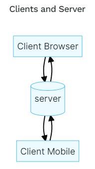
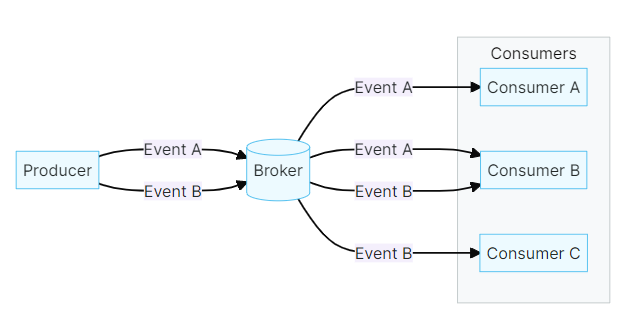

# **Asyncapi: definición de APIs asíncronas en una arquitectura dirigida por eventos**

# Tabla de Contenidos
- [1. Introducción](#1-introducci%C3%B3n)
- [2. Conceptos](#2-conceptos)
   - [2.1. Server](#21-server)
   - [2.2. Producer](#22-producer)
   - [2.3. Consumer](#23-consumer)
   - [2.4. Channel](#24-channel)
   - [2.5. OpenAPI vs AsyncAPI](#25-openapi-vs-asyncapi)
- [3. Estructura](#3-estructura)
   - [3.1. Info](#31-info)
     - [3.1.1. Contact](#311-contact)
     - [3.1.2. License](#312-license)
   - [3.2. Servers](#32-servers)
     - [3.2.1. Server Variable Object](#321-server-variable-object)
   - [3.3. defaultContentType](#33-defaultcontenttype)
   - [3.4. Channels](#34-channels)
     - [3.4.1. Operation object](#341-operation-object)
     - [3.4.2. Parameter object](#342-parameter-object)
   - [3.5. Components Object](#35-components-object)
   - [3.6. Message Object](#36-message-object)
   - [3.7. External Documentation Object](#37-external-documentation-object)
   - [3.8 Reference Object](#38-reference-object)
   - [3.9 Schema Object](#39-schema-object)
   - [3.10 Composición y herencia (Polimorfismo)](#310-composición-y-herencia-polimorfismo)
   - [3.11 Security Scheme Object](#311-security-scheme-object)
   - [3.12 Oauth Flows Object](#312-oauth-flows-objects)
   - [3.13 Oauth Flow Object](#313-oauth-flow-object)
   - [3.14 Security Scheme Object](#314-security-requirement-object)
   - [3.15 Correlation Id Object](#315-correlation-id-object)
- [4. Ejemplo](#4-ejemplo)
- [5. Herramientas](#5-herramientas)
    - [5.1. AsyncApi Studio](#51-asyncapi-studio)
    - [5.2. Microcks](#52-microcks)
    - [5.3. Generadores de código](#53-generadores-de-c%C3%B3digo)
- [6. Especificación](#6-especificaci%C3%B3n)
  - [6.1. Formato](#61-formato)
  - [6.2. Estructura de archivos](#62-estructura-de-archivos)
  - [6.3. Estructura de archivos](#63-versionado)
  - [6.4. Identificador](#64-identificador)
  - [6.5. Formatos de los tipos de datos](#65-formatos-de-los-tipos-de-datos)
- [7. Referencias](#7-referencias)

<div style="page-break-after: always;"></div>

# **1. Introducción**

<div align="center">
  
</div>

[AsyncAPI](https://www.asyncapi.com/) es una iniciativa cuyo objetivo es proporcionar la especificación de un lenguaje de definición de APIs asíncronas, que permita un diseño más efectivo de arquitecturas dirigidas por eventos, al igual que [OpenAPI](https://github.com/OAI/OpenAPI-Specification) lo es para la definición de APIs REST. Ambos son agnósticos de la implementación y en el caso de AsyncAPI lo es también del protocolo por el cual se transmiten los mensajes (AMQP, MQTT, WebSockets, Kafka, STOMP, HTTP…).

La iniciativa está liderada por [Fran Méndez](https://twitter.com/fmvilas), quien es ahora Director de Ingeniería del equipo de [Postman](https://www.postman.com/) y ha anunciado recientemente un partnership con [AsyncAPISpec](https://twitter.com/AsyncAPISpec),
la especificación que él mismo lidera, que impulsará el desarrollo y evolución de la misma.

A día de hoy, podemos decir que OpenAPI 3 es el estándar de facto para la definición de APIs REST, proporcionando no solo un lenguaje de definición de APIs, sino todo un set de herramientas que permiten generar documentación entendible por humanos, aunque el propio lenguaje de definición ya lo sea y disponer de generadores de código que permiten ahorrar tiempo en la construcción de ambas capas (productor y consumidor) en infinidad de lenguajes. OpenAPI 3 es el sucesor de Swagger 2, de hecho, la especificación de OpenAPI se renombró, mientras que el set de herramientas se sigue denominando [Swagger](https://swagger.io/).
Hasta llegar a este punto, existían básicamente dos alternativas adicionales: JSON Schema, mucho más básico, y RAML, con características similares.

**AsyncAPI** se basa en **OpenAPI 3**, hasta tal punto que la definición de los componentes es la misma, y su objetivo es proporcionar las mismas utilidades que OpenAPI, para la definición de [eventos en el ámbito de la asincronicidad](https://www.adictosaltrabajo.com/2018/02/26/spring-cloud-streamevent-driven-microservices/).

Ambas especificaciones se basan en la premisa **contract-first** de modo que, antes de comenzar el desarrollo de las APIS, consumidor /productor o cliente / servidor deben tener disponible la definición del API como un ejercicio previo de estudio del mismo, por dos razones:

- Sin un posible cliente que consuma la API REST o los eventos, no tiene ningún sentido desarrollar desde un único punto de vista.
- Una vez definida la interfaz del servicio, se debería «elevarlo a público», tratando de hacer una analogía con la firma de un contrato legal de derecho de uso. Una cosa es llegar a un acuerdo sobre el precio y las condiciones del servicio y otra muy diferente, es firmarlo ante notario para hacerlo público; OpenApi y AsyncAPI proporcionan una especificación para redactar los términos del acuerdo o ser capaces de leer las condiciones del mismo de una manera sencilla, si bien después nos deberíamos asegurar que ninguna de las partes incumplen los términos del acuerdo, elevándolo a la firma de un contrato.

En una arquitectura de cierta envergadura ya se debería usar alguna especificación, **preferiblemente OpenAPI**, no solo desde el punto de vista de publicar APIs hacia terceros, sino también para la definición del consumo interno, tener controladas las dependencias para realizar un posible análisis de impacto de cualquier modificación o versionado de las APIs.
Si la arquitectura tiene también comunicación asíncrona, se debería plantear el uso de AsyncAPI para la definición de la estructura de los eventos y tener una herramienta para analizar el impacto de las dependencias.

De la misma manera, en el ámbito de APIs REST se debería plantear el uso de alguna herramienta que asegure el cumplimiento de los contratos de consumo de APIs. Existen dos alternativas: [Pact](https://www.adictosaltrabajo.com/2020/02/13/consumer-driven-contract-testeando-servicios-con-pact/) y [Spring Cloud Contracts](https://spring.io/projects/spring-cloud-contract). En una arquitectura orientada a eventos se debería analizar también la mejor manera de implementar un **sistema de cumplimiento de contratos en la publicación y consumo de eventos** con el enfoque de consumer driven contracts.

<div style="page-break-after: always;"></div>

# **2. Conceptos**
En esta sección se explicarán los conceptos necesarios para entender cómo funciona una API asíncrona de una forma sencilla.

## **2.1. Server**
Un servidor representa un broker de mensajería que se encarga de comunicar a productores y consumidores. A diferencia de los servidores API tradicionales que dependen de la solicitud / respuesta, las interacciones con el broker de mensajes se producen a través de distintos canales.

Los servidores juegan un papel importante en el mantenimiento de una relación entre productores y consumidores. Al diseñar y configurar una aplicación basada en eventos, los servidores están a cargo de entregar mensajes asincrónicos del productor a los consumidores a través del uso de canales. Al integrar diferentes protocolos de mensajería, los servidores pueden transmitir e intercambiar mensajes entre clientes.

<div align="center">
  
</div>

El diagrama anterior describe una comunicación bidireccional entre varios clientes y un servidor. En este caso, en el archivo AsyncAPI, se describe el servidor y, por lo tanto, el Server Object contiene información sobre el servidor real, incluida su ubicación física.

<div align="center">
  
</div>

El diagrama superior muestra la arquitectura Broker Centric. En este caso, creamos tres archivos AsyncAPI para producer, consumer1 y consumer2. En estos archivos AsyncAPI, el Server Object proporciona información sobre el broker, de manera que los usuarios de la API sepan dónde conectarse para comenzar a recibir o enviar mensajes.

## **2.2. Producer**
Un productor es una aplicación que detecata cambios de estado (eventos) y los publica como mensajes. Un evento indica un cambio de estado o una actualización provocada por la acción de un usuario o dispositivo.

Algunos ejemplo de eventos son:
  - Colocar un artículo en un carrito de compras de una tienda online.
  - Suscribirse a un canal de YouTube.
  - Un cambio de temperatura detectado por un sensor.

Uno de los conceptos principales de la arquitectura basada en eventos es el modelo de comunicación de publicación / suscripción. Los productores son la primera capa lógica del modelo, encargados de distribuir mensajes al broker para que otros puedan suscribirse y recibir estos mensajes.

<div align="center">
  
</div>

El diagrama anterior representa la comunicación entre un productor que publica eventos en un canal específico en un broker y un consumidor suscrito a este canal.

En algunos casos, una entidad puede ser tanto un productor que publica mensajes en un canal específico del broker, como un consumidor que se suscribe a mensajes de un canal diferente.

<div align="center">
  
</div>

En el diagrama anterior, se puede observar un productor que publica mensajes en un canal específico y un consumidor que se suscribe a los mensajes de ese canal. También se tiene un segundo productor que publica en un canal, pero se suscribe a los mensajes del otro.

## **2.3. Consumer**
En una Arquitectura Dirigida por Eventos (EDA), un consumidor es una aplicación que escucha un evento particular de un broker y reacciona ante él

A diferencia de las API REST tradicionales, en EDA, no se espera que los consumidores de eventos respondan de inmediato. En esta arquitectura, un consumidor no es consciente del productor o de otros consumidores; lo único que saben es que cuando un broker les envía un evento, es porque se suscribieron a él.



El diagrama anterior describe el flujo de eventos desde un productor a un consumidor, pasando por el broker. En este caso, 'producer' publica dos eventos *(A y B)* y los envía al 'broker'. Entonces, cada uno de los consumidores *(A, B y C)* se suscribe para recibir esos eventos.

## **2.4. Channel**
Un canal es un mecanismo creado por el servidor para la organización y trasnmisión de mensajes. Los usuarios pueden definir canales como *topic, queue, routing, key, path o subject* dependiendo del protocolo usado (AMQP, HTTP, JMS, Kafka, MQTT, STOMP, WebSocket…).

Los canales juegan un papel crucial en la comunicación entre productores y consumidores. Un productor puede enviar un mensaje a través de un canal, de manera que lo reciban los consumidores suscritos a este. El único propósito de un canal es asegurar que los mensajes correctos lleguen a los consumidores correctos.

<div align="center">
  
</div>

El diagrama anterior muestra la comunicación entre un productor 'Producer' y un consumidor 'Consumer', con el productor enviando un mensaje 'message' a través del canal 'channel'. Luego, el canal pone en cola el mensaje para el consumidor específico.

## **2.5. OpenAPI vs AsyncAPI**
Lo más sencillo para explicar los componentes de la especificación es compararla con los de la especificación de OpenAPI, entendiendo que de una manera u otra, hemos llegado a una arquitectura dirigida por eventos tras haber pasado por el exceso de dependencias síncronas en nuestra arquitectura. Podemos encontrar el siguiente esquema en la propia documentación de la especificación de AsyncAPI donde nos proporciona una [comparativa entre OpenAPI y AsyncAPI](https://www.asyncapi.com/docs/getting-started/coming-from-openapi).

<div align="center">
  
</div>

Lo primero que se debe destacar es que donde en OpenAPI se definen endpoints en la sección de paths, en AsyncAPI **se definen canales de comunicación** que pueden equipararse a colas de mensajería, en las que se pueden especificar tanto operaciones de publicación como de consumo o suscripción a dichos canales.

Dentro de un mismo canal se pueden especificar varias operaciones de publicación o consumo, como efectivamente, se pueden publicar eventos de varios tipos dentro de un mismo canal. Junto con la definición del canal, se pueden especificar también el protocolo de comunicaciones y qué protocolo se utilizará para el intercambio de mensajes: AMQP, HTTP, JMS, Kafka, MQTT, STOMP, WebSocket…

La segunda diferencia relevante es que donde en OpenAPI se definen esquemas de petición respuesta, en AsyncAPI **se define el esquema de publicación o consumo de los mensajes**, dentro de los cuales se pueden especificar cabecera y payload. Cuando se consume un evento, el objetivo es trasladar al dominio particular un hecho de negocio acaecido en el sistema de forma asíncrona y puede interesar trasladar una proyección del mismo, no necesariamente toda la información completa del mensaje, no se tiene porqué consumir toda la información del mensaje.

En cuanto a la definición del contenido del mensaje, la especificación de las propiedades del mensaje es totalmente compatible en cuanto a tipos, con la definición de OpenAPI.

Cabe reseñar la inclusión, dentro de la especificación, de componentes básicos dentro de la definición de una arquitectura dirigida por eventos como es la posibilidad de incluir un atributo en la cabecera de los mensajes para propagar un id de correlación en los mensajes (correlationId) que permita gestionar la trazabilidad distribuida, no solo en las llamadas síncronas entre microservicios, sino también en la producción de los mensajes. Es básico disponer de un **identificador único de petición** que acompañe al sistema de trazabilidad centralizado que permita buscar trazas y correlacionarlas, independientemente del microservicio en el que se produzcan y ya sea porque se ha producido una petición síncrona o asíncrona en la entrada hacia el mismo.
Con ese atributo la especificación de AsyncAPI reserva una definición nativa del mismo para su inclusión en la cabecera de los mensajes.

Finalmente, en la siguiente tabla, presentaremos a modo de resumen las principales diferencias entre la especificación OpenAPI y AsyncAPI:

|             | OpenAPI                                 | AsyncAPI                       |   |   |   |   |   |   |   |
|-------------|-----------------------------------------|---------------------------------|---|---|---|---|---|---|---|
| **Paths**       | HTTP Endpoints                          | Colas, topics, etc.             |   |   |   |   |   |   |   |
| **Operaciones** | Métodos HTTP: GET, PUT, POST, DELETE... | Publicación o suscripción       |   |   |   |   |   |   |   |
| **Esquemas**    | Esquemas de petición/respuesta          | Esquemas de publicación/consumo |   |   |   |   |   |   |   |
|             |                                         |                                 |   |   |   |   | 


<div style="page-break-after: always;"></div>

# **3. Estructura**

En este apartado se desarrolla la estructura de un fichero AsyncAPI en la versión 2.5.0. A continuación se desarrollan los objetos que debe tener.

|  Nombre del campo        | Tipo de dato                          | Descripción                                                                                              |
|--------------------|-------------------------------|----------------------------------------------------------------------------------------------------------|
| **asyncapi**          | AsyncAPI Version String       | Especifica la versión de la especificación AsyncAPI que se emplea. La estructura será major.minor.patch. |
| **id**                 | Identifier                    | Identificador de la aplicación que define el documento AsyncAPI.                                         |
| **info**               | Info Object                   | Metadatos de la API.                                                                                     |
| **servers**            | Servers Object                | Detalles de conexión de los servidores.                                                                  |
| **defaultContentType** | Default Content Type          | Tipo de contenido predeterminado para usar al codificar/descodificar la carga útil de los mensajes.      |
| **channels**           | Channels Object               | Los canales y mensajes disponibles para la API.                                                          |
| **components**         | Components Object             | Elemento para contener varios esquemas de objetos para la especificación.                                |
| **tags**               | Tags Object                   | Lista de etiquetas empleadas por la especificación con sus metadatos.                                    |
| **externalDocs**       | External Documentation Object | Documentación externa adicional.                                                                         |

## **3.1. Info**

Este objeto proporciona metadatos sobre la API. Los metadatos pueden ser utilziados por los clientes si es necesario.

| Nombre del campo | Tipo de dato   | Descripción                                  |
|------------------|----------------|----------------------------------------------|
| **title**            | string         | **REQUERIDO.** Título de la aplicación.                      |
| **version**          | string         | **REQUERIDO.** Proporciona la versión de la API.            |
| **description**      | string         | Breve descripción de la API.                 |
| **termsOfService**   | string         | URL absoluta a los términos de servicio.     |
| **contact**          | Contact Object | Información de contacto de la API expuesta.  |
| **license**          | License Object | Información de licencia para la API expuesta |

En el campo Info se emplean los objetos Contact y License que se desarrollan a continuación.

### **3.1.1. Contact**

| Nombre del campo | Tipo de dato | Descripción                                                                             |
|------------------|--------------|-----------------------------------------------------------------------------------------|
| **name**             | string       | Nombre identificativo de la persona/organización de contacto.                           |
| **url**              | string       | URL absoluta que apunta a la información de contacto.                                   |
| **email**            | string       | Dirección de correo electrónico de la persona/organización de contacto. Formato: email. |

### **3.1.2. License**

| Nombre del campo | Tipo de dato | Descripción                                    |
|------------------|--------------|------------------------------------------------|
| **name**             | string       | **REQUERIDO.** Nombre de la licencia empleada. |
| **url**              | string       | URL absoluta de la licencia empleada.          |

## **3.2. Servers**

A través de este objeto se definen todos los detalles y particularedidades de los servidores. El objeto tiene los siguientes campos:

| Nombre del campo | Tipo de dato                                             | Descripción                                                                                                                    |
|------------------|----------------------------------------------------------|--------------------------------------------------------------------------------------------------------------------------------|
| **url**              | string                                                   | **REQUERIDO.** URL, absoluta o relativa, al host de destino. Admite variables de servidor, colocando su nombre entre {nombre}. |
| **protocol**         | string                                                   | **REQUERIDO.** Protocolo que admite esta URL para la conexión.                                                                 |
| **protocolVersion**  | string                                                   | Versión del protocolo utilizado para la conexión.                                                                              |
| **description**      | string                                                   | Descripción del protocolo utilizado para la conexión.                                                                          |
| **variables**        | Map [string, Server Variable Object \| Reference Object] | Mapa nombreDeVariable-valor. El valor se emplea para la sustitución en la URL del servidor.                                    |
| **security**         | [Security Requirement Object]                            | Declaración de los mecanismos de seguridad que se pueden emplear con este servidor.                                            |
| **tags**             | Tags Object                                              | Lista de etiquetas para la agrupación lógica de servidores.                                                                    |
| **bindings**         | Server Bindings Object \| Reference Object               | Mapa nombreDeVariable-valor. Describen definiciones específicas del protocolo.                                                 |

### **3.2.1. Server Variable Object**

| Nombre del campo | Tipo de dato | Descripción                                                           |
|------------------|--------------|-----------------------------------------------------------------------|
| **enum**            | [string]     | Se emplea si las opciones de sustitución son de un conjunto limitado. |
| **default**          | string       | Valor por defecto.                                                    |
| **description**      | string       | Descripción opcional de las variables de servidor.                    |
| **examples**         | [string]     | Matriz de ejemplos de la variable de servidor.                        |

## **3.3. defaultContentType**

Una cadena que representa el tipo de contenido predeterminado que se usará al codificar o decodificar la carga útil de un mensaje. El valor DEBE ser un tipo de medio específico (p. ej application/json). Los analizadores de esquemas DEBEN utilizar este valor cuando se omite la propiedad contentType .

## **3.4. Channels**

Describe las operaciones disponibles en un solo canal.

| **Nombre del campo** | **Tipo de dato**                             | **Descripción**                                                            |
|----------------------|----------------------------------------------|----------------------------------------------------------------------------|
| **$ref**             | string                                       | Permite referenciar una definición de objeto.                              |
| **description**      | string                                       | Descripción opcional del elemento de canal.                                |
| **servers**          | [string]                                     | Servidores en los que esta disponible el canal.                            |
| **subscribe**        | Operation Object                             | Define los mensajes producidos por la API.                                 |
| **publish**          | Operation Object                             | Define los mensajes consumidos por la API desde el canal.                  |
| **parameters**       | Parameters Object                            | Parámetros incluidos en el nombre del canal.                               |
| **bindings**         | Channel Bindings Object \| Reference Object  | Mapa nombreDeVariable-valor. Describen definiciones específicas del canal. |

### **3.4.1. Operation Object**

Describe una operación  

| **Nombre del campo** | **Tipo de dato**                                                                      | **Descripción**                                                                                      |
|----------------------|---------------------------------------------------------------------------------------|------------------------------------------------------------------------------------------------------|
| **operationId**      | string                                                                                | Cadena única para identificar la operación. Debe ser única dentro de la API.                         |
| **summary**          | string                                                                                | Resumen de lo que trata la operación.                                                                |
| **description**      | string                                                                                | Explicación detallada de la operación.                                                               |
| **security**         | [Security Requirement Object]                                                         | Declaración de los mecanismos de seguridad asociados a esta operación.                               |
| **tags**             | Tags Object                                                                           | Lista de etiquetas para la agrupación lógica de las operaciones.                                     |
| **externalDocs**     | External Documentation Object                                                         | Documentación externa adicional.                                                                     |
| **bindings**         | Operation Bindings Object \| Reference Object                                         | Mapa nombreDeVariable-valor para las definiciones específicas del protocolo de la operación.         |
| **traits**           | [Operation Trait Object \| Reference Object]                                          | Lista de rasgos para aplicar al objeto de operación. Se deben fusionar en el objeto de la operación. |
| **message**          | Message Object \| Reference Object Map["oneOf", [Message Object \| Reference Object]] | Definición del mensaje que será publicado o recibido por la operación.                               |

### **3.4.2. Parameter Object**

Describe un parámetro incluido en el nombre del canal, definido dentro del Parameters Object.

| **Nombre del campo** | **Tipo de dato**                  | **Descripción**                                  |
|----------------------|-----------------------------------|--------------------------------------------------|
| **description**      | string                            | Explicación detallada del parámetro.             |
| **schema**           | Schema Object \| Reference Object | Definición del parámetro.                        |
| **location**         | string                            | Especifica la ubicación del valor del parámetro. |

## **3.5. Components Object**

Representa un conjunto de objetos reutilizables para diferentes aspectos de la documentación AsyncAPI. Estos componentes no tendrán efecto sobre la especificación a menos que sean referenciados explícitamente utilizando un [Reference Object](#38-reference-object). Los atributos de este objeto son:

| **Nombre del campo**  | **Tipo de dato**                                          | **Descripción**                                               |
|-----------------------|-----------------------------------------------------------|---------------------------------------------------------------|
| **schemas**           | Map[string, Schema Object / Reference Object]             | Objeto para incluir Schema Objects reutilizables.             |
| **servers**           | Map[string, Server Object / Reference Object]             | Objeto para incluir Server Objects reutilizables.             |
| **serverVariables**   | Map[string, Server Variable Object / Reference Object]    | Objeto para incluir Server Variable Objects reutilizables.    |
| **channels**          | Map[string, Channel Item Object]                          | Objeto para incluir Channel Item Objects reutilizables.       |
| **message**           | Map[string, Message Object / Reference Object]            | Objeto para incluir Message Objects reutilizables.            |
| **securitySchemes**   | Map[string, Security Scheme Object / Reference Object]    | Objeto para incluir Security Scheme Objects reutilizables.    |
| **parameters**        | Map[string, Parameter Object / Reference Object]          | Objeto para incluir Parameter Objects reutilizables.          |
| **correlationIds**    | Map[string, Correlation ID Object / Reference Object]     | Objeto para incluir Correlation ID Objects reutilizables.     |
| **operationTraits**   | Map[string, Operation Trait Object / Reference Object]    | Objeto para incluir Operation Trait Objects reutilizables.    |
| **messageTraits**     | Map[string, Message Trait Object / Reference Object]      | Objeto para incluir Message Trait Objects reutilizables.      |
| **serverBindings**    | Map[string, Server Bindings Object / Reference Object]    | Objeto para incluir Parameter Objects reutilizables.          |
| **channelBindings**   | Map[string, Channel Bindings Object / Reference Object]   | Objeto para incluir Channel Bindings Objects reutilizables.   |
| **operationBindings** | Map[string, Operation Bindings Object / Reference Object] | Objeto para incluir Operation Bindings Objects reutilizables. |
| **messageBindings**   | Map[string, Message Bindings Object / Reference Object]   | Objeto para incluir Message Bindings Objects reutilizables.   |

Básicamente, este objeto puede llegar a representar cualquiera de los tipos de datos y estructuras mencionados anteriormente para que estos sean referenciados desde cualquier otra parte del código.

## **3.6 Message Object**
Representa un mensaje recibido en unos determinados canal y operación. Los atributos de este campo son los siguientes:

| **Nombre del campo** | **Tipo de dato**                           | **Descripción**                                                                                                                                                                |
|----------------------|--------------------------------------------|--------------------------------------------------------------------------------------------------------------------------------------------------------------------------------|
| **messageId**        | string                                     | String única para identificar el mensaje.                                                                                                                                      |
| **headers**          | Schema Object / Reference Object           | Define el esquema de los encabezados de la aplicación.                                                                                                                         |
| **payload**          | any                                        | Define el mensaje payload. Debe ser un objeto JSON o YAML.                                                                                                                     |
| **correlationId**    | Correlation ID Object / Reference Object   | Campo utilizado para la trazabilidad.                                                                                                                                          |
| **schemaFormat**     | string                                     | Contiene el nombre del esquema usado para definir el payload.                                                                                                                  |
| **contentType**      | string                                     | Define el tipo de contenido utilizado para codificar o decodificar el mensaje del payload. Si este campo está vacío, se tomará el especificado en el campo defaultContentType. |
| **name**             | string                                     | Nombre del mensaje (machine-readable).                                                                                                                                         |
| **title**            | string                                     | Título del mensaje (human-readable).                                                                                                                                           |
| **summary**          | string                                     | Resumen de la explicación sobre el mensaje.                                                                                                                                    |
| **description**      | string                                     | Descripción detallada de la funcionalidad del mensaje.                                                                                                                         |
| **tags**             | Tags Object                                | Lista de etiquetas para categorizar el mensaje.                                                                                                                                |
| **externalDocs**     | External Documentation Object              | Documentación adicional del mensaje.                                                                                                                                           |
| **bindings**         | Message Bindings Object / Reference Object | Mapa donde las claves describen el nombre del protocolo y los valores, las definiciones específicas del protocolo para el mensaje.                                             |
| **examples**         | [Message Example Object]                   | Lista de ejemplos.                                                                                                                                                             |
| **traits**           | [Message Trait Object / Reference Object]  | Lista de traits para aplicar al objeto del mensaje.                                                                                                                            


## **3.7 External Documentation Object**
Permite referenciar una fuente externa de documentación extendida. Sus campos son:

| **Nombre del campo** | **Tipo de dato** | **Descripción**                                   |
|----------------------|------------------|---------------------------------------------------|
| **description**      | string           | Pequeña descripción de la documentación referida. |
| **url**              | string           | URL a la documentación externa.                   |

## **3.8 Reference Object**
Objeto simple cuya función es referenciar a otros componentes en la especificación, tanto internos como externos. Estos componentes referenciados deber estar en formato JSON o YAML. Su único atributo está descrito en la siguiente tabla:

| **Nombre del campo** | **Tipo de dato** | **Descripción**                                                               |
|----------------------|------------------|-------------------------------------------------------------------------------|
| **$ref**             | string           | **REQUERIDO**. Cadena que representa la ruta del objeto al que se referencia. |

## **3.9 Schema Object**
Permite definir tipos de entrada/salida de datos. Estos tipos pueden ser objetos, pero también tipos primitivos de datos o arrays. Existe el schema vacío, que podrá ser representado por el valor booleano `true`. El schema que no permite ninguna instancia, puede ser representado con el valor booleano `false`.

A continuación, enumeraremos las propiedades del objeto: title, type, required, multipleOf, maximum, exclusiveMaximum, minimum, exclusiveMinimum, maxLength, minLength, pattern, maxItems, minItems, uniqueItems, maxProperties, minProperties, enum, const, examples, if / then / else, readOnly, writeOnly, properties, patternProperties, additionalProperties, additionalItems, items, propertyNames, contains, allOf, oneOf, anyOf, not, description, format y default. 

Además de todos estos, mencionaremos los siguientes campos:

| **Nombre del campo** | **Tipo**                      | **Descripción**                                                                                   |
|----------------------|-------------------------------|---------------------------------------------------------------------------------------------------|
| **discriminator**    | string                        | Añade soporte para el polimonrnfismo.                                                             |
| **externalDocs**     | External Documentation Object | Añade documentación externa para este esquema.                                                    |
| **deprecated**       | boolean                       | Especifica que un schema está obsoleto y debería ser reemplazado. El valor por defecto es false |

## **3.10 Composición y herencia (Polimorfismo)**
AsyncAPI permite combinar y extender los usos de la propiedad allOf del JSON Schema.

Además, para el polimorfismo, AsyncAPI emplea el campo `discriminator`. Este campo, permitirá eleir qué definicion del schema se usa para validar la estructura del modelo, por lo que dicho campo será requerido.

### **Ejemplo de polimorfismo**
```
schemas:
  ErrorModel:
    type: object
    required:
    - message
    - code
    properties:
      message:
        type: string
      code:
        type: integer
        minimum: 100
        maximum: 600
  ExtendedErrorModel:
    allOf:
    - $ref: '#/components/schemas/ErrorModel'
    - type: object
      required:
      - rootCause
      properties:
        rootCause:
          type: string
```
## **3.11 Security Scheme Object**
Define el tipo de seguridad que será usado por las operaciones. Los schemes soportados son los siguientes:

* Usuario / contraseña
* API Key
* Certificado X.509
* Encriptación End-to-end (simétrica o asimétrica)
* Autenticación HTTP
* HTTP API Key
* Flujos comunes de OAuth 2 
* OpenID Connect Discovery
* SASL [(RFC4422)](https://www.rfc-editor.org/rfc/rfc4422)

Para definir este objeto, se emplearán los siguientes campos:

| **Nombre del campo** | **Tipo**           | **Aplica a**        | **Descripción**                                                                                                                                                                                                                                                           |
|----------------------|--------------------|---------------------|---------------------------------------------------------------------------------------------------------------------------------------------------------------------------------------------------------------------------------------------------------------------------|
| **type**             | string             | Cualquiera          | **REQUERIDO**. Define el tipo de esquema de seguridad. Los valores permitidos serán: "userPassword", "apiKey", "X509", "symmetricEncryption", "asymmetricEncryption", "httpApiKey", "http", "oauth2", "openIdConnect", "plain", "scramSha256", "scramSha512", y "gssapi". |
| **description**      | string             | Cualquiera          | Descripción breve para el esquema de seguridad.                                                                                                                                                                                                                           |
| **name**             | string             | httpApiKey          | **REQUERIDO**. Nombre del parámetro header, query o cookie empleado.                                                                                                                                                                                                      |
| **in**               | string             | apiKey / httpApiKey | Localización donde irá la API Key. Los valores permitidos serán: "user" y "password" para apiKey y "query", "header" o "cookie" para httpApiKey                                                                                                                           |
| **scheme**           | string             | http                | **REQUERIDO**. El nombre del esquema de autorización usado en el Authorization Header, definido en la [RFC7235](https://www.rfc-editor.org/rfc/rfc7235#section-5.1)                                                                                                       |
| **bearerFormat**     | string             | http ("bearer")     | Indica cómo está formado el bearer token.                                                                                                                                                                                                                                 |
| **flows**            | string             | oauth2              | **REQUERIDO**. Contiene la información de la configuración para el tipo de flujo soportado.                                                                                                                                                                               |
| **openIdConnectUrl** | OAuth Flows Object | openIdConnect       | **REQUERIDO**. OpenId Connect URL que muestra los valores de configuración de OAuth2.                                                                                                                                                                                     |

## **3.12 OAuth Flows Objects**
Incluye configuraciones para los flujos OAuth soportados. Los campos que incluye este objeto son los siguientes:

| **Nombre del campo**  | **Tipo**          | **Descripción**                                                                          |
|-----------------------|-------------------|------------------------------------------------------------------------------------------|
| **implicit**          | OAuth Flow Object | Configuración para el flujo OAuth implícito.                                             |
| **password**          | OAuth Flow Object | Configuración para el flujo de credenciales protegidas del propietario del recurso OAuth |
| **clientCredentials** | OAuth Flow Object | Configuración para el flujo de credenciales de cliente de OAuth.                         |
| **authorizationCode** | OAuth Flow Object | Configuración para el flujo de código de autorización OAuth.                             |

## **3.13 OAuth Flow Object**
Define los detalles de configuración para un flujo OAuth soportado. Sus campos son:

| **Nombre del campo** | **Tipo**            | **Aplica a**                                                  | **Descripción**                                                                                                                                            |
|----------------------|---------------------|---------------------------------------------------------------|------------------------------------------------------------------------------------------------------------------------------------------------------------|
| **autorizationUrl**  | string              | oauth2 ("implicit", "authorizationCode")                      | **REQUERIDO**. URL de autorización empleado en este flujo.                                                                                                 |
| **tokenUrl**         | string              | oauth2 ("password", "clientCredentials", "authorizationCode") | **REQUERIDO**. Token URL empleado en este flujo.                                                                                                           |
| **refreshUrl**       | string              | oauth2                                                        | URL usada para obtener Refresh Tokens.                                                                                                                     |
| **scopes**           | Map[string, string] | oauth2                                                        | **REQUERIDO**. Mapa que representa los scopes disponibles para el esquema de seguridad OAuth2, formados por el nombre del scope y una pequeña descripción. |

## **3.14 Security Requirement Object**
Lista los esquemas de seguridad requeridos para ejecutar una operación determinada. 

Solo dispondrá de un campo:

| **Nombre del campo** | **Tipo** | **Descripción**                                                                                                                                       |
|----------------------|----------|-------------------------------------------------------------------------------------------------------------------------------------------------------|
| **{name}**           | [string] | Array que contiene los nombres de los esquemas de seguridad empleados. Deben estar definidos en el objeto [Security Schemes](#312-security-scheme-object), bajo el [Components Object](#39-components-object) |

## **3.15 Correlation ID Object**
Objeto que especifica un identificador en tiempo de diseño que se puede usar para el seguimiento y la correlación de mensajes. Sus campos serán los siguientes:

| **Nombre del campo** | **Tipo** | **Descripción**                                                                                    |
|----------------------|----------|----------------------------------------------------------------------------------------------------|
| **description**      | string   | Descripción del identificador.                                                                     |
| **location**         | string   | **REQUERIDO**. Expresión en tiempo de ejecución que especifica la localización del correlation ID. |

<div style="page-break-after: always;"></div>

# **4. Ejemplo**

Podemos encontrar un [editor online de AsyncAPI](https://playground.asyncapi.io/) con el que jugar con la definición de nuestros mensajes. A continuación vemos un ejemplo simple de definición:

```
asyncapi: 2.5.0
info:
  title: Asynapi Example
  version: 1.0.0
  description: Documentation events propagation
  license:
    name: Apache 2.0
    url: 'https://www.apache.org/licenses/LICENSE-2.0'
  contact:
    name: Paco Pruebas
    email: pacotest@axpe.com
servers:
  production:
    url: 'localhost:{port}'
    protocol: kafka
    description: dockerized broker
    variables:
      port:
        description: Secure connection (TLS) is available through port 9092.
        default: '9092'
defaultContentType: application/json
channels:
  documentation-published:
    publish:
      description: Describes the event which occurs when a new documentation is published.
      operationId: documentationPublished
      message:
        $ref: '#/components/messages/documentationPublishedEvent'
    subscribe: 
      description: Represents the subscription of the user to the publication channel.
      operationId: userSuscribed
components:
  messages:
    documentationPublishedEvent:
      name: documentationPublished
      title: documentation published in the system
      payload:
        $ref: '#/components/schemas/documentationLoggedInEventPayload'
  schemas:
    documentationLoggedInEventPayload:
      type: object
      properties:
        documentationId:
          description: Documentation identifier
          type: string
          format: uuid
          pattern: '[0-9a-f]{8}-[0-9a-f]{4}-[0-9a-f]{4}-[0-9a-f]{4}-[0-9a-f]{12}'
          loggedAt: null
          $ref: '#/components/schemas/loggedAt'
    loggedAt:
      type: string
      format: date-time
      description: Date and time when the message was sent.

```

Se tiene un canal de comunicación «customers» que corresponde con un tópico de kafka en el que publicamos un evento de tipo «client logged in» con la intención de propagar al resto del sistema un evento que informe del login de un cliente.

La información que se propagaría en el evento **contiene únicamente el UUID del cliente** con el formato de UUID y la fecha en la que se produjo el login.

<div style="page-break-after: always;"></div>

# **5. Herramientas**
En este apartado se hará un recorrido por las herramientas más relevantes que facilitan el diseño de APIs asíncronas, teniendo en cuenta todo el ciclo de vida de estas.

## **5.1. AsyncAPI Studio**
Se trata de un editor que permite diseñar, validar, obtener una vista previa de la documentación y visualizar el flujo de eventos de una manera clara y sencilla.
Es el punto de partida para definir la especificación de una API, guardando gran similitud con otros editores con Stoplight, estando este enfocado a APIs síncronas.

<div align="center">
  
</div>

## **5.2. Microcks**
Es una plataforma enfocada a levantar mocks y realizar pruebas para APIs y microservicios. Se puede conventir los ejemplo de contratos AsyncAPI, OpenAPI o colecciones Postman en mocks listos para usar. A través de los ejemplos se pueden simular y validar los mensajes recibidos según los elemntos definidos en la especificación. Por otro lado, estos mocks se pueden integrar en el flujo de integración continua del proyecto.

Otra herramienta que cumple este propósito de manera similar a [Microcks](https://microcks.io/) es [Virtualan](https://www.virtualan.io/)

## **5.3. Generadores de código**
Se trata de herramientas que facilitan la implementación de APIs a partir de la especificación diseñada. En la siguiente tabla se exponen algunas de las herramientas principales destinadas a este propósito.

|      **Herramienta**     | **Descripción**                                                                                                              |
|:------------------------:|------------------------------------------------------------------------------------------------------------------------------|
| [AsyncAPI Generator](https://github.com/asyncapi/generator)       | Permite usar la definición AsyncAPI para generar documentación Markdown,  código Node.js, código Java, documentación HTML... |
| [Node-RED AsyncAPI plugin](https://github.com/dalelane/node-red-contrib-plugin-asyncapi) | Permite usar la definición AsyncAPI para generar y configurar nodos Node-RED.                                                |
| [MultiAPI Generator](https://github.com/corunet/scs-multiapi-plugin)       | Permite usar la definición AsyncAPI, incluso varias al mismo tiempo, para generar código Spring Cloud con Maven.             |
| [asyncapi_gencpp](https://github.com/hatchbed/asyncapi_gencpp)          | Permite usar la definición AsyncAPI para generar código C++ para serializar y deserializar componentes y mensajes.           |

<div style="page-break-after: always;"></div>

# **6. Especificación**

## **6.1. Formato**
De acuerdo con la especificación AsyncAPI, los archivos que describen la API se representan como objetos JSON y se ajustan a los estándares JSON. YAML, al ser un superconjunto de JSON también puede utilizarse para realizar la especificación.

Aunque el formato del archivo sea JSON, no impone JSON como formato de entrada/salida para la API. 

Los nombres de todos los campos de la especificación distinguen entre mayúsculas y minúsculas (case sensitive).

## **6.2. Estructura de archivos**
Un documento AsyncAPI puede estar formado por un solo documento o por un conjunto de varios documentos conectados. En este caso, se utilizarán los Objetos de Referencia.

El archivo de especificación AsyncAPI (A2S) se denomina `asyncapi.json` o `asyncapi.yaml`.

## **6.3. Versionado**

El formato de la cadena utilizada para especificar el versionado de una especificación será la siguiente: `major.minor.patch`. 
 
- `major.minor` será empleado para especificar la versión de AsyncAPI.

- `patch` puede tener como sufijo un guión y caracteres alfanuméricos

## **6.4. Identificador**
Este campo representa un identificador universal único de la aplicación que define el documento AsyncAPI. Debe ajustarse al formato URI, según la [RFC 3986](https://www.rfc-editor.org/rfc/rfc3986).

Para identificar de forma global y única la aplicación durante largos períodos de tiempo, aunque esta deje de existir o de estar disponible, se recomienda utilizar una [URN](https://www.rfc-editor.org/rfc/rfc8141).

## **6.5. Formatos de los tipos de datos**

| **Nombre**   | **Tipo** | **Formato** | **Comentarios**                               |
|--------------|----------|-------------|-----------------------------------------------|
| **integer**  | integer  | int32       | 32 bits con signo.                             |
| **long**     | integer  | int64       | 64 bits con signo.                             |
| **float**    | number   | float       |                                               |
| **double**   | number   | double      |                                               |
| **string**   | string   |             |                                               |
| **byte**     | string   | byte        | Codificado en base64.                         |
| **binary**   | string   | binary      | Cualquier secuencia de octetos.               |
| **boolean**  | boolean  |             |                                               |
| **date**     | string   | date        | Definido como full-date en la [RFC3339](https://www.rfc-editor.org/rfc/rfc3339.html#section-5.6).                                      |
| **dateTime** | string   | date-time   | Definido como date-time en la [RFC3339](https://www.rfc-editor.org/rfc/rfc3339.html#section-5.6).                                    |
| **password** | string   | password    | Indica a la IU que la entrada debe ocultarse. |

<div style="page-break-after: always;"></div>

# **7. Referencias**
<https://studio.asyncapi.com/>

<https://www.asyncapi.com/>

<https://www.asyncapi.com/docs/concepts>

<https://rapidapi.com/guides/async-api>

<https://apidocs.leadsquared.com/async-api/>

<https://www.avenga.com/magazine/async-api/>

<https://christophergs.com/tutorials/ultimate-fastapi-tutorial-pt-9-asynchronous-performance-basics/>