# **Documentación Spectral**

|**Versión**|**Fecha**|**Autor**|**Comentarios**|
| :- | :- | :- | :- |
|**1.0**|14/03/2023|AXPE|Versión inicial.|

# Índice
[Introducción](#Introduccion)

[Características](#Caracteristicas)

[Instalación](#Instalacion)

[Instalación de Spectral desde línea de comandos:](#Comandos)

[Instalación de Spectral en Stoplight Studio:](#Stopligth)

[Estructura de conjunto de reglas (Rulesets)](#Conjunto)

[Estructura de las reglas](#Reglas)

[Given](#Given)

[Then](#Then)

[Message](#Message)

[Severity](#Severity)

[Resolved](#Resolved)

[Expresiones JSONPath](#JSON)

[Funciones](#Funciones)

[¿Cómo crear reglas?](#Crear)

[Default rule](#Default)

[Custom rule](#Custom)

# Introducción
Spectral es un linter JSON/YAML opensource, que permite crear, definir reglas, validar dichas reglas y aplicarlas para ficheros que contengan OAS versión 3.0, OAS 3.1, Swagger versión 2 y AsyncAPI v2.

La gran ventaja que representa Spectral es la automatización de las guías de estilo de API, implementando reglas necesarias que los equipos de Arquitectura y Gobierno de API han definido.
## Características
Es una herramienta que nos facilita la validación de ficheros de tipo OpenAPI 2.X, 3.X. Por defecto ofrece un conjunto de reglas de validación básicas, pero además con Spectral se puede:

- Crear o definir nuevas reglas para aplicar a objetos dentro de ficheros JSON o YAML.
- Modificar las reglas por defecto.
- Usar JSON Path para definir en qué puntos de los ficheros JSON aplica una regla en concreto.
- Crear funciones personalizadas para casos de uso avanzados.
- Validar JSON contra Json Schemas

# Instalación
Existen dos formas de hacer uso de la herramienta, desde la línea de comandos y desde Stoplight, a continuación, se detallan:
## Instalación de Spectral desde línea de comandos:
Existen varias formas de instalar a partir de diferentes comandos, pero está es la forma más utilizada y sencilla. Primero hay que tener instalado [NodeJS](https://nodejs.org/en/) en el sistema operativo. Después, ya tendríamos que ejecutar el siguiente comando en la consola de nuestro sistema operativo.

**npm install -g @stoplight/spectral**
## Instalación de Spectral en Stoplight Studio:
Como hemos indicado anteriormente, Spectral viene ya integrado con Stoplight Studio, la opción para activarlo es la pestaña que se encuentra en la parte inferior derecha, con nombre Issues.

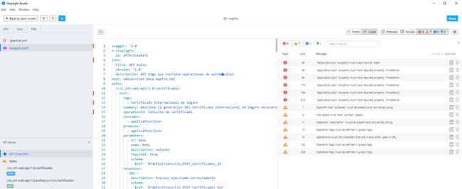

# Estructura de conjunto de reglas (Rulesets)
Los rulesets son ficheros que contienen las reglas y funciones. Puede tener cualquier nombre, pero para integrarlo e iniciar la revisión con Stoplight Studio debe existir al menos un fichero como **nombre.spectral.yml** para que inicie la validación.

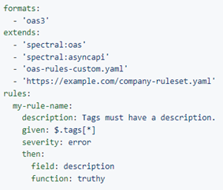

Existen cinco propiedades que se pueden usar en el nivel raíz de un ruleset:

- **Rules**: Las reglas son el núcleo de cómo funcionan los conjuntos de reglas, que posteriormente se utilizaran para revisar y validar la especificación de la API.   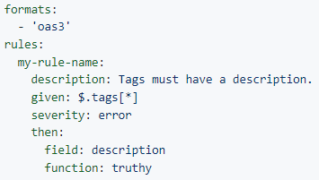

- **Extends**: Una referencia a otros conjuntos de reglas. Se utiliza para ampliar y personalizar los diferentes conjuntos de reglas existentes. Puede ser una sola cadena, o una matriz de cadenas, e incluso puede contener rutas de archivos, URL o módulos npm. Las reglas definidas que se encuentran dentro del conjunto de reglas se pueden modificar libremente o incluso crear una regla nueva. 

    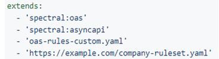

- **Formats**: son una forma opcional de especificar a que formatos de descripción de API se aplica una regla o conjunto de reglas. Estos serían los formatos que soporta Spectral:

    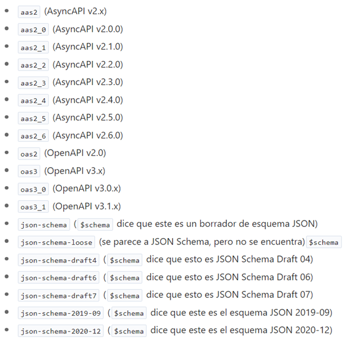

- **DocumentationUrl**: es una dirección URL que contiene más información sobre el conjunto de reglas y las reglas que contiene. Puede ayudar a proporcionar más información y así entender mejor dichas reglas, e incluso como se debe usar.

- **ParserOptions**: se puede utilizar para ajustar la gravedad de las claves duplicadas o los valores no validos del conjunto de reglas. 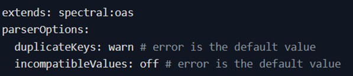

- **Aliases**: una matriz de pares clave-valor que se pueden usar para definir expresiones **JSONPath** de uso común que se reutilizaran en el conjunto de reglas. 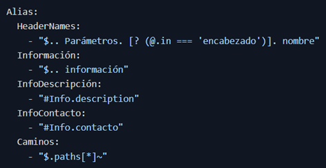

- **Overrides**: se puede utilizar para personalizar a qué formatos, archivos o partes de archivos se debe aplicar el conjunto de reglas. Con esto conseguimos la ventaja de no tener que duplicar reglas a la hora de aplicarlas en diferentes archivos.

    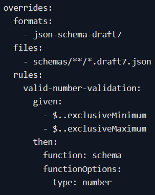

# Estructura de las reglas
Vamos a detallar la estructura de propiedades de las rules:

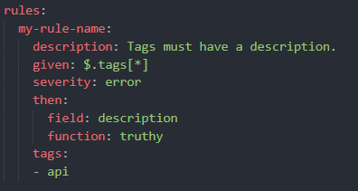

Las reglas pueden tener las siguientes propiedades:

- given (requerido): parte del documento donde se debe aplicar la regla, Usa la sintaxis de JSONPath.
- then (requerido): describe la función que se va a aplicar en given. Se puede usar con una función principal o con una función personalizada.
- description: breve descripción de la regla.
- message: mensaje que se muestra en spectral lint. Se puede personalizar.
- severity: rigor de la regla. Se usa para diferenciar entre reglas que deben seguirse y advertencias.
- formats: formato de la regla.
- recommended: se utiliza al ampliar un conjunto de reglas.
- resolved: se usa para aplicar una regla a un documento que no está “resuelto”.

## Given
Esta propiedad es muy similar a un selector en CSS, ya que indica donde se aplican las reglas en el documento.

El valor puede ser una cadena que contenga cualquier expresión JSONPath válido o una matriz de expresiones para aplicar una regla a varias partes de un documento.

## Then
Es la parte de la regla que explica que función aplicar al given. La función que aplique puede ser una de las funciones principales o puede ser una función personalizada.

Tiene dos palabras clave principales:

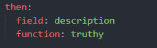

- field: especifica el campo donde aplicará la regla. (Opcional)
- function: especifica la función a utilizar en la rule y es un campo obligatorio. En este caso, se podría utilizar una función Core o una personalizada. Ej: lenght.

## Message
Propiedad que se utiliza para retornar el error. Se pueden utilizar distinto funcionalidades predefinidas dentro del mensaje de salida.

- {{error}} : Error devuelto por la función.
- {{description}} : Descripción general de la regla.
- {{path}} : Retorna la ruta donde se produce el error.
- {{property}} : Devuelve valor del campo de la especificación donde ocurrió el error.
- {{value}} : Retorna el valor devuelvo por la función.

## Severity
Propiedad que determina el tipo de severidad se quiere indicar, se puede clasificar en error, warn, info y hint. Por defecto es warn.

## Resolved
De forma predeterminada, Spectral procesa cada regla en un documento “resuelto”.

Si una regla necesita acceder a los valores $ref de referencia sin procesar, se puede configurar ‘ resolved: false ‘ para permitir que la regla reciba la versión sin revolver del documento. De lo contrario ‘resolver: true’ es el valor por defecto.

# Expresiones JSONPath
Las expresiones [JSONPath](https://docs.proxyman.io/basic-features/jsonpaths) que se emplean dentro de Spectral son:

|**Operador**|**Description**|
| :-: | :-: |
|**$**|Elemento raíz. |
|**@**|Elemento actual.|
|**\***|Comodín.|
|**..**|Descenso recursivo.|
|**.<name>**|Operador secundario.|
|**['<name>' (, '<name>')]**|Array de valores.|
|**[<number> (, <number>)]**|Array de índices.|
|**[start:end]**|Operador de corte de matriz.|
|**[?(<expression>)]**|Expresión de filtro.|

|**Función**|**Descripción**|**Salida**|
| :-: | :-: | :-: |
|**min()**|Proporciona el valor mínimo de un array de números|Double|
|**max()**|Proporciona el valor máximo de un array de números|Double|
|**avg()**|Proporciona el valor promedio de un array de números|Double|
|**stddev()**|Proporciona la desviación estándar de un array de números|Double|
|**length()**|Proporciona la longitud de un array.|Integer|
|**sum()**|Proporciona el valor de la suma de un array de números.|Double|
|**keys()**|Proporciona las claves de propiedad (alternativa para la terminal)|Set<E>|
|**concat(X)**|Proporciona una versión concatenada de la ruta de salida con un nuevo elemento|Como la entrada|
|**append(X)**|Añade un elemento al array de salida de la ruta json.|Como la entrada|
|**first()**|Proporciona el primer elemento de un array.|Depende|
|**last()**|Proporciona el último elemento de un array.|Depende|
|**index(X)**|Proporciona el elemento situado en la posición X.|Depende|

|**Operador**|**Descripción**|
| :-: | :-: |
|**==**|Igual|
|**!=**|Distinto|
|**<**|Menor que|
|**<=**|Menor o igual que|
|**>**|Mayor que|
|**>=**|Mayor o igual que|
|**=~**|Expresiones regulares|
|**in**|Existe|
|**nin**|No existe|
|**subsetof**|Valida si es un subconjunto|
|**anyof**|Valida si tiene una intersección |
|**noneof**|Valida si no tiene una intersección|
|**size**|Igual tamaño|
|**empty**|vacío |
# Funciones
Functions: La function se asocia a una regla con el objetivo de verificar el cumplimiento de dicha regla. Se clasifican en predefinas o personalizadas que es código totalmente configurable. Spectral tiene una serie de funciones predefinidas para tener una mayor facilidad a la hora de crear reglas.

En el caso de las Reglas personalizadas deben de estar definidas dentro de la ruta "/functions", ya que Spectral busca por defecto esa carpeta. Se escribirán en NodeJS y se tratará de aplicar buenas prácticas de código.

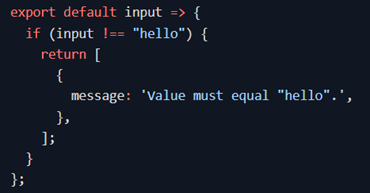   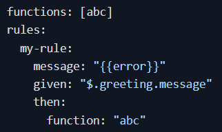

En estas imágenes se comprueba un ejemplo donde el archivo de la función se llama abc.js.

La rule contiene una propiedad llamada "then", dentro de ella existe otra propiedad que tiene como nombre "function" la cual será la asignada de relacionar la "rule" con la "function".

Reglas predefinidas:

- **Alphabetical**: Se pasa una clave comprobando que esté incluida.
- **Enumeration**: Comprueba un conjunto de valores posibles.
- **Falsy**: El valor debe ser false, vacío o 0.
- **Length**: Cuenta la longitud de una cadena o de una matriz.
- **Pattern**: Expresiones regulares.
- **Casing**: El texto debe coincidir con el formato de escritura indicado.
- **Schema**: Usar un schema JSON.
- **Truthy**: El valor no debe de ser false, vacio, 0, null o undefined.
- **Defined**: El valor debe ser cualquier cosa menos undefined.
- **Undefined**: El valor debe ser undefined.
- **unreferencedReusableObject**: identifica objetos sain referencias dentro de un documento.
- **Xor**: Se requiere alguna de las propiedades indicadas.
- **typedEnum**: Se comprueban los tipos de datos dentro de un Enum.

El proceso de creación de una función consta de 2 pasos:

- Cree un archivo *.js* dentro de un directorio llamado functions, que debe colocarse en el mismo directorio que se encuentra su archivo de conjunto de reglas.
- Cree una functions dentro de la matriz de “rules” y escriba una cadena usando el nombre de la función sin la extensión *.js*.

# ¿Cómo crear reglas?
Para la creación se deberá tener un archivo de nombre **.spectral.yaml**, en el cual servirá de almacén de todas las reglas.
## Default rule
Estas reglas son las predefinidas por Spectral, dependiendo de la extensión que elijamos. Pero a su vez pueden ser modificadas. Para modificar una regla ya definida, se debe sobrescribir esta norma, creando una con su mismo nombre.

## Custom rule
Reglas que se desean implementar para cubrir las necesidades de la API, estas reglas se pueden definir a partir de las funciones predeterminadas que tiene Spectral, que hemos visto anteriormente. 

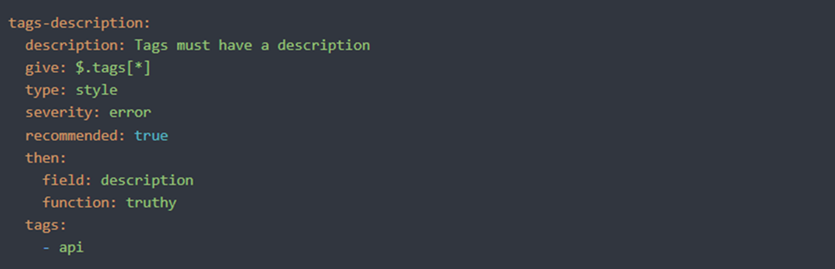

También para la creación de una regla, se pueden definir a partir de la creación de un fichero *js* donde definiremos las diferentes funciones que queremos implementar para nuestras reglas.

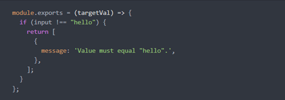

