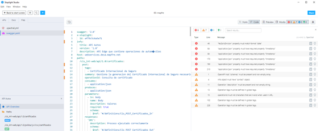
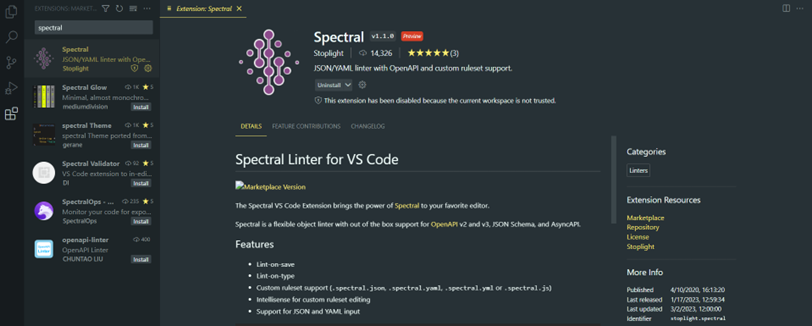
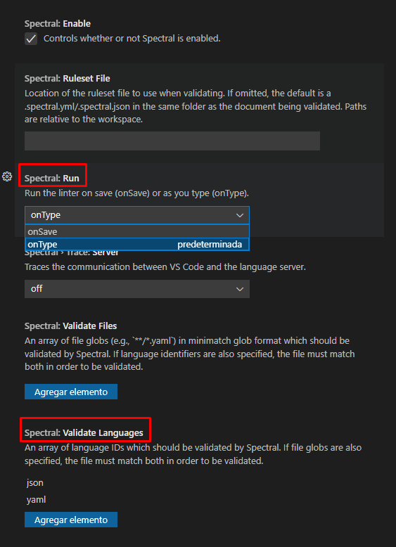

# **Índice**

**CONTROL DE VERSIONES**

|**Versión**|**Fecha**|**Autor**|**Comentarios**|
| :- | :- | :- | :- |
|**1.0**|14/03/2023|Axpe|Versión inicial.|

# Índice
[Introducción](#Introduccion)

[Integrado con Stoplight Studio	](#Stopligth)

[Visual Studio Code	](#VisualStudio)

[Standalone	](#Standalone)

# Introducción
En este documento se detalla los pasos a seguir para realizar la validación de Spectral sobre las especificaciones API. Para implementar estas validaciones se ha creado un conjunto de reglas obligatorias que se deberán incluir cuando se cree una nueva especificación de API ó modificar una existente.

Existen varias posibilidades para ver y mostrar estas validaciones:

Integrado con Stoplight Studio - Esta es la forma más sencilla y fácil para realizar la validación de las reglas. Cuando empezamos a desarrollar la especificación OpenAPI se irán aplicando de forma automática las reglas definidas.

Visual Studio Code - Dentro de visual studio code nos encontramos el mismo funcionamiento que en el anterior caso, para ello deberemos instalar la extensión de spectral. Como podemos observar en la siguiente imagen:

Una vez instalada, se configurará para que se validen los ficheros de tipo JSON/YAML y se indicará cuando se requiere que se pase dicha validación.

Standalone - Esta forma se debería utilizar solo cuando se desee integrar Spectral en alguna [**pipeline**](https://definicion.de/pipeline/) o ejecución automática.

Para trabajar en este modo antes de empezar deberemos verificar que se tiene descargado e instalado [NodeJS](https://nodejs.org/en/) con el paquete necesario de [Spectral](https://www.npmjs.com/package/@stoplight/spectral).

Después deberemos crear un archivo .yaml (“.spectral.yaml”) donde definiremos los diferentes reglas que queremos utilizar para la validación de nuestra API. Este archivo deberá ser creado en el mismo directorio donde se encuentra nuestra API. En la siguiente imagen se ve un ejemplo de cómo definiremos las reglas:

Ejecutar el siguiente comando dentro del directorio donde se encuentran los archivos:

spectral lint api.yaml -r .spectral.yml -v

api.yaml sería la API que querríamos validar.

Parámetros:

- -r: Parámetro para adjuntar los archivos de reglas, pueden existir N archivos de reglas.
- -v: Parámetro para activar modo verbose.

