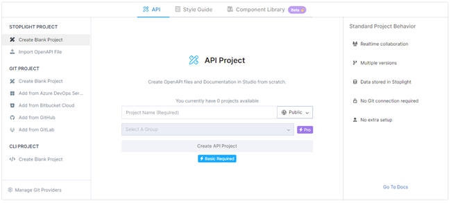
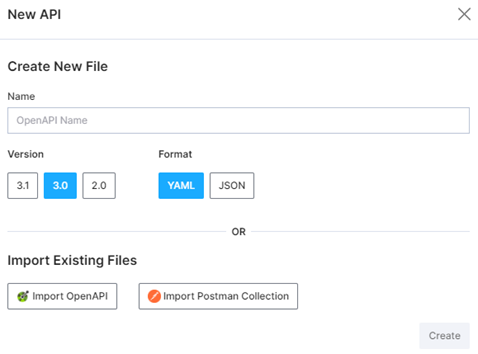
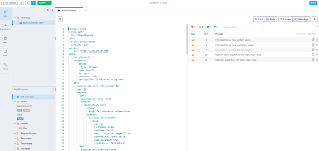
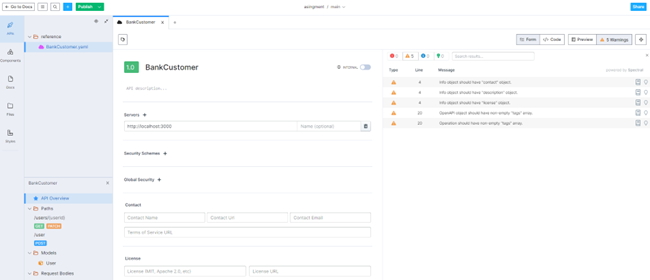
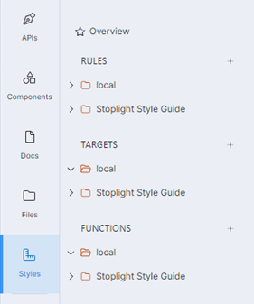
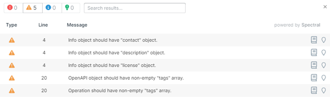

# **Documentacion de la herramienta Stopligth**
|**Versión**|**Fecha**|**Autor**|**Comentarios**|
| :- | :- | :- | :- |
|**1.0**|27/03/2023|Axpe|Versión inicial.|

## Índice
---
[1. Introducción](#Introduccion)

[2. Crear un proyecto](#Proyecto)

[3. Ventana principal del diseño de una API](#Ventana)

[4. Editor formulario de una API](#Formulario)

[5. Validación de la API con spectral](#Validacion)

## 1. Introducción
Stoplight Studio es una plataforma de diseño y documentación de API que permite a los desarrolladores crear, probar, documentar y compartir sus API de manera eficiente y colaborativa.

Con Stoplight Studio,  se pueden diseñar sus API utilizando la interfaz visual de Stoplight, documentarlas con Swagger y OpenAPI, y probarlas en tiempo real sin tener que escribir código adicional. La plataforma también incluye herramientas como la revisión, que permiten a los equipos trabajar juntos de manera más efectiva.

Stoplight Studio también proporciona características avanzadas de administración de API, como la capacidad de monitorear el uso de API, establecer políticas de seguridad y cumplimiento, y generar informes y análisis. Además, la plataforma admite una amplia gama de integraciones y herramientas de terceros, lo que la convierte en una opción flexible y escalable para las necesidades de API de cualquier equipo de desarrollo.
## 2. Crear un proyecto 
Lo primero que se debe realiza es el registro y crear un espacio de trabajo. 

Se debe elegir entre la versión web y la versión de escritorio. Si se trabaja de forma habitual se recomienda la versión de escritorio por su simplicidad y fácil manejo.

La descarga de la versión de escritorio se puede realizar desde <https://stoplight.io/studio> 

El siguiente paso consiste en hacer clic en el botón + en la parte superior para agregar un nuevo proyecto. Se le pone un nombre al proyecto y se selecciona Crear proyecto API.

 

Se crea el proyecto.

A continuación, en la barra lateral izquierda se selecciona API y se crea una nueva API.

En este paso, es necesario ponerle un nombre a la API y seleccionar el formato y la versión deseadas, en este caso será YAML en la versión OPENAPI 3.0.

 ## 3. Ventana principal del diseño de una API
Una vez creada una nueva API o abierta una existente se presenta la siguiente ventana. La ventana principal del diseño de una API en Stoplight Studio se llama "Workspace". En ella se pueden crear, editar y visualizar los diferentes elementos de una API, como son los endpoints, los modelos de datos, las respuestas, entre otros.

En el centro de la ventana se encuentra el editor principal, que muestra el diagrama de la API. En él se pueden agregar y modificar endpoints, modelos de datos, parámetros, respuestas y otros elementos de la API. También es posible definir la estructura y el contenido de cada uno de estos elementos mediante una interfaz visual intuitiva.

En la parte izquierda de la ventana se encuentra el panel de navegación, que permite acceder a diferentes vistas y herramientas, como la documentación de la API, las validaciones de esquemas, los tests automatizados y otros.

Finalmente, en la parte inferior de la ventana, o en la derecha, dependiendo de la resolución de la pantalla, se encuentran las pestañas de consola y de registro, que muestran información detallada sobre el proceso de diseño y construcción de la API, así como posibles errores o advertencias que puedan surgir durante este proceso.

## 4. Editor formulario de una API
Otra ventaja que proporciona stoplight a la hora de crear el diseño de una API, se puede hacer a través de código pero también se puede hacer a través de formulario realizando clic en el botón superior derecho “Form”.

 

A través de esta vista, en el menú inferior izquierdo se puede seleccionar que parte de la API se desea modificar. Esto facilita la navegación entre las diferentes partes de la API.

## 5. Validación de la API con spectral
La validación de las APIs en Stoplight Studio, con la herramienta Spectral, es un proceso de verificación automática de la especificación de una API, que se realiza utilizando reglas definidas en un archivo de configuración en formato YAML. Spectral es una herramienta de validación que se utiliza para garantizar la calidad y consistencia de las API en diferentes etapas del ciclo de vida de desarrollo de las APIs.

Spectral utiliza un enfoque basado en reglas, lo que significa que se definen reglas que deben cumplirse para garantizar que la especificación de la API sea correcta. Estas reglas se basan en el lenguaje JSON.

Las reglas se pueden crear seleccionando “styles” en el panel izquierdo y realizando clic en + en el apartado RULES, para crear un ruleset personalizado. También se pueden importar reglas ya creadas.

Cuando se ejecuta Spectral en una especificación de API, la herramienta verifica que se cumplan todas las reglas definidas en el archivo de configuración. En caso de que alguna regla no se cumpla, Spectral genera un informe de error indicando la ubicación del problema y una descripción detallada. De esta manera se puede identificar el error y ponerle solución.

