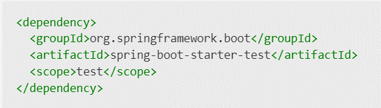
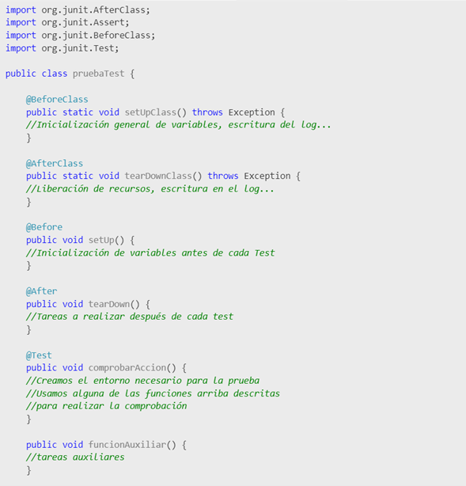
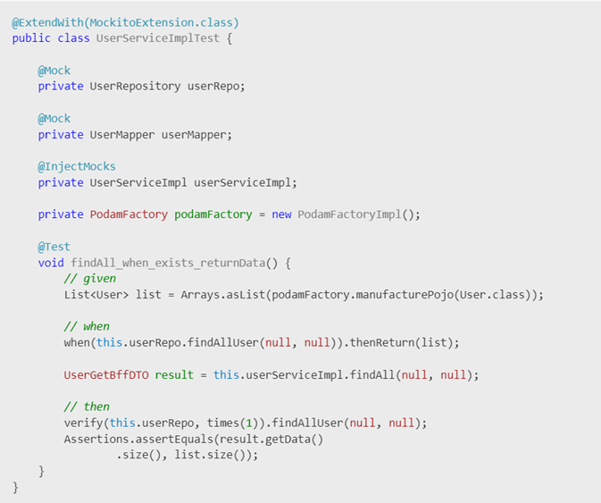
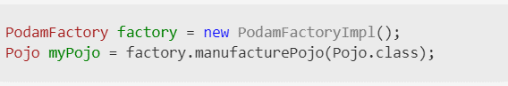

# **Documentación JUnit5**
|**Versión**|**Fecha**|**Autor**|**Comentarios**|
| :- | :- | :- | :- |
|**1.0**|30/01/2023||Versión inicial.|

## Índice
---
[I. ntroducción](#Introduccion)

[2. Instalación](#Instalacion)

[3. Métodos](#Metodos)

[4. Anotaciones](#Anotaciones)

[5. Ejemplo](#Ejemplo)

[6. Mockito](#Mockito)

[7. Podam](#Podam)

## 1. Introducción 

**Junit** se trata de un Framework Open Source para la automatización de las pruebas (tanto unitarias, como de integración) en los proyectos de Software. El **Framework** provee al usuario de herramientas, clases y métodos que le facilitan la tarea de desarrollar pruebas en un sistema y así conseguir asegurar un correcto funcionamiento.

**Junit 5** contiene una serie de innovaciones con respecto a la versión anterior, con lo que habilita la posibilidad de implementar nuevas funciones en **Java 8** y versiones posteriores, así como habilitar diferentes estilos de prueba.

Como complemento a **Junit**, a la hora de realizar pruebas unitarias, necesitaremos abstraer el método concreto que queremos probar, de los servicios que internamente utilice. Para ello, vamos a utilizar el patrón **Mock Object**, que consiste en un “*objeto falso*” donde representa a otro objecto y lo sustituye en funcionalidad. Este patrón es utilizado mayormente dentro de las pruebas Unitarias para asegurar un correcto aislamiento de la clase bajo un test. 

Las dependencias que tenga nuestro objeto a testear pueden ser remplazadas por **mocks** que funcionen como nosotros deseemos. De lograr esto, podemos testear de forma aislada a nuestra clase, sin preocuparnos por el funcionamiento de las dependencias que tenga.

Usando **Mocks Objects** podemos asegurar un “*entorno perfecto y a medida*”, consiguiendo que este entorno responda como nosotros necesitemos. Luego, si el test de la clase falla, será por un problema de esta misma clase y no de sus dependencias ya que consideramos tener un entono ideal.

## 2. Instalación 
Para conseguir trabajar con Junit 5 en Spring Boot, solo tendríamos que añadir la siguiente dependencia a nuestro pom.xml:

Donde dentro de esta dependencia incluye las bibliotecas (como JUnit, Hamcrest y Mockito) necesarias para poder realizar test a partir de Junit5. Esta dependencia solo valdría para proyectos basados en Spring Boot.
## 3. Métodos
Una clase de Test realizada para ser tratada por JUnit tiene una estructura con 4 tipos de métodos:

- **Método setUp**: Se asignan valores iniciales a variables antes de la ejecución de cada test. Si sólo queremos que se inicialicen al principio una vez, el método se debe llamar "setUpClass"
- **Método tearDown**: Es llamado después de cada test y puede servir para liberar recursos o similar. Igual que antes, si queremos que sólo se llame al final de la ejecución de todos los test, se debe llamar "tearDownClass"
- **Métodos Test**: Contienen las pruebas concretas que vamos a realizar.
- **Métodos auxiliares**: funciones que complementan nuestros test.
## 4. Anotaciones
Se llama anotaciones a caracteres especiales que se usan para intentar simplificar más la labor del programador. Se trata de palabras clave que se colocan delante de los métodos definidos y que indican a las librerías JUnit instrucciones concretas.

A continuación, pasamos a ver las más relevantes:

- **@RunWith**: Se le asigna una clase externa a la que JUnit invocará en lugar del ejecutor por defecto de JUnit.
- **@ExtendWith**: Se usa para extender clases externas de Junit, y poder utilizarlas y trabajar con ellas.
- **@Before**: Indicamos que el siguiente método se debe ejecutar antes de cada test (precede al método setUp). Si tiene que preceder al método setUpClass, la notación será "@BeforeClass"
- **@After**: Indicamos que el siguiente método se debe ejecutar después de cada test (precede al método tearDown). Si tiene que preceder al método tearDownClass, la notación será "@AfterClass"
- **@Test**: Indicamos a Junit que se trata de un método de Test. Con esta anotación colocada delante de los métodos podemos elegir el nombre libremente.
## 5. Ejemplo
A continuación, se explica uso y creación de métodos y las anotaciones que hemos visto previamente. 

En la siguiente imagen vemos un ejemplo más practico en la que se realizar un test a partir de la ayuda de [Mockito](https://site.mockito.org/) y [Podam](https://javadoc.io/static/uk.co.jemos.podam/podam/0.0.1-RC2/index.html?uk/co/jemos/podam/mockery/PodamFactory.html) (clase para crear objetos con valores aleatorios).

## 6. Mockito
Mockito es una librería Java que permite simular el comportamiento de una clase de forma dinámica. De esta forma nos aislamos de las dependencias con otras clases y sólo testeamos la funcionalidad concreta que queremos. Dentro de Mockito existen diferentes tipos de objetos que se pueden implementar, donde el más común es **Mock Object** muy usado para el testeo unitario. 

Características principales: 

- Se pueden crear mocks de interfaces y clases correctas. 
- Verificación de invocaciones (cantidad exacta, al menos una vez, orden de invocación, etc.) 
- El stack trace se mantiene limpio, ya que los errores ocurren en los assert que se implementen (y no dentro del método bajo prueba, como se puede ver en EasyMock). 
- Una API más clara para crear stubs y verificaciones.

## 7. Podam
Podam es una herramienta para pruebas Java, que crea automáticamente con datos inventados POJOS Java. Podam puede llenar cualquier árbol de objetos con datos. Es compatible con los tipos genéricos, colecciones, matrices y tipos nativos de Java. Esta herramienta permite crear datos aleatorios para POJOs(Objeto Java).

Por defecto, Podam utiliza para generar datos una estrategia que produce valores aleatorios de acuerdo con el tipo del dato (Random). Esta estrategia puede ser cambiada a nivel de cada tipo de dato y cada atributo.

Para utilizar Podam, se debe crear una fábrica y luego invocar el método de construcción de objetos que recibe de argumento la clase del objeto que se va a crear:

 

