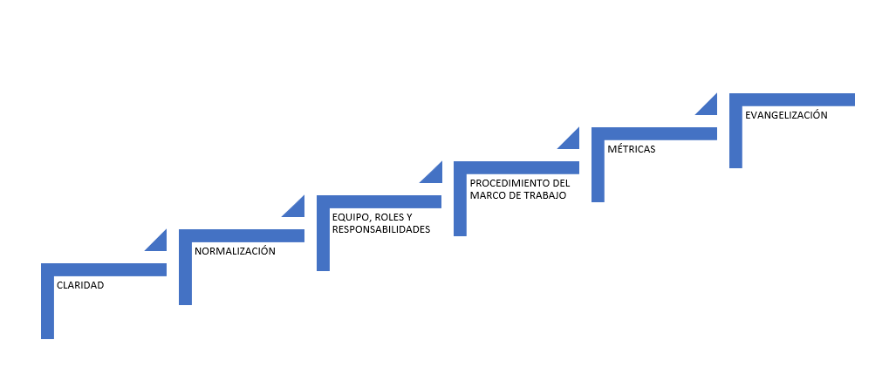

 # **Oficina de Gobierno de APIs**

## Índice

[1. Objetivos](#1-objetivos)

[2. Tareas](#2-tareas)

[3. Líneas de actuación](#3-l%C3%ADneas-de-actuaci%C3%B3n)
- [3.1. Promover la claridad](#31-promover-la-claridad)
- [3.2. Normalización](#32-normalizaci%C3%B3n)
- [3.3. Definir roles y responsabilidades](#33-definir-roles-y-responsabilidades)
- [3.4. Definir procedimiento del marco de trabajo](#34-definir-procedimiento-del-marco-de-trabajo)
- [3.5. Gestionar métricas](#35-gestionar-m%C3%A9tricas)
- [3.6. Evangelizar](#36-evangelizar)

[4. Modelo organizativo de la Oficina de Gobierno de API](#4-modelo-organizativo-de-la-oficina-de-gobierno-de-api)

--------

## 1. Objetivo

La Oficina de Gobierno de las APIs nace por los siguientes necesidades:

- Establecer y definir un procedimiento y metodología dentro de la empresa **Axpe Consulting** que incluya: buenas prácticas de la guia de diseño, implementación y securización de las APIs.

- Mediar entre los distintos equipos de negocio y desarrollo en la preparación y definición de las especificaciones API objetivo, para la agregación a los proyectos. Con el objetivo de seguir y gestionar unas buenas prácticas de diseño de los productos API dentro de la compañía, como dar soporte en la toma de decisión adecuadas durante todo el ciclo de vida API.

## 2. Tareas

Las tareas de la Oficina serán las siguientes:

- Soporte y apoyo a los equipos de negocio y de desarrollo en todas las áreas a la hora de analizar, identificar, definir e implementar correctamente las APIs. 
- Definir un marco de trabajo y una metodología de trabajo, basado en estándares y guías de buenas prácticas, relacionadas con la definición y desarrollo de APIs. 
- Identificar los participantes, equipos y roles involucrados en el ciclo de vida APIs. 
- Analizar y establecer los requisitos de arquitectura y seguridad de las APIs. 
- Creacción y mantenimiento de documentos: Diseño de API, buenas prácticas, versionado, etc, en las que los diseñadores API puedan apoyarse a la hora de definir y creación de la especificaciones API. 
- Promover el uso de las API (Reutilización) y actuar como evangelista, responsable de difusionar, promoción, comunicar y formar a la compañia en todos los aspectos necesarios relacionados con metodología establecida y disciplina definda.
- Asegurar la estratégico de *"apificación"* entre negocio y tecnología.
- Identificar, analizar y coordinar con los equipos involucrados (negocio y equipos de desarrollo) a la hora de definición y gestión de las APIs. Como colaborar en la definición de las distintas interfaces y documentación de las APIs dentro del proyecto. 
- Mantener, revisar y verificar la calidad de la documentación y el cumplimiento de las normas, estándares y buenas prácticas.

## 3. Líneas de actuación

Para lograr los objetivos definicidos anteriormente, la Oficina de Gobierno contenpla las siguientes líneas de actuación:

### 3.1 Promover la claridad

Fase en la que se recopilar la mayoría de la información, conocimiento en el catálogo de APIs y se estable como punto de entrada para definir, diseñar, planificar y publicar las APIs.

Media, comunica y forma a las organizaciónes en todo el proceso de  participación del modelo de gobierno definido.

### 3.2 Normalización

En esta fase el objetivo principal de la oficina, es definir un conjunto de documentos donde se refleje las buenas prácticas de definición de productos API a través de pautas para homogeneizar las especificaciones, gestionar los esquemas y modelos de datos.

### 3.3 Definir roles y responsabilidades

Fase destinada a identificar los diferentes participantes e involucrarlos en el flujo de trabajo, estableción en qué momento del flujo participa cada integrante y que tareas debe aportar.

### 3.4 Definir procedimiento del marco de trabajo

Esta fase se encarga de establecer el proceso de trabajo y mejorarlo de manera continua. También se identifica y/o define los distintos canales de comunicación y las reunones necesarias (reuniones, comités, dailys, etc) que permiten gestionar el proceso de trabajo. 
Por otro lado, se incluirán puntos de control para garantizar lo establecido en las definiciones a la hora de cumplir las buenas prácticas.

### 3.5 Gestionar métricas

Definir instrumentos necesarios de control y de medida mediante KPIs de ámbito técnico para verificar el uso y la operación adecuados de las APIs y el alcance de negocio para cuantificar el éxito del desarrollador y el uso de la adopción de las API.

### 3.6 Evangelizar 

Difundir, promocionar, formar y fomentar la estategía de soluciones que integren APIs y impulsar la reutilización, reusabilidad y componentes ya existentes. Asegurar la sincronización estratégica con negocio y promover a analizar e identificar elemntos "APIificables" que aporten un valor a la organización.

Por otro lado, también se deverá de evangelizar sobre el trabajo en comunidad y dinamizarla.

## 4. Modelo organizativo de la Oficina de Gobierno de API

En una primera fase se trabajará en un modelo “Distribuido Centralizado” para pasar paulatinamente a un modelo “Equilibrado” en el que los Equipos de Desarrollo tienen mayor responsabilidad en el Diseño y Desarrollo y la Oficina de Gobierno hace la validación de los memes.

